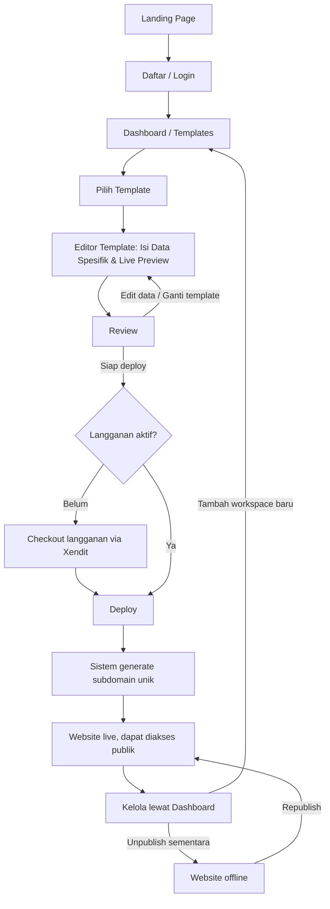

# Product Requirements Document (PRD)
## Portofio - SaaS Portfolio Website Builder

**Versi**: 1.4
**Tanggal**: 14 Juli 2026
**Disusun oleh**: Maulana Chandra Irawan
**Status**: Siap untuk development

> Perubahan v1.1: model monetisasi diubah dari freemium menjadi **gratis membuat & preview, berbayar untuk publish** (satu paket langganan); auth MVP dipersempit ke email/password; UI aplikasi dua bahasa (id/en); skema data portofolio dikonkretkan; spesifikasi 5 template ditambahkan.
>
> Perubahan v1.2: alur utama diubah mengikuti pola Framer/Canva — galeri 5 template kini juga tampil **publik di landing page** (sebelum daftar), diisi data contoh/demo per template supaya calon pengguna bisa lihat hasil jadi sebelum commit. Memilih template di galeri publik lalu mendaftar akan membawa pilihan itu otomatis ke akun baru; template tetap bisa diganti kapan saja dari dashboard seperti sebelumnya. Lihat section 6 dan 7.3.
>
> Perubahan v1.3: ditambahkan konsep **Workspace** — satu akun dapat memiliki lebih dari satu workspace (brand profile), masing-masing dengan data portofolio, pilihan template, dan subdomain publish sendiri-sendiri (sebelumnya diasumsikan 1 akun = 1 portofolio). Alur pengguna dirinci: setelah daftar, pengguna membuat workspace pertama lalu mengisi Data General; di dalam workspace, memilih template menampilkan preview dengan **data dummy** dulu, baru setelah "Gunakan template" pengguna masuk ke form khusus yang auto-fill dari Data General dan hanya minta field yang belum terisi (bukan field unik per template — kontrak data tetap satu untuk semua template, lihat 7.3/9.4). Ditambahkan langkah Review eksplisit sebelum Deploy (=Publish). Skema data (9.4) dan model billing (7.6) disesuaikan; harga per-workspace vs per-akun dicatat sebagai open question (16) karena belum diputuskan.
>
> Perubahan v1.4: Menyederhanakan alur pengguna (Ponytail mode). Menghapus langkah isi "Data General" di awal. Pengguna langsung masuk ke Dashboard setelah login untuk memilih template, lalu mengisi data spesifik di dalam Editor (mirip Framer).

---

## 1. Ringkasan Produk

Portofio adalah platform SaaS yang memungkinkan pengguna membuat website portofolio profesional secara instan tanpa perlu keahlian coding maupun desain. Pengguna mengisi data diri melalui form terstruktur, memilih salah satu template yang tersedia, melihat preview secara real-time, lalu — dengan berlangganan — mempublikasikan website tersebut ke subdomain dalam hitungan menit. Membuat dan mem-preview portofolio gratis; publish adalah fitur berbayar.

Model ini terinspirasi dari platform seperti Framer, namun disederhanakan dengan pendekatan form + template (bukan drag-and-drop canvas bebas) agar proses pembuatan lebih cepat dan ramah untuk pengguna non-teknis.

## 2. Latar Belakang dan Problem Statement

Banyak profesional umum (fresh graduate, freelancer, job seeker, content creator) membutuhkan portofolio online yang terlihat profesional, tetapi tidak memiliki waktu maupun keahlian teknis untuk membangunnya dari nol. Alternatif yang ada saat ini punya kelemahan masing-masing:

- Website builder seperti Framer/Webflow terlalu kompleks dan mahal untuk kebutuhan sederhana
- Template desain statis (Canva, dsb) menghasilkan file gambar/PDF, bukan website yang bisa diakses lewat link
- Membangun sendiri dengan coding butuh skill dan waktu yang tidak dimiliki mayoritas target pengguna

Portofio mengisi celah ini dengan alur super sederhana: isi data, pilih template, publish.

## 3. Tujuan Produk dan Success Metrics

**Tujuan Bisnis**
- Meluncurkan MVP dalam [X bulan] dengan 5 template siap pakai
- Mendapatkan [Z] pengguna terdaftar dalam 3 bulan pertama pasca-launch
- Konversi minimal 5-10% dari pembuat portofolio (akun gratis) menjadi pelanggan berbayar yang publish

**Metrik Keberhasilan (KPI)**
- Jumlah website yang berhasil dipublikasikan
- Time-to-publish rata-rata (target di bawah 15 menit dari signup sampai publish)
- Retention rate bulanan
- Conversion rate free ke paid subscription
- Churn rate subscription bulanan

## 4. Target Pengguna (Persona)

Persona utama: profesional umum non-teknis (fresh graduate, freelancer, job seeker, konsultan individu, content creator) yang butuh portofolio online cepat tanpa belajar coding atau desain.

Karakteristik:
- Melek digital dasar, bukan developer maupun desainer
- Mengutamakan kecepatan dan hasil yang terlihat profesional
- Sensitif terhadap harga, terutama segmen fresh graduate
- Mengakses baik dari desktop maupun mobile

## 5. Ruang Lingkup (Scope)

### MVP (Fase 1)
- Registrasi dan autentikasi pengguna via email/password.
- **Workspace**: satu akun dapat memiliki lebih dari satu workspace/brand profile. Workspace tambahan dapat dibuat dari dashboard.
- Landing page untuk marketing.
- Editor form per workspace (biodata, pengalaman, skill, project/karya, kontak, sosial media) yang diisi langsung di dalam halaman Editor Template.
- 5 template siap pakai untuk peluncuran awal (struktur tetap, tanpa kustomisasi bebas; kontrak data sama untuk semua template — tidak ada field unik per template)
- Kustomisasi dasar tema (warna aksen, pilihan font terbatas)
- Live preview real-time saat mengisi data — preview galeri (sebelum pilih) memakai data dummy, preview setelah "Gunakan template" memakai Data General workspace yang aktif
- Publish (Deploy) ke subdomain (contoh: nama.appku.com) — khusus pelanggan berbayar; per-workspace atau per-akun masih open question, lihat section 16
- Dashboard pengguna (kelola workspace, kelola data, ganti template, unpublish/republish)
- Model akses: gratis membuat portofolio dan melihat live preview; publish hanya untuk pelanggan berbayar (satu paket langganan bulanan)
- Integrasi payment gateway untuk subscription
- UI aplikasi dua bahasa: Bahasa Indonesia dan English

### Di Luar Scope MVP (Fase 2+)
- OAuth Google (login sosial)
- Custom domain
- Drag-and-drop editor bebas
- Analytics pengunjung website
- Multi-bahasa untuk website yang dihasilkan
- Marketplace template dari kreator pihak ketiga
- Integrasi CMS/blog
- Onboarding B2B (kampus, organisasi)

## 6. Alur Pengguna Utama



Poin penting dari alur di atas (Ponytail simplified flow):
1. Pengguna daftar/login.
2. Langsung diarahkan ke Dashboard untuk memilih template.
3. Setelah klik template, pengguna masuk ke **Editor**. Di sini mereka mengisi biodata dan data portofolio melalui panel form, sembari melihat live preview. Tidak ada langkah "Isi Biodata" yang terpisah (YAGNI).
4. Gerbang berbayar hanya ada di langkah Deploy (=Publish): tanpa langganan aktif, tombol Deploy mengarahkan ke checkout.

## 7. Functional Requirements

### 7.1 Autentikasi, Akun, dan Workspace
- Registrasi via email/password (OAuth Google = Fase 2)
- Verifikasi email
- Reset password
- Manajemen profil akun
- **Workspace**: satu akun bisa memiliki banyak workspace, dibuat kapan saja dari dashboard. Setiap workspace memiliki data, pilihan template, dan status publish sendiri-sendiri.

### 7.2 Editor dan Input Data Portofolio
- Form input terintegrasi langsung di halaman **Editor Template** (seperti Framer). Panel form berdampingan dengan Live Preview.
- Data yang diisi (identitas diri, bio, pengalaman, dll) secara otomatis tersimpan di workspace tersebut.
- Validasi input dan upload gambar dengan kompresi otomatis.
- Auto-save draft.

### 7.3 Template dan Kustomisasi
- **Dashboard Galeri**: setelah login, user disuguhkan pilihan template.
- Setiap template menerima struktur data yang sama (`PortfolioData`, lihat 9.4).
- Kustomisasi terbatas: skema warna dan pilihan font, diatur langsung di Editor.
- Live Preview real-time: perubahan input data dan kustomisasi langsung terlihat.

Lima template peluncuran (nama kerja, masing-masing satu karakter desain yang jelas):

| Template | Karakter |
|---|---|
| Minimal | Putih bersih, tipografi serif, satu kolom, fokus ke teks |
| Bold | Warna aksen kuat, heading besar, cocok untuk creative/marketer |
| Creative | Grid project menonjol di atas, cocok untuk desainer/fotografer |
| Corporate | Rapi dan formal, timeline pengalaman kerja menonjol, cocok job seeker |
| Dark | Tema gelap, aksen neon, cocok untuk developer/tech |

Data contoh/demo untuk galeri publik: satu `PortfolioData` demo per template (nama, headline, bio, 1–2 pengalaman, beberapa skill, 1–2 project — cukup untuk menunjukkan karakter template, tidak perlu realistis sempurna), disimpan sebagai fixture statis di kode, bukan di database (tidak terhubung ke akun manapun).

### 7.4 Preview dan Publish
- Preview mode identik dengan tampilan akhir sebelum publish
- Generate subdomain otomatis dengan validasi nama unik dan filter kata terlarang
- Proses publish idealnya di bawah beberapa detik karena render dinamis, bukan build statis per pengguna
- Opsi unpublish sementara

### 7.5 Dashboard Pengguna
- Daftar workspace milik akun, tombol tambah workspace baru (v1.3)
- Per workspace: ringkasan status website (published/draft), kelola data dan template
- Statistik dasar (jumlah views, opsional untuk MVP)
- Kelola langganan dan billing

### 7.6 Billing dan Subscription
- Satu paket langganan bulanan (tanpa tier). Akun tanpa langganan tetap bisa mengisi data, ganti template, dan melihat preview — tetapi tidak bisa publish/deploy
- Publish gate: aksi Deploy (dan status published) hanya tersedia selama langganan aktif
- **Cakupan langganan per akun atau per workspace (v1.3, belum diputuskan — lihat Open Questions 16):** dengan workspace jamak, apakah satu langganan meng-cover publish semua workspace milik akun, atau tiap workspace publish butuh langganannya sendiri? Default sementara untuk development: satu langganan per akun meng-cover seluruh workspace-nya (paling sederhana, sejalan dengan "satu paket langganan bulanan, tanpa tier") — dikonfirmasi sebelum go-live
- Integrasi payment gateway lokal (Xendit) untuk checkout dan recurring bulanan
- Notifikasi jatuh tempo dan invoice; pembatalan langganan
- Perilaku saat langganan berakhir/gagal bayar (default usulan, bisa dikoreksi): grace period 7 hari, lalu seluruh website (semua workspace) auto-unpublish. Data portofolio tetap tersimpan; berlangganan lagi mengaktifkan kembali kemampuan republish

### 7.7 Internasionalisasi UI
- UI aplikasi (dashboard, form, halaman marketing) tersedia dalam Bahasa Indonesia dan English, mis. via `next-intl`, dengan bahasa default Indonesia
- Website portofolio yang dihasilkan pengguna satu bahasa saja (mengikuti konten yang diisi pengguna) — multi-bahasa untuk website hasil tetap di luar scope MVP

## 8. Non-Functional Requirements

- Performa: waktu render halaman publik di bawah 2 detik
- Skalabilitas: arsitektur multi-tenant harus mendukung ribuan subdomain aktif tanpa proses build terpisah per pengguna
- Keamanan: enkripsi data pengguna, proteksi terhadap subdomain hijacking, rate limiting pada form submission
- Ketersediaan: target uptime 99.5% untuk website publik yang sudah live
- Seluruh template harus responsif di perangkat mobile

## 9. Tech Stack dan Arsitektur Teknis

### 9.1 Ringkasan Arsitektur

Sistem ini adalah aplikasi multi-tenant, satu aplikasi melayani banyak pengguna, dan setiap pengguna memiliki representasi website publik sendiri yang diakses lewat subdomain unik. Alih-alih melakukan build/deploy statis per pengguna yang mahal secara komputasi dan lambat, pendekatan yang direkomendasikan adalah dynamic rendering: data pengguna disimpan di database, dan halaman publik dirender secara dinamis berdasarkan subdomain yang diakses.

### 9.2 Rekomendasi Tech Stack

Mengingat sudah familiar dengan ekosistem Next.js/React dan Supabase, berikut rekomendasi yang mempercepat development tanpa mengorbankan skalabilitas:

**Frontend (dashboard editor dan rendering website publik)**
- Next.js (App Router) dengan TypeScript
- Tailwind CSS untuk styling dan sistem template
- React Hook Form + Zod untuk validasi form input data

**Backend**
- Next.js API Routes / Server Actions untuk MVP, fullstack dalam satu codebase agar iterasi lebih cepat
- Backend terpisah (NestJS atau Laravel) baru dipertimbangkan bila kompleksitas bisnis logic seperti billing dan moderasi tumbuh signifikan pasca-MVP

**Database dan Auth**
- Supabase (PostgreSQL) untuk database relasional, autentikasi pengguna, dan storage file (foto profil, gambar project)
- Alasan pemilihan: mengurangi effort setup infrastruktur auth dan storage dari nol, cocok untuk kecepatan MVP

**Payment Gateway**
- Keputusan: Xendit, dipilih karena dukungan recurring/subscription native yang mencakup kartu, e-wallet, dan direct debit (lebih lengkap dibanding Midtrans yang saat ini membatasi recurring hanya pada kartu dan GoPay Tokenization serta membutuhkan approval tambahan dari bank)
- API Xendit juga lebih ramah untuk integrasi custom (API-first), sesuai dengan pendekatan fullstack Next.js yang direkomendasikan
- Catatan: modul billing tetap dibangun dengan lapisan abstraksi (payment provider interface) agar provider dapat diganti di kemudian hari bila diperlukan

**Hosting dan Infrastruktur**
- Vercel direkomendasikan untuk MVP karena dukungan native terhadap wildcard subdomain routing, SSL otomatis, dan overhead DevOps minim
- Alternatif jika ingin kontrol penuh dan biaya lebih rendah di skala besar: VPS + Docker + Traefik/Nginx untuk wildcard SSL, dengan kompleksitas operasional yang lebih tinggi

### 9.3 Arsitektur Multi-Tenant dan Penyimpanan Template

Sistem menggunakan pendekatan **Hybrid Template Storage**:
- **Metadata Template (di Database)**: Tabel `templates` di Supabase menyimpan data seperti `id`, `name`, `thumbnail_url`, dan `category`. Hal ini memungkinkan Dashboard meload daftar ratusan template secara dinamis.
- **Kode UI Template (di Codebase)**: Kode desain (React Components / `.tsx`) murni disimpan di codebase `src/templates/`. Pendekatan ini (Ponytail mode) dipilih untuk keamanan (mencegah XSS/eksekusi kode dari DB), menghindari *over-engineering* membuat engine JSON-to-UI, serta memanfaatkan *Code Splitting* bawaan Next.js yang hanya me-load komponen template terkait ke memori.

Alur rendering teknis:

1. DNS wildcard (*.appku.com) diarahkan ke aplikasi
2. Next.js Middleware membaca header host dari setiap request masuk
3. Middleware mengekstrak subdomain dan melakukan rewrite ke route dinamis, misalnya /sites/[subdomain]
4. Route tersebut melakukan query ke database berdasarkan subdomain untuk mengambil data pengguna dan ID template yang dipilih
5. Halaman dirender menggunakan komponen template dari `src/templates/` yang sesuai, setiap template adalah komponen React yang menerima struktur data yang sama sebagai props
6. Gunakan ISR (Incremental Static Regeneration) atau caching di edge untuk menjaga performa tanpa perlu build ulang setiap kali data berubah

### 9.4 Skema Data

Entitas utama:

- **users**: akun, kredensial, status subscription
- **workspaces** (v1.3): satu workspace = satu brand/portofolio. Terhubung ke `user_id` (satu user → banyak workspace, relasi one-to-many). Kolom minimal: `id`, `user_id`, `name`, `created_at`
- **portfolio_data**: data terstruktur (bio, pengalaman, pendidikan, skill, kontak) — terhubung ke `workspace_id` (bukan langsung ke `user_id` lagi sejak v1.3, karena tiap workspace punya Data General sendiri)
- **projects**: daftar karya/project milik satu portfolio_data, relasi one-to-many
- **sites**: representasi website (subdomain, template_id, status publish) — terhubung ke `workspace_id` (bukan langsung ke `user_id` lagi sejak v1.3; satu workspace = satu site)
- **templates**: metadata template yang tersedia (nama, kategori, thumbnail, komponen renderer)
- **subscriptions**: status langganan dan riwayat pembayaran, terhubung ke payment gateway. Tetap terhubung ke `user_id` (bukan `workspace_id`) — lihat 7.6 untuk status "satu langganan meng-cover semua workspace milik akun" (default sementara, open question 16)

Kontrak data portofolio — bentuk data yang diterima **semua template sebagai props**, satu instance per workspace. Ini adalah kontrak inti proyek: form (`data-001`) menulis bentuk ini untuk workspace yang sedang dikelola, kelima template (`template-001`) merendernya (baik dengan data dummy di galeri publik maupun data asli workspace di dashboard/situs publik), dan halaman publik (`publish-001`) mengambilnya dari database berdasarkan workspace yang terhubung ke subdomain tersebut. Field bertanda `?` opsional; template wajib merender wajar saat field opsional kosong. Struktur ini tidak berubah oleh workspace (v1.3) — hanya kepemilikannya yang berpindah dari `user_id` ke `workspace_id`.

```ts
interface PortfolioData {
  profile: {
    fullName: string;
    headline: string;          // mis. "Product Designer"
    bio: string;               // ringkasan singkat, plain text
    photoUrl?: string;         // Supabase Storage
    location?: string;
  };
  experiences: {
    company: string;
    role: string;
    startDate: string;         // "YYYY-MM"
    endDate?: string;          // kosong = masih berjalan
    description?: string;
  }[];
  educations: {
    institution: string;
    degree?: string;
    field?: string;
    startYear: number;
    endYear?: number;
  }[];
  skills: string[];            // daftar nama skill sederhana
  projects: {
    title: string;
    description: string;
    imageUrl?: string;
    link?: string;
  }[];
  contact: {
    email: string;             // email publik yang ditampilkan
    phone?: string;
    whatsapp?: string;
  };
  socials: {
    platform: "linkedin" | "github" | "instagram" | "x" | "youtube" | "tiktok" | "website";
    url: string;
  }[];
  theme: {
    accentColor: string;       // hex, dari palet terbatas
    font: string;              // dari daftar font terbatas
  };
}
```

Semua teks adalah plain text (tanpa HTML) dan wajib di-escape saat render untuk mencegah XSS (lihat 9.5).

### 9.5 Pertimbangan Keamanan

- Validasi dan sanitasi ketat pada seluruh input form untuk mencegah XSS di halaman publik yang menampilkan data pengguna
- Rate limiting pada proses signup, publish, dan pemilihan nama subdomain
- Daftar kata terlarang untuk validasi nama subdomain
- Row Level Security (RLS) di Supabase agar pengguna hanya bisa mengakses workspace miliknya sendiri (dan data/site di bawahnya) — bukan hanya per-user seperti sebelum v1.3, karena kepemilikan data kini lewat `workspace_id`

### 9.6 Pertimbangan Skalabilitas

- Dengan pendekatan dynamic rendering (bukan static build per pengguna), penambahan jumlah pengguna tidak menambah beban build/deploy
- Caching di edge (Vercel Edge Cache atau CDN) untuk halaman publik yang jarang berubah
- Pisahkan proses upload dan optimasi gambar, misalnya lewat image CDN seperti Cloudflare Images atau Supabase Storage transformation, agar tidak membebani server aplikasi utama

### 9.7 Lingkungan Development

- **Subdomain lokal**: gunakan `http://nama.localhost:3000` (browser modern me-resolve `*.localhost` ke loopback tanpa konfigurasi) atau `nama.lvh.me:3000` sebagai fallback. Middleware harus memperlakukan host lokal ini sama dengan wildcard produksi.
- **Domain produksi**: belum ditentukan — `appku.com` di dokumen ini adalah placeholder. Simpan sebagai env var (`NEXT_PUBLIC_ROOT_DOMAIN`) sejak awal agar penggantian domain hanya soal konfigurasi.
- **Env vars minimum**: `NEXT_PUBLIC_SUPABASE_URL`, `NEXT_PUBLIC_SUPABASE_ANON_KEY`, `SUPABASE_SERVICE_ROLE_KEY`, `XENDIT_SECRET_KEY` (sandbox), `XENDIT_WEBHOOK_TOKEN`, `NEXT_PUBLIC_ROOT_DOMAIN`. Sediakan `.env.example` saat scaffold.
- **Billing di lokal**: gunakan Xendit sandbox; webhook diuji via tunnel (mis. `ngrok`) atau simulasi request manual.

### 9.8 Estimasi Kompleksitas Development

| Modul | Kompleksitas | Catatan |
|---|---|---|
| Auth dan onboarding | Rendah | Supabase Auth mempercepat signifikan |
| Form input data + wizard | Sedang | Perlu UX matang untuk multi-step form |
| Template system (5 template) | Sedang-Tinggi | Setiap template adalah desain + kode terpisah |
| Subdomain routing dan rendering | Sedang | Middleware Next.js sudah menyediakan primitif yang dibutuhkan |
| Billing dan subscription | Sedang | Bergantung kompleksitas integrasi payment gateway |
| Dashboard pengguna | Rendah-Sedang | CRUD standar |

## 10. Monetisasi dan Pricing

Model: **gratis membuat, berbayar untuk publish**. Satu paket langganan bulanan, tanpa tier.

| Akses | Harga | Yang didapat |
|---|---|---|
| Tanpa langganan | Rp0 | Buat akun, isi data portofolio, pilih semua template, live preview. Tidak bisa publish |
| Berlangganan | Rp[X]/bulan (placeholder — lihat section 16) | Publish 1 website ke subdomain, update/unpublish/republish bebas selama aktif |

Saat langganan berakhir: grace period 7 hari, lalu website auto-unpublish; data tetap tersimpan (lihat 7.6).

Catatan: harga final perlu riset kompetitor dan validasi willingness-to-pay; tier tambahan (multiple website, dsb.) dipertimbangkan pasca-MVP.

## 11. Asumsi dan Batasan

- MVP tidak mendukung custom domain, hanya subdomain di root domain platform
- Template bersifat struktur tetap (bukan drag-and-drop bebas) untuk mempercepat development
- Fokus pasar awal adalah Indonesia, mencakup payment gateway lokal
- UI aplikasi dua bahasa (Indonesia default + English); website hasil pengguna satu bahasa mengikuti konten yang diisi
- Auth MVP hanya email/password; OAuth Google menyusul di Fase 2
- Hanya yang berlangganan yang bisa mem-publish; tidak ada website live dari akun gratis

## 12. Risiko dan Mitigasi

| Risiko | Mitigasi |
|---|---|
| Kompetitor besar (Framer, Wix, Canva) sudah mapan | Diferensiasi lewat kesederhanaan alur dan harga lebih terjangkau untuk pasar lokal |
| Subdomain rentan disalahgunakan (spam, konten tidak pantas) | Hanya pelanggan berbayar yang bisa publish (menaikkan biaya penyalahgunaan), filter kata terlarang, rate limiting, terms of service yang jelas |
| Biaya infrastruktur membengkak seiring pertumbuhan akun gratis | Akun gratis tidak menghasilkan website live (hanya data + preview), monitoring biaya hosting berkala |
| Gerbang bayar di publish menekan konversi | Pastikan preview meyakinkan (identik dengan hasil akhir), pertimbangkan trial/diskon peluncuran bila konversi rendah |

## 13. Roadmap Tingkat Tinggi

- **Fase 1 (MVP)**: fitur inti sesuai scope di atas
- **Fase 2**: OAuth Google, custom domain, analytics pengunjung, penambahan template
- **Fase 3**: drag-and-drop editor terbatas, marketplace template, dukungan multi-bahasa

## 14. Definition of Done (DoD)

Checklist yang berlaku untuk setiap fitur/task sebelum dianggap selesai dikerjakan:

- Fungsionalitas sesuai acceptance criteria pada user story/backlog terkait
- Sudah diuji manual pada happy path dan minimal satu edge case
- Tidak ada error atau warning kritis di console/log
- Tampilan responsif di mobile dan desktop (untuk fitur yang menyentuh UI)
- Sudah di-deploy ke environment staging dan diverifikasi berjalan normal sebelum masuk ke branch utama

## 15. Kriteria Go-Live MVP

Checklist tingkat produk yang harus terpenuhi sebelum MVP diluncurkan ke publik:

- Seluruh functional requirement di section 7 sudah diimplementasi dan lulus DoD
- 5 template sudah siap dan lulus QA visual di berbagai ukuran layar
- Alur signup sampai publish (termasuk checkout langganan) bisa diselesaikan di bawah 15 menit, sesuai target KPI di section 3
- Integrasi Xendit sudah diuji end-to-end, termasuk penanganan webhook untuk status pembayaran dan alur langganan berakhir (grace period → auto-unpublish)
- Terjemahan UI lengkap untuk kedua bahasa (id/en) di seluruh alur inti
- Kebijakan privasi dan syarat & ketentuan sudah dipublikasikan di aplikasi
- Moderasi dasar aktif: filter kata terlarang untuk nama subdomain dan rate limiting pada signup/publish
- Monitoring dan error tracking dasar sudah terpasang
- Backup database terjadwal sudah aktif

## 16. Open Questions

Tidak memblokir mulainya development (semua punya placeholder yang bisa jalan), tapi harus dijawab sebelum go-live:

- Harga final paket langganan bulanan (`Rp[X]` di section 10)?
- Nama domain produksi (pengganti placeholder `appku.com`)?
- Durasi grace period saat langganan berakhir — default usulan 7 hari, dikonfirmasi?
- Target bisnis: `[X bulan]` waktu peluncuran MVP dan `[Z]` jumlah pengguna 3 bulan pertama (section 3)?
- Langganan per akun atau per workspace (v1.3, section 7.6)? Default sementara: satu langganan per akun meng-cover semua workspace-nya. Perlu dikonfirmasi sebelum go-live karena berdampak ke harga dan ke apakah akun bisa publish banyak website dengan satu paket yang sama.
- Ada batas maksimum jumlah workspace per akun (v1.3)? Belum ada batas yang diusulkan — perlu diputuskan sebelum go-live terutama jika langganan bersifat per-akun (lihat poin di atas), supaya satu akun tidak bisa publish website tanpa batas dengan satu langganan.
