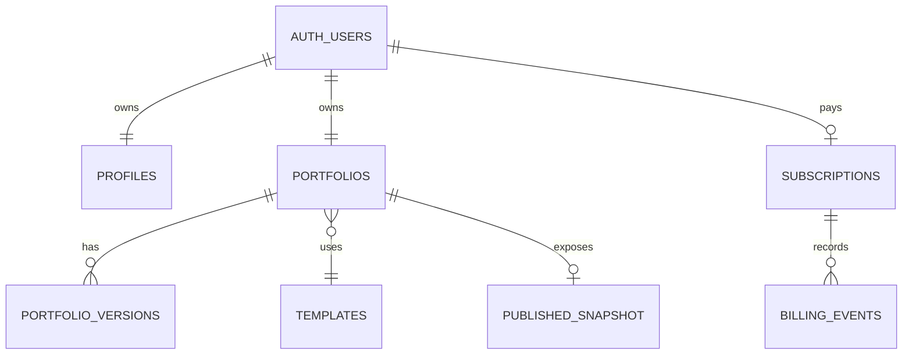

# Deep Research: Product & Engineering Build Plan Portofio

**Tanggal audit:** 15 Agustus 2026  
**Scope:** repository, dokumentasi, implementasi aktual, migrasi Supabase, RLS, E2E, konfigurasi deployment, dan riset kompetitor primer.  
**Kesimpulan singkat:** Portofio sudah memiliki vertical slice yang luas dan cukup baik untuk demo, tetapi belum production-ready. Masalah utamanya bukan kekurangan fitur; masalah utamanya adalah scope terlalu lebar, billing tiered belum selesai, operational hardening belum terbukti, dan beberapa security/reliability control masih hanya bekerja pada satu process.

## 1. Executive Summary

### Core value

Portofio menjual **hasil profesional dengan usaha minimum**: pengguna non-teknis memasukkan data penting, memilih desain yang sudah dikurasi, melihat hasil nyata, lalu membagikan satu link portfolio.

Kalimat positioning yang paling kuat:

> **Isi data sekali, pilih template yang tepat, dan dapatkan portfolio profesional yang siap dibagikan.**

Ini cukup kuat tanpa AI, asalkan kualitas template, copy guidance, preview, dan publish reliability benar-benar unggul.

### Target MVP yang disarankan

Fokus awal pada satu job-to-be-done: **fresh graduate/job seeker Indonesia yang perlu portfolio/CV online sebelum melamar kerja**. Freelancer dan creator dapat menjadi template/use-case berikutnya, bukan persona yang harus dioptimalkan bersamaan.

### Verdict scope

- **MUST BUILD:** auth yang benar, template gallery, editor content-first, preview desktop/tablet/mobile, autosave yang durable, publish satu website ke subdomain, public rendering, basic SEO, billing satu plan, unpublish/republish, legal, abuse controls, observability, backup, dan E2E happy path.
- **SHOULD BUILD:** template switching dengan migration contract, readiness checklist yang tidak menghalangi draft, rollback sederhana, image upload ke Storage, admin suspend/blocklist minimal, email delivery production.
- **CAN DEFER:** multi-workspace UI, Content Library, analytics, tiered billing, custom domain, Designer Portal, Enterprise, i18n website, advanced version history, OAuth, marketplace.
- **SHOULD REMOVE dari launch:** pseudo-Enterprise, Designer Portal, revenue sharing, advanced analytics, 8-template commitment, public template catalog yang dikendalikan DB sebelum benar-benar diperlukan, dan dua model content/profile yang sama-sama menjadi sumber data.

### Baseline verifikasi audit

- `./init.sh`: pass; lint 0 error, 1 warning pada `src/components/dashboard/BillingClientView.tsx:126`.
- `npx tsc --noEmit`: pass.
- `npm run build`: pass; 36 route termasuk admin, designer, analytics, cron, webhook.
- `npx playwright test`: 35 passed, 3 skipped. Coverage default banyak berupa unauthenticated smoke/UI; integration flows bersifat opt-in.
- `npm audit --json`: 3 high severity transitive vulnerabilities: `brace-expansion`, `js-yaml`, `nanoid`.
- Worktree sudah memiliki perubahan billing/tiered dan artefak schema dari pekerjaan sebelumnya; audit tidak mengubah atau membatalkan perubahan tersebut.

## 2. Current Project Assessment

### Yang sudah nyata di codebase

| Area | Implementasi aktual | Penilaian |
|---|---|---|
| Auth | Supabase email/password, confirm/reset route, password strength, Google button | Vertical slice ada; email template/SMTP masih dependency manual |
| Tenant model | `workspaces` → `projects` → `project_versions` | Aman secara konsep, terlalu besar untuk persona single-portfolio |
| Editor | Form panel, preview renderer, sections, SEO, autosave, history, mobile drawers | Banyak value nyata; beberapa kontrol masih kompleks untuk non-teknis |
| Templates | 8 code-defined definitions, Zod schema, defaults, mapper, migration, renderer | Architecture code-defined tepat; 8 template menaikkan QA dan maintenance cost |
| Publish | `publish_project()` SECURITY DEFINER, subdomain uniqueness, public route, ISR 60 detik | Publish gate belum atomic untuk quota akun dan belum tier-entitlement lengkap |
| Billing | Midtrans signature, event table, subscription state, cron | Single-plan baseline ada; tiered implementation belum end-to-end |
| Admin | role, suspend, blocklist, template visibility, audit logs | Bukan blocker user value; perlu diperkecil untuk launch |
| Designer | submission DB, private ZIP bucket, review lifecycle, E2E opt-in | Fase 2 dan sebaiknya dikeluarkan dari launch surface |
| Analytics | public beacon, page/section visits, dashboard | Tidak membantu Create → Edit → Preview → Publish; tangguhkan |
| Storage | content bucket public, uploads dari data URL, ZIP private | Upload validation dan lifecycle perlu hardening |
| Ops | Vercel cron config, no visible Sentry DSN/config evidence, manual migration history | Belum cukup sebagai production evidence |

### Kontradiksi dokumentasi vs implementasi

1. `docs/PRD.md:112-128` menyatakan MVP mencakup tiga tier, annual billing, analytics, Content Library, 8 template, RBAC/Admin. Ini bukan MVP minimal; ini roadmap gabungan.
2. `docs/IMPLEMENTATION_PLAN.md:44` masih menyatakan tiered billing belum diimplementasikan, sedangkan `claude-progress.md:24-40` dan migration `20260814000000_tiered_billing.sql` menyatakan schema dan koneksi awal sudah ada. Status yang benar: **schema + checkout wiring ada, entitlement behavior dan E2E belum selesai**.
3. `docs/IMPLEMENTATION_PLAN.md:101-106` menyebut sanitization sudah wired, tetapi sanitizer (`src/lib/utils/sanitize.ts:5-13`) bukan HTML sanitizer yang robust dan URL scheme tidak divalidasi secara sistematis.
4. `docs/IMPLEMENTATION_PLAN.md:330-348` menyatakan rate limiting selesai, tetapi `src/lib/rate-limit.ts:10` menggunakan `Map` in-memory. Di Vercel, instance berbeda tidak berbagi state dan state hilang saat cold start.
5. `docs/IMPLEMENTATION_PLAN.md:370-378` menyatakan Sentry siap DSN, tetapi package/configuration Sentry tidak terlihat di `package.json` dan env example. Ini harus dianggap belum ada sampai error nyata masuk ke dashboard.
6. `docs/IMPLEMENTATION_PLAN.md:500` menyebut 21 migration; repository saat ini memiliki migration lebih banyak dan sebagian diterapkan manual. `docs/DATABASE_SCHEMA.md:487-489` sendiri mencatat hanya sebagian migration tercatat di migration metadata. Ini adalah schema-drift/reproducibility risk.
7. `docs/PRD.md:232` menyebut visibility katalog DB, tetapi `src/templates/registry.tsx:14-55` tetap mendaftarkan semua definition dari code. Jika DB menonaktifkan template, semua entry point harus benar-benar memfilter hasil registry.
8. `docs/PRD.md:13-17` pernah menetapkan flow Data General lalu Ponytail menghapusnya. Code saat ini sudah Ponytail, tetapi workspace profile, user profile, dan project content masih tumpang tindih sebagai sumber data.
9. `docs/PRD.md:130-140` menaruh Designer Portal di luar MVP, tetapi route, schema, storage, dan E2E-nya aktif. Ini undocumented production surface yang menambah attack surface.
10. File `docs/SPRINTS.md` yang diminta dalam workflow tidak ada; yang tersedia adalah CSV backlog. Dokumentasi sprint tidak restartable sesuai instruksi repo.

## 3. Product Gaps

### Core product gaps

- Tidak ada bukti instrumentasi funnel untuk mengetahui titik drop-off signup → first content → preview → publish. KPI stopwatch bukan activation evidence.
- Copy/value proposition masih menjual platform luas, sementara mental model yang benar adalah guided portfolio generator.
- Tiga paid tier menciptakan pilihan sebelum user merasakan value. Untuk target sensitif harga, ini menambah decision friction.
- Satu website live per akun masuk akal sebagai constraint biaya, tetapi harus dijelaskan sebagai **one active portfolio**, bukan limit workspace yang membingungkan.
- Workspace abstraction belum terbukti dibutuhkan oleh target utama. Banyak workspace adalah power-user capability, bukan alasan pertama untuk signup.
- Analytics dan Content Library bukan bagian minimum untuk mendapatkan portfolio live. Keduanya memperluas data model dan UI sebelum product-market fit.

### Product decision

Untuk 100–1.000 user pertama, gunakan:

- 1 account = 1 portfolio aktif.
- 1 template pilihan per portfolio, dapat diganti dengan safe migration.
- Draft gratis, publish berbayar.
- 1 paid plan, monthly dulu; annual setelah payment lifecycle terbukti.
- 5 template terbaik, bukan 8 template yang kualitasnya belum sama.
- Analytics hanya internal product events, bukan feature user-facing.

## 4. UX Gaps

### Ideal journey

```text
Landing
→ lihat template demo tanpa login
→ pilih template
→ signup singkat
→ Editor langsung dengan 5–7 field wajib
→ autosave + preview nyata
→ readiness check
→ pilih subdomain
→ checkout
→ public portfolio
```

### Friction yang ditemukan

- Dashboard/workspace/template/editor berpotensi terasa seperti tiga produk berbeda.
- Istilah `workspace`, `project`, `Content Library`, `Data General`, `Deploy`, dan `Publish` tidak semuanya natural untuk job seeker. Gunakan satu istilah user-facing: **Portfolio** dan **Publish**.
- Profile account, workspace profile, dan editor data dapat meminta data yang sama lebih dari sekali.
- Template switching existing content belum tersedia. Feature evidence mengakui `SP2-020` dan `SP2-022` deferred. Ini gap besar karena produk menjanjikan template-driven choice.
- Version history 20 autosave rows (`src/lib/projects/store.ts:91-104`) bukan undo/redo yang mudah dipahami; dapat menjadi noise dan storage growth.
- `saveDraftJson()` membaca max version lalu insert (`store.ts:200-242`), sehingga concurrent autosave dapat collision pada unique `(project_id, version_number)`.
- `handleRevertToLive()` hanya mengubah client state dan mengandalkan autosave; jika tab ditutup sebelum autosave, user dapat mengira revert sudah tersimpan padahal belum.
- Preview iframe/device simulation kuat secara visual, tetapi harus mempertahankan fokus pada content completion, bukan mengajak user mengutak-atik layout.
- Publish button perlu selalu menyatakan: data tersimpan, apa yang live, URL yang akan dipakai, dan apa yang terjadi bila subscription berhenti.
- Mobile editor harus diuji dengan keyboard virtual, bukan hanya viewport screenshot.

### UX acceptance criteria

- User baru dapat mengisi nama, headline, bio, satu project, email, dan foto lalu melihat hasil yang masuk akal tanpa membuka settings.
- Semua field punya contoh dan alasan, bukan label teknis.
- Optional fields benar-benar optional dan section kosong tidak tampil.
- Save state membedakan `Saving`, `Saved`, `Failed to save`; retry tersedia.
- Template change memiliki preview non-destructive dan konfirmasi hanya jika data extension tidak compatible.
- Publish failure menjelaskan tindakan berikutnya, bukan generic error.

## 5. Technical Gaps

### P0/P1 implementation findings

| Severity | Evidence | Risk | Required action | Launch? |
|---|---|---|---|---|
| CRITICAL | `src/app/api/cron/check-subscriptions/route.ts:8-13` | Jika `CRON_SECRET` kosong, GET cron terbuka; attacker dapat invoke admin/service-role unpublish worker | Fail closed in production; require secret and reject missing secret | Before launch |
| CRITICAL | `src/lib/projects/actions.ts:196-216` + RPC | Quota one-published checked before RPC; dua request concurrent dapat publish dua project | Enforce quota atomically in RPC/transaction with DB lock or unique partial index strategy | Before launch |
| HIGH | `src/lib/rate-limit.ts:10-45` | Rate limit bypass antar Vercel instances/cold starts; publish/signup abuse remains possible | Use durable provider-backed limiter or Postgres atomic counter; enforce per IP + account | Before launch |
| HIGH | `src/lib/projects/store.ts:206-242` | Autosave version-number race and unbounded version rows | Use DB function/sequence strategy, debounce server writes, retention policy | Before launch |
| HIGH | `src/app/api/webhooks/midtrans/route.ts:44-56` | Idempotency check then insert is not atomic; duplicate concurrent webhooks can both process | Insert with unique key and handle conflict; process status transactionally | Before launch |
| HIGH | `src/app/api/webhooks/midtrans/route.ts:82-109` | DB errors from billing event/subscription writes are not checked before returning success | Check every write, return non-2xx on transient failure so provider retries | Before launch |
| HIGH | `src/lib/billing/subscription.ts:53-61` | Extra plan query per status; entitlement resolver exists but publish uses boolean subscription only | Centralize `getEntitlements()` and enforce plan, watermark, domain, template server-side | Before tier launch |
| HIGH | `src/app/sites/[subdomain]/page.tsx:3-14` | Public request uses service-role client; any future query mistake bypasses RLS | Prefer anon/server request client for public reads or isolate minimal service role repository | Before launch |
| HIGH | `src/lib/utils/sanitize.ts:5-33` | Regex stripping is not a general sanitizer; URLs such as `data:`, `vbscript:`, malformed schemes may pass | Store plain text only; validate URL protocols with allowlist; avoid dangerouslySetInnerHTML for user data | Before launch |
| HIGH | `src/lib/content/actions.ts:47-69` | Base64 decode accepts declared MIME and size but does not verify actual magic bytes; public object can be abused | Verify image signature, dimensions, decompression limits, and content type; use Storage upload path | Before launch |
| HIGH | `src/lib/auth/actions.ts:11-14` | Trusts first `x-forwarded-for` value; rate-limit identity can be spoofed outside trusted proxy assumptions | Use platform-trusted request IP or durable edge limiter; do not treat header as security identity | Before launch |
| MEDIUM | `src/proxy.ts:74-89` | Host/subdomain parsing accepts multi-label prefix; production wildcard and apex/`www` behavior need explicit tests | Allow exactly one label, normalize IDN/punycode policy, test host injection and path rewrite | Before launch |
| MEDIUM | `src/app/auth/confirm/route.ts:9-21` | `next` redirect is not allowlisted; current callers are internal but route is externally supplied | Accept only relative paths beginning `/`, reject `//` and schemes | Before launch |
| MEDIUM | `src/app/api/track/route.ts:66-104` | Public endpoint permits unlimited inserts and visitor-controlled cardinality | Add abuse budget/batching/rate control, retention, and sampling; defer feature if not needed | Prefer defer |
| MEDIUM | `src/lib/utils/compressImage.ts:9-21` | `ImageBitmap` lifecycle not closed; data URLs inflate JSON and response/query sizes | Move images to Storage and store references; limit dimensions and bytes at client + server | Before launch |
| MEDIUM | package audit | 3 high transitive vulnerabilities | Upgrade lockfile dependencies, rerun audit, document exceptions only if proven dev-only | Before launch |
| LOW | `package.json:15,28` and `docs/DESIGN.md:142-145` | Phosphor/Lucide dependencies remain despite icon rule | Remove unused dependencies or enforce one icon system | Before launch polish |

### Authorization observations

RLS ownership chains are generally well designed: `projects` and `project_versions` scope through `workspaces`, and role mutation is protected by trigger `20260811000007_harden_role_boundaries.sql`. However:

- Claims deployment is documented as manual (`docs/IMPLEMENTATION_PLAN.md:296-316`). A role stored in `profiles` is not enough if JWT `app_metadata.role` is stale.
- `requireRole()` correctly rejects anonymous requests, but server actions still need resource ownership tests for every ID-based action.
- Admin service-role usage is broad. Keep it in small repositories with explicit input validation, not generic action functions.
- Public RLS policies should expose only fields required by public rendering. A public profile policy can accidentally widen data exposure as schema evolves.

## 6. Security Risks

### CRITICAL

1. **Unauthenticated cron execution when secret absent.** Exploit: attacker calls `/api/cron/check-subscriptions` repeatedly; impact includes expensive DB scans and unpublishing expired users. Fix: production requires `CRON_SECRET`; route returns 503 if unset and 401 for mismatch.
2. **Concurrent publish quota bypass.** Exploit: submit two publish actions for two projects before either check sees the other. Impact violates paid-plan promise and can expose multiple live sites. Fix in DB transaction/RPC, not UI.

### HIGH

1. **Distributed rate-limit bypass.** Fix durable atomic limiter and rate limits on auth, publish, checkout, tracking, and upload.
2. **Webhook race/false success.** Fix unique insert conflict handling, verify order amount/currency/product against server-side plan snapshot, record processed status, and only return success after subscription transaction completes.
3. **Weak URL/input sanitation.** User-controlled links and image URLs are rendered in anchors/images across templates. Use `https:`/`http:` only where needed, `mailto:` and `tel:` only in specific fields, reject dangerous schemes, and never render arbitrary HTML.
4. **File upload spoofing and resource exhaustion.** Validate magic bytes, dimensions, decoded size, file count, and storage quota. ZIP upload is out of MVP; if retained, inspect archive entries for path traversal and bombs before any processing.
5. **Service-role blast radius.** Public rendering, cron, webhook, analytics, and billing share an all-powerful key. Split access by request type and minimize selected columns.

### MEDIUM

1. Open redirect through `next` parameters.
2. Analytics spam and privacy/retention ambiguity.
3. Subdomain abuse: reserved names alone do not stop phishing, malware, adult content, spam, or impersonation. Need Terms, report abuse path, suspension, and post-publish moderation response.
4. Missing CSP/security headers evidence. Add CSP compatible with templates, `frame-ancestors`, `Referrer-Policy`, HSTS in production, and clickjacking tests.
5. Schema drift and manually applied migrations make rollback/recovery uncertain.

### LOW

- Dependency hygiene, stale legacy payment table names, duplicate policies, and inconsistent design-system dependencies.

## 7. Performance Risks

### Reasonable assumptions

| Scale | Expected shape | Architecture decision |
|---|---|---|
| 100 users | <100 live sites, low traffic | Current Next.js + Supabase is more than enough after security fixes |
| 1,000 users | 100–500 live sites, normal portfolio traffic | Add public cache headers/ISR discipline, image Storage/CDN, query indexes, retention |
| 10,000 users | 1,000–5,000 live sites, traffic uneven | Measure hot sites, cache public documents, aggregate analytics, consider read replicas only after evidence |

### Concrete bottlenecks

- Every autosave creates a full JSONB version row. At 10 saves/minute/user this grows rapidly. Save a current draft row and create named/history snapshots only on meaningful milestones.
- Public render performs project lookup then version lookup and parses Zod on each cache miss. Fine at MVP; cache immutable published version by project/version and invalidate on publish/unpublish.
- Inline data URLs duplicate image payloads in draft, versions, and published snapshot. Storage URLs are the correct MVP production boundary.
- Analytics fetches bounded rows and aggregates application-side. Fine for low traffic; defer analytics or add daily aggregates before 10k users.
- Supabase client per request is normal, but service-role calls and sequential queries in public page, billing, and admin should be minimized.
- `revalidate = 60` means content may remain stale for one minute and does not replace an explicit invalidation policy. Decide whether publish requires near-immediate visibility; use tag/path revalidation after publish if so.

Do not introduce Kubernetes, microservices, Redis, Kafka, sharding, or read replicas at 100–10,000 users without measurements.

## 8. Architecture Recommendation

### Current → problems

```text
Next.js + Supabase + Vercel
  workspaces → projects → project_versions
  code registry + DB catalog
  Midtrans + webhook + cron
  Admin + Designer + analytics + content library
```

Problems: too many product surfaces, two profile/content concepts, manual schema drift, service-role everywhere, non-durable rate limiting, and billing complexity before pricing validation.

### Recommended MVP architecture

- **Frontend:** Next.js App Router, one localized marketing/auth shell and one editor shell. Keep form + preview; remove decorative workspace/admin complexity from first-run.
- **Backend:** Server Actions for authenticated mutations; Route Handlers only for Midtrans webhook, cron, and public analytics if retained.
- **Database:** Supabase Postgres with `profiles`, `portfolios`, `portfolio_versions`, `subscriptions`, `billing_events`, and minimal `templates` catalog. RLS for owner access.
- **Storage:** Supabase Storage private uploads with public transformed delivery URLs; no base64 in JSONB.
- **Auth:** Supabase Auth email/password; production SMTP, URL templates, session refresh, email confirmation, and password reset tested in staging.
- **Rendering:** Dynamic public route by subdomain, code-defined renderer, published immutable snapshot. Use Vercel cache/ISR with explicit invalidation.
- **Billing:** One Basic plan monthly at launch. Server-created Snap transaction. Webhook signature + exact order/amount/product validation + atomic idempotency.
- **Jobs:** One protected Vercel cron for expiry, fail-closed. No queue until job duration/retry evidence requires it.
- **Deployment:** Vercel preview/staging/production, wildcard DNS, environment separation, migration pipeline, rollback runbook.

### What to remove or hide now

- `designer` portal and private ZIP workflow from production routes until Phase 2.
- `enterprise` plan and annual billing until willingness-to-pay and recurring lifecycle are proven.
- user-facing analytics and section tracking.
- account-global Content Library; copy content directly into portfolio document first.
- `workspace_assets` table/UI stub.
- admin template marketplace controls; use code registry plus a small feature flag only if needed.

### Future architecture

Keep `TemplateDefinition` code architecture as the extension point. Later add versioned template IDs (`minimal@2` or immutable template version), migration tests, custom domains, aggregate analytics, and Designer submission review. Do not dynamically execute uploaded template code or build a database JSON-to-UI plugin runtime.

## 9. Recommended MVP Scope

### PORTOFIO MVP SHOULD CONTAIN

1. Landing page with 3–5 high-quality template demos.
2. Email/password auth with verified email and reset password.
3. One guided portfolio creation flow.
4. One editor with content sections, optional fields, clear examples, autosave, and save failure recovery.
5. Desktop/tablet/mobile preview that renders the same renderer as public site.
6. Template selection and safe template switching.
7. Readiness check: name, headline, one proof item, contact method, photo optional.
8. One published website per account, with unique subdomain.
9. Draft/live separation and unpublish/republish without data loss.
10. One paid Basic plan, Midtrans sandbox-to-production lifecycle, webhook idempotency, grace period.
11. Basic SEO title/description, social preview fallback, accessible links, responsive QA.
12. Abuse controls: subdomain reserved list, rate limits, account suspension, report abuse, Terms and Privacy.
13. Error tracking, structured logs, DB backup, migration verification, and production smoke tests.

### PORTOFIO MVP SHOULD NOT CONTAIN

1. Drag-and-drop, arbitrary CSS/JS/HTML.
2. AI generation.
3. Designer Portal, template uploads, marketplace, revenue sharing.
4. Enterprise/team collaboration.
5. Custom domains unless domain setup is a proven launch requirement.
6. Advanced analytics or section engagement.
7. Account-global Content Library.
8. Eight templates as a hard launch gate.
9. Annual billing before monthly cancellation/refund/renewal is proven.
10. Multiple workspace/project UI unless interviews prove it is a primary use case.

## 10. Features to Remove / Defer

| Decision | Feature | Reason |
|---|---|---|
| Remove from MVP | Enterprise | No distinct value while max live sites remains 1 and collaboration is absent |
| Defer | Annual billing | Adds payment/refund/renewal edge cases; monthly validates willingness-to-pay faster |
| Defer | Custom domain | DNS support and domain verification are operationally expensive; subdomain proves core value |
| Defer | Analytics | Does not improve first publish; creates public ingestion abuse surface |
| Defer | Designer Portal/marketplace | No dependency for user outcome; adds untrusted upload and moderation risk |
| Defer | Content Library | Duplicates portfolio data and increases editor mental model |
| Defer | Multi-workspace | Useful later, not needed for first portfolio |
| Keep small | Admin | Suspend, blocklist, audit, and support metadata only |
| Keep | Versioning | Keep one previous published snapshot and bounded history; do not store every keystroke forever |
| Keep | Theme variants | Predefined variants uphold Content First, Design Second |

## 11. Product Backlog

| ID | Product Backlog | User Story | Priority | SP | Acceptance Criteria |
|---|---|---|---|---:|---|
| P0-01 | Production auth | Sebagai pengguna, saya ingin verifikasi email dan reset password bekerja sehingga akun saya dapat dipakai dengan aman | P0 | 3 | SMTP/template production tested; no fragment bug; reset succeeds |
| P0-02 | Durable authorization | Sebagai pemilik portfolio, saya ingin hanya dapat melihat data saya sehingga portfolio tidak bocor | P0 | 5 | RLS + server action ID tests for owner/non-owner/anon |
| P0-03 | Atomic publish | Sebagai pengguna, saya ingin satu portfolio live secara konsisten sehingga quota tidak dapat dilanggar | P0 | 5 | Concurrent publish test; DB rejects second live site |
| P0-04 | Durable rate limits | Sebagai operator, saya ingin signup/publish/webhook terlindungi dari abuse | P0 | 3 | Multi-instance-safe; limits for auth, publish, upload, webhook |
| P0-05 | Billing Basic monthly | Sebagai pengguna, saya ingin membayar sekali dan publish sehingga saya mendapatkan URL live | P0 | 8 | Sandbox settlement, idempotent webhook, amount/product validation, grace/unpublish |
| P0-06 | Public rendering | Sebagai pengguna, saya ingin link portfolio saya terbuka untuk publik sehingga dapat dibagikan ke recruiter | P0 | 5 | Subdomain, cache, 404, published snapshot, no draft leakage |
| P0-07 | Backup/observability | Sebagai operator, saya ingin tahu error dan memulihkan data sehingga insiden tidak menjadi kehilangan permanen | P0 | 5 | Sentry/alternative receives error; backup restore drill; alerts |
| P1-01 | Guided editor | Sebagai job seeker, saya ingin tahu data apa yang harus diisi sehingga dapat selesai tanpa memahami web design | P1 | 5 | Required/optional labels, examples, empty states, readiness check |
| P1-02 | Autosave reliability | Sebagai pengguna, saya ingin perubahan tidak hilang sehingga aman reload/close tab | P1 | 5 | Saved/failed states, retry, no version collision, retention |
| P1-03 | Safe template switch | Sebagai pengguna, saya ingin mencoba template lain tanpa menghapus isi sehingga dapat memilih desain terbaik | P1 | 8 | Non-destructive preview, migration/compatibility test, published snapshot unchanged |
| P1-04 | Image Storage | Sebagai pengguna, saya ingin upload foto/project image sehingga portfolio terlihat profesional | P1 | 5 | Magic-byte/dimension/size validation; Storage URL; orphan cleanup |
| P1-05 | Basic SEO/accessibility | Sebagai pengguna, saya ingin link saya tampil baik saat dibagikan dan mudah dibaca | P1 | 3 | title/description/OG, alt text, keyboard/focus, mobile QA |
| P1-06 | Minimal moderation | Sebagai operator, saya ingin memblokir abuse dan menonaktifkan site sehingga platform aman | P1 | 3 | blocklist, suspend, audit, report abuse route |
| P2-01 | Annual billing | Sebagai pelanggan, saya ingin membayar tahunan sehingga mendapat harga lebih sederhana | P2 | 5 | refund/cancel/renewal policy proven |
| P2-02 | Custom domain | Sebagai pelanggan premium, saya ingin memakai domain sendiri sehingga brand lebih profesional | P2 | 8 | ownership verification, DNS status, SSL, detach/reclaim policy |
| P2-03 | Analytics | Sebagai pemilik site, saya ingin melihat visitor dasar sehingga tahu link saya dipakai | P2 | 5 | privacy, retention, anti-spam, aggregation |
| P2-04 | Multi-workspace | Sebagai freelancer, saya ingin portfolio terpisah sehingga dapat mengelola beberapa brand | P2 | 8 | terminology, isolation, billing policy, switch UX |
| P3-01 | Designer submissions | Sebagai designer, saya ingin mengusulkan template sehingga katalog dapat bertumbuh | P3 | 13 | malware/ZIP policy, manual review, code integration |
| P3-02 | Enterprise collaboration | Sebagai tim, saya ingin role dan approval sehingga dapat mengelola site bersama | P3 | 13 | organization model, billing, audit, support |

## 12. Sprint Plan

### Phase 0 — Foundation

- **Objective:** satu environment reproducible dan schema aman.
- **Backlog:** P0-02, P0-04, migration reconciliation, env validation, remove/upgrade vulnerable dependencies, staging project.
- **Dependencies:** Supabase project, Vercel environments, production domain.
- **Complexity:** sedang, 1 sprint.
- **Acceptance:** fresh database migration succeeds; RLS tests; no secret in client; cron fails closed.

### Phase 1 — Core Product

- **Objective:** user menghasilkan draft portfolio pertama.
- **Backlog:** P1-01, P1-02, trim workspace/project terminology, choose 3–5 templates.
- **Dependencies:** foundation/auth.
- **Complexity:** sedang, 1–2 sprint.
- **Acceptance:** new user reaches editor without dead ends; draft survives reload and failed request recovery.

### Phase 2 — Editor UX

- **Objective:** content-first editor feels like guided form, not Webflow.
- **Backlog:** contextual sections, required/optional states, readiness, safe template switch P1-03, bounded version history.
- **Dependencies:** stable document contract and template migration tests.
- **Complexity:** tinggi, 1–2 sprint.
- **Acceptance:** switch template preserves content and published snapshot; mobile editor usable.

### Phase 3 — Preview & Publishing

- **Objective:** what user sees in preview is what visitor receives.
- **Backlog:** P0-03, P0-06, P1-04, P1-05, cache invalidation, subdomain abuse/report flow.
- **Dependencies:** document/storage/security.
- **Complexity:** tinggi, 1 sprint.
- **Acceptance:** concurrent quota test, public no-draft-leak test, subdomain DNS/HTTPS smoke, <2s warm public response target.

### Phase 4 — Billing

- **Objective:** monetize publish without corrupting entitlement state.
- **Backlog:** P0-05, one Basic monthly, webhook transaction, grace period, cancellation/refund policy.
- **Dependencies:** atomic publish and production domain.
- **Complexity:** tinggi, 1–2 sprint.
- **Acceptance:** sandbox settlement → active; duplicate webhook once; deny/expire → grace → unpublish; data persists.

### Phase 5 — Security Hardening

- **Objective:** close launch blockers and abuse paths.
- **Backlog:** URL allowlists, file signatures, CSP, open redirect fix, rate limits, service-role minimization, dependency audit.
- **Dependencies:** all core flows.
- **Complexity:** sedang, 1 sprint.
- **Acceptance:** security checklist and targeted adversarial tests pass; no critical/high unreviewed findings.

### Phase 6 — Production Launch

- **Objective:** controlled launch to a small cohort.
- **Backlog:** Sentry/alerts, backup restore, migration runbook, Vercel/DNS, legal, support/report abuse, funnel events, staged rollout.
- **Dependencies:** all P0.
- **Complexity:** sedang, 1 sprint.
- **Acceptance:** 10–20 invited users complete create → publish; rollback drill; payment reconciliation; incident owner assigned.

### Phase 7 — Post-MVP

- **Objective:** learn before expanding.
- **Backlog:** interviews, template conversion data, annual billing, custom domains, analytics, multi-workspace, OAuth, Designer Portal.
- **Dependencies:** activation, publish conversion, support load evidence.
- **Complexity:** variable.
- **Acceptance:** each feature has measured user problem and monetization/retention hypothesis.

## 13. MVP User Journey

1. Visitor opens landing page and sees three real template demos.
2. Visitor clicks `Gunakan template ini` and signup preserves the choice.
3. Signup asks only email, password, name; email confirmation is clear and retryable.
4. User enters editor, not a separate workspace setup wizard.
5. Editor opens `Profile` section with name/headline/bio/photo and a visible completion indicator.
6. User adds one work/project and one contact method; all other sections are optional.
7. Preview switches Desktop/Tablet/Mobile and uses the same renderer as public site.
8. User clicks `Preview publik` to see the draft without making it live.
9. User clicks `Publish`; readiness check identifies missing content, then asks for subdomain.
10. If unpaid, user sees one clear Basic plan and checkout.
11. Verified settlement unlocks publish; webhook is source of truth.
12. Public site loads from published snapshot. Dashboard shows `Live`, URL, last saved, and `Unpublish`.

## 14. Recommended Database Model



### Entity rationale

- `profiles`: account identity and locale only; do not duplicate portfolio content here.
- `portfolios`: one user-owned active product at MVP, with `template_id`, `status`, `subdomain`, current draft pointer, published pointer.
- `portfolio_versions`: bounded draft/history snapshots. Keep current draft and published snapshot; prune autosaves.
- `templates`: optional operational catalog (`id`, `is_active`, `minimum_plan`) only. Renderer/schema/version remain in code.
- `subscriptions`: one user subscription, provider identifiers, status, current period, plan snapshot.
- `billing_events`: immutable webhook audit/idempotency records with unique provider event key.
- `published_snapshot`: can be a pointer to an immutable `portfolio_versions` row rather than a separate table. The name is conceptual, not necessarily a new entity.
- `assets`: add only when Storage URL workflow is implemented; no `workspace_assets` stub in MVP.

JSONB is appropriate for template-specific portfolio content because the renderer owns the schema and MVP rarely queries individual fields. Normalize only user/account, billing, publish identity, and operational data.

### Versioning rules

- Every template has immutable `template_id + template_version`.
- A schema change requires a migration function and fixture tests.
- Template switch creates a new draft document; never mutates the published pointer.
- Publish is one DB transaction: verify ownership, entitlement, quota, subdomain, current draft, then set published pointer.
- Keep at most 20 meaningful history snapshots or time-based retention; do not persist every debounce event forever.

## 15. Production Readiness Checklist

### Must-have before production

- [ ] Production Supabase project schema is reproducible from migration history; no undocumented manual DDL.
- [ ] Staging and production env vars are separated; service key never reaches browser bundle.
- [ ] SMTP and Supabase email templates use safe `token_hash` links; signup/reset tested through actual email.
- [ ] RLS tests cover anonymous, owner, second user, designer, admin, and suspended account.
- [ ] `publish_project()` atomically enforces ownership, entitlement, one-live quota, status, subdomain uniqueness, and published pointer.
- [ ] Cron fails closed when secret absent; cron is idempotent and bounded.
- [ ] Midtrans validates signature, order ID, user, amount, currency, product, and status; unique event insert handles race.
- [ ] Billing failures retry safely; cancel, deny, expire, grace, refund, and republish behavior documented.
- [ ] URL protocols, redirect params, image uploads, ZIP uploads, and text lengths are validated server-side.
- [ ] CSP, HSTS, frame policy, referrer policy, and secure cookies verified.
- [ ] Rate limits are durable and cover auth, publish, checkout, upload, webhook, and public abuse endpoints.
- [ ] Public pages cannot reveal draft content, private Storage objects, or internal profile data.
- [ ] Database backup schedule and restore drill are recorded.
- [ ] Error tracking, structured logs, uptime check, and alert owner exist.
- [ ] E2E covers real staging signup → publish → public site → unpublish, plus payment sandbox.
- [ ] Legal Terms, Privacy, refund/cancellation, abuse reporting, and user data deletion policy are live.
- [ ] Dependency audit has no unresolved high severity issue or documented accepted risk.

### Nice-to-have

- Google OAuth, annual billing, advanced analytics, custom domains, template marketplace, Designer Portal, organization roles, Redis, queue, read replica, and microservices.

## 16. Competitive Insights

### Primary-source observations

- **Framer:** official feature page positions a full canvas/platform with hosting, SEO, CMS, analytics, collaboration, localization, and AI. Portofio should not compete on breadth; it should compete on “no design decisions required.” Source: [Framer Features](https://www.framer.com/features/).
- **Webflow:** official feature page emphasizes visual CSS/layout control, CMS, custom code, interactions, SEO, hosting, backups, integrations, and team workflows. This validates that drag-and-drop/custom code are a different category, not an MVP requirement for Portofio. Source: [Webflow Features](https://webflow.com/features).
- **Wix:** official template page combines large template discovery, industry/use-case categories, customization, AI, business apps, SEO, analytics, and domains. Portofio should use narrow role-based template discovery rather than a huge catalog. Source: [Wix Templates](https://www.wix.com/website/templates).
- **Squarespace:** official site organizes templates around personal, portfolio, freelancer, creative services, and professional services, while bundling broader business tooling. This supports curated portfolio-specific templates and explains why Portofio must avoid becoming a general website platform. Source: [Squarespace Templates](https://www.squarespace.com/templates).
- **Carrd:** official docs are organized around sites, building, forms, account, and Pro, showing a focused product surface. The lesson is not to copy its controls; it is to preserve a small mental model. Source: [Carrd Documentation](https://carrd.co/docs).
- **Notion Sites:** official help describes publish as opening Share → Publish and automatically updating the public site, with paid customization/domain options. The benchmark for Portofio is equally clear: publishing must feel instantaneous and understandable. Source: [Notion Sites](https://www.notion.so/help/public-pages-and-web-publishing).

### Answers to research questions

1. **Is fill data → choose template → publish strong enough?** Yes, for a focused job-seeker segment, if time-to-first-good-preview and template quality are excellent.
2. **Is no AI a problem?** Not for the initial product promise. Users need structure and examples more than generated copy. Add an extension point, not an AI dependency.
3. **Is template quality more important than customization?** Yes. A bad template with many controls creates work; a strong template with guided content creates value.
4. **What differentiates Portofio?** Local language/payment, portfolio-specific information architecture, fewer decisions, fast public URL, and content guidance for people who do not know what a good portfolio needs.
5. **What should not be copied?** CMS, ecommerce, collaboration, code export, arbitrary embeds, advanced analytics, marketplace, and broad industry template catalogs.

## 17. Top 10 Highest Priority Actions

If time and budget are limited, do these in order:

1. Freeze MVP scope to one persona, one portfolio, one Basic monthly plan, and 3–5 templates.
2. Fix cron fail-open behavior and atomic one-live publish enforcement.
3. Replace in-memory rate limiting with a durable implementation.
4. Complete and adversarially test Midtrans webhook idempotency, amount validation, retries, cancellation, grace, and refund policy.
5. Make draft autosave durable without version collisions and unbounded row growth.
6. Fix URL/file validation and move all images out of JSONB into Storage.
7. Simplify editor terminology and first-run flow; remove duplicate profile/workspace/content inputs.
8. Implement non-destructive template switching with schema migrations and published snapshot protection.
9. Establish production operations: migrations, backup restore, Sentry/error tracking, alerts, DNS/SSL, legal/abuse support.
10. Run a 10–20 user staging cohort and measure activation, time-to-good-preview, publish conversion, payment failures, and support questions before adding features.

## 18. Red Team Review

### Could this recommendation still be over-engineered?

Yes, if the simplified schema is implemented as a large migration rewrite before user validation. Keep the current tables temporarily if migration risk is high; hide unused surfaces first, then consolidate after evidence.

### Is one published website too restrictive?

Probably not for the first segment. It controls hosting abuse and aligns with one-person job-seeking intent. Revisit only when users actively request separate personal/freelance/agency sites.

### Is one Basic plan enough?

For launch validation, yes. It tests willingness to pay without confusing value. A second Premium plan should be added only when custom domain or watermark removal has measured demand.

### Is analytics truly unnecessary?

User-facing analytics are unnecessary; internal funnel events are necessary. Track product events with a privacy-conscious, low-cost tool or database table, but do not ship a full visitor dashboard yet.

### Is multi-workspace always wasteful?

No. It is reasonable for freelancers and agencies, but those are not the first persona. Retain data isolation capability if already shipped, but do not force the mental model into onboarding or pricing.

### Security blind spot in this audit

The audit is based on static code, migrations, local tests, and repository evidence. It does not replace a live Supabase advisor report, authenticated staging penetration test, Vercel DNS/SSL verification, or Midtrans production contract review. Those are explicit launch gates.

### Best-practice recommendations deliberately rejected

- No microservices, Kubernetes, Kafka, Redis, sharding, read replicas, or queue by default.
- No AI in MVP.
- No custom CSS/JS or free canvas.
- No marketplace/plugin runtime.
- No normalization of every portfolio field before query evidence exists.

## 19. Final Verdict

Portofio memiliki fondasi teknis yang cukup untuk menjadi MVP nyata, tetapi belum boleh disebut production-ready hanya karena `tsc`, build, dan local E2E pass. Current implementation is a **feature-rich beta vertical slice**, not a narrow production MVP.

The strongest path is to stop adding surfaces and finish the narrow loop:

```text
Create → Edit → Preview → Pay → Publish → Share
```

Jadikan kualitas template, guidance konten, reliable autosave, atomic publish, dan payment correctness sebagai keunggulan. Pertahankan code-defined template architecture; pangkas entitlement/marketplace/admin/designer complexity sampai ada bukti kebutuhan. Setelah 10–20 user pertama berhasil publish dan membayar tanpa bantuan manual, barulah tambahkan annual/Premium, custom domains, analytics, multi-workspace, dan Designer ecosystem.
