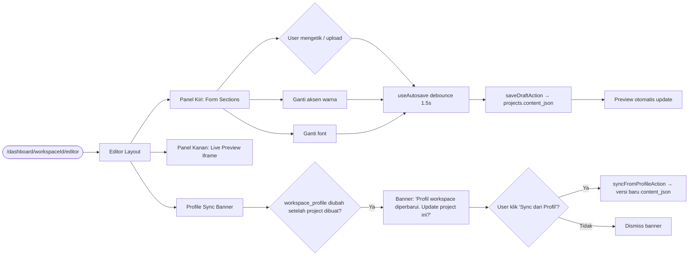
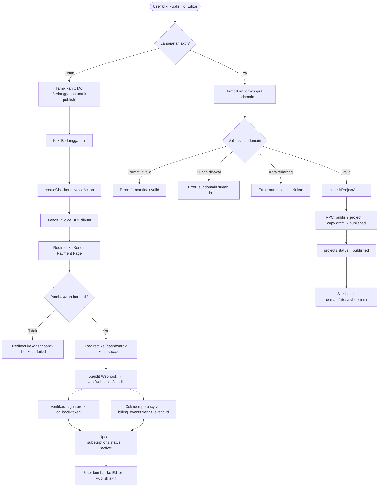
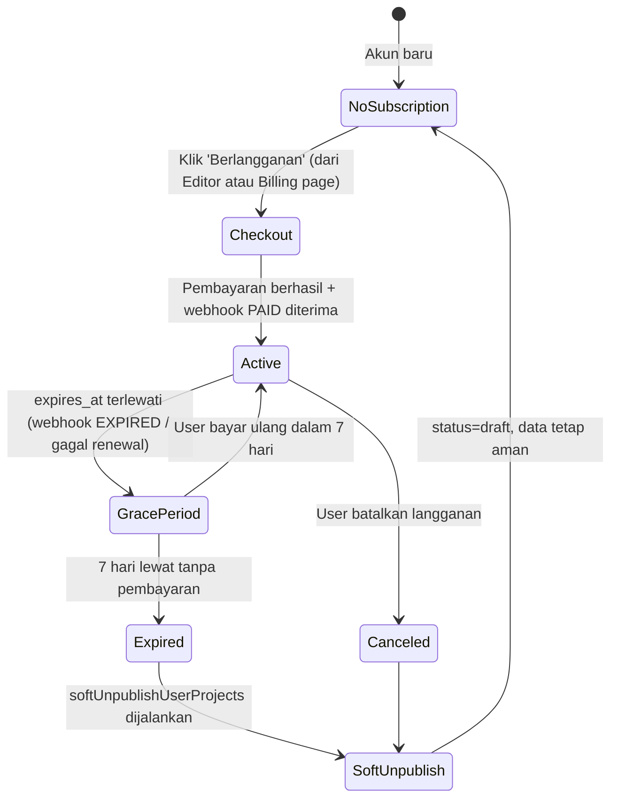
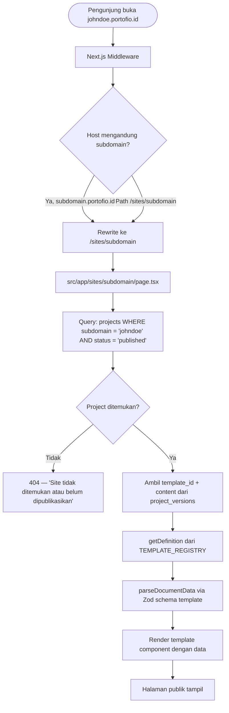
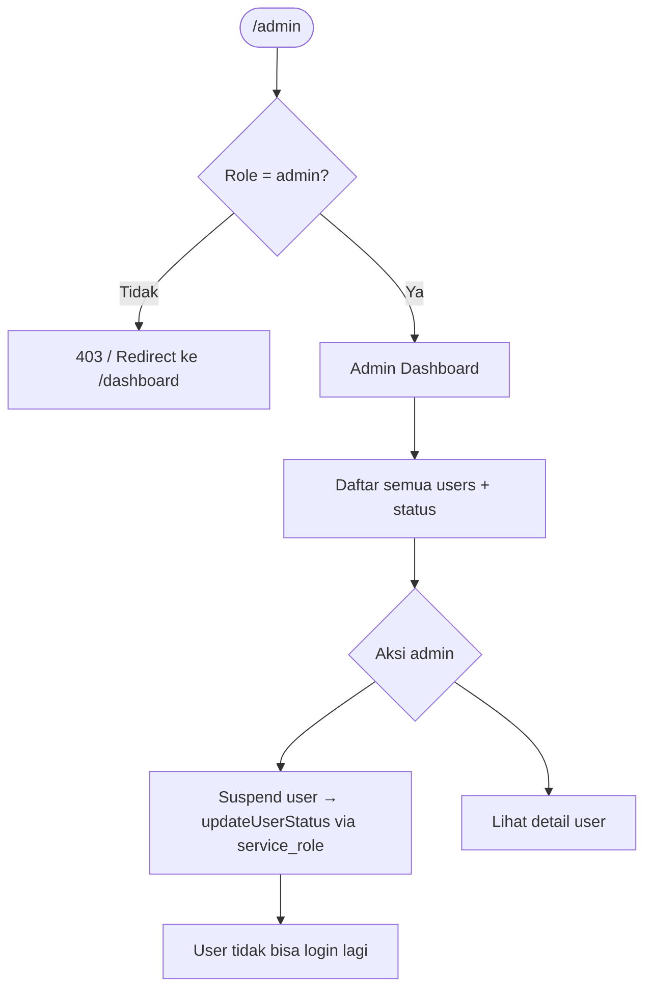

# FLOW.md — Portofio SaaS User Flows

**Versi**: 1.0
**Tanggal**: 2026-07-31
**Disusun berdasarkan**: PRD v1.6, codebase aktual, feature_list.json

Dokumen ini mendefinisikan **semua alur pengguna** (user flows) yang diimplementasikan maupun direncanakan dalam platform Portofio. Gunakan sebagai acuan pengembangan, QA, dan onboarding developer baru.

---

## Daftar Isi

1. [Flow 1: Visitor → Landing Page](#flow-1-visitor--landing-page)
2. [Flow 2: Onboarding → Registrasi & Konfirmasi Email](#flow-2-onboarding--registrasi--konfirmasi-email)
3. [Flow 3: Pilih Template → Buat Project Pertama](#flow-3-pilih-template--buat-project-pertama)
4. [Flow 4: Editor → Isi Data → Live Preview → Autosave](#flow-4-editor--isi-data--live-preview--autosave)
5. [Flow 5: Publish → Xendit Checkout → Site Live](#flow-5-publish--xendit-checkout--site-live)
6. [Flow 6: Dashboard → Kelola Project](#flow-6-dashboard--kelola-project)
7. [Flow 7: Billing & Subscription Lifecycle](#flow-7-billing--subscription-lifecycle)
8. [Flow 8: Akses Site Publik (Multi-Tenant)](#flow-8-akses-site-publik-multi-tenant)
9. [Flow 9: Admin Panel](#flow-9-admin-panel)
10. [Flow 10: Reset Password](#flow-10-reset-password)

---

## Flow 1: Visitor → Landing Page

**Aktor**: Visitor (belum punya akun)  
**Entry point**: `https://portofio.id` atau `http://localhost:3000/id`  
**Route**: `src/app/[locale]/page.tsx` → `src/components/landing/LandingPage.tsx`

```mermaid
flowchart TD
    A([Visitor buka portofio.id]) --> B[Landing Page]
    B --> C{Scroll / Klik}
    C --> D[Hero — CTA: Mulai Gratis]
    C --> E[Template Showcase — Preview template]
    C --> F[Pricing — Lihat harga]
    C --> G[Testimonials / FAQ]
    D --> H[/signup]
    E --> E1{Template diklik?}
    E1 -- Ya --> E2[Preview full-screen modal]
    E2 --> E3{Klik 'Gunakan Template'?}
    E3 -- Ya --> H2[/signup?templateId=minimal]
    E3 -- Tidak --> E2
    E1 -- Tidak --> E
    F --> H
    B --> I{Sudah login?}
    I -- Ya --> J[/dashboard]
    I -- Tidak --> B
```

**Komponen kunci:**
- `src/components/landing/Hero.tsx` — CTA utama
- `src/components/landing/TemplateShowcase.tsx` — preview modal + "Gunakan Template" CTA
- `src/components/landing/PricingPlans.tsx` — pricing display
- `src/components/landing/Navbar.tsx` — deteksi session, link ke `/login` jika belum login

**State/Cookie:**
- Klik "Gunakan Template" di landing page → navigasi ke `/signup?templateId={id}` (query param)
- Setelah signup + workspace pertama dibuat → `preferredTemplateId` cookie dibersihkan

---

## Flow 2: Onboarding → Registrasi & Konfirmasi Email

**Aktor**: Visitor baru  
**Entry point**: `/signup`  
**Routes**: `src/app/[locale]/signup/page.tsx` → `src/lib/auth/actions.ts`

```mermaid
flowchart TD
    A([/signup]) --> B[Isi Form: email + password]
    B --> C[Submit → signUpAction]
    C --> D{Supabase Auth}
    D -- Error rate limit --> E[Tampilkan pesan 'Terlalu banyak percobaan']
    D -- Email sudah dipakai --> F[Tampilkan pesan 'Email sudah terdaftar']
    D -- Sukses --> G[Tampilkan: 'Cek email Anda']
    G --> H[Klik link konfirmasi di email]
    H --> I[/auth/confirm?token_hash=...&type=signup]
    I --> J{verifyOtp berhasil?}
    J -- Tidak --> K[/login?error=confirm_failed]
    J -- Ya --> L[/dashboard?confirmed=1]
    L --> M{Ada preferredTemplateId cookie?}
    M -- Ya --> N[Dashboard: form buat project dengan template pre-selected]
    M -- Tidak --> O[Dashboard: empty state + CTA 'Buat project baru']
```

**Komponen kunci:**
- `src/app/[locale]/signup/page.tsx` — form signup
- `src/app/auth/confirm/route.ts` — verifikasi token hash dari email
- `src/lib/auth/actions.ts` — `signUpAction`, `signInAction`

**Syarat Supabase Dashboard:**
- Email template "Confirm Signup" harus mengarah ke:
  `{{ .SiteURL }}/auth/confirm?token_hash={{ .TokenHash }}&type=signup&next=/dashboard`
- "Site URL" di Supabase Authentication → URL Configuration harus sesuai domain

---

## Flow 3: Pilih Template → Buat Project Pertama

**Aktor**: User yang baru login (belum punya project)  
**Entry point**: `/dashboard` (empty state) atau `/dashboard/templates`  
**Routes**: `src/app/[locale]/dashboard/page.tsx`, `src/app/[locale]/dashboard/templates/page.tsx`

```mermaid
flowchart TD
    A([Dashboard kosong]) --> B{preferredTemplateId ada?}
    B -- Ya --> C[Form buat project + template pre-selected tampil di-center]
    B -- Tidak --> D[Empty state: 'Belum ada project']
    D --> E[Klik 'New Project']
    E --> F[/dashboard/templates — Template Gallery]
    F --> G[Browse 8 template tersedia]
    G --> H{Klik template card}
    H --> H1[Preview full-screen modal]
    H1 --> I{Klik 'Gunakan Template'}
    I --> J[Form: input nama project]
    J --> K[Submit → createWorkspaceAction]
    K --> L{Validasi nama}
    L -- Kosong/duplikat --> M[Tampilkan error]
    L -- Valid --> N[Insert ke workspaces + projects DB]
    N --> O[Redirect ke /dashboard/workspaceId/editor]
    C --> K
```

**Template yang tersedia (TEMPLATE_REGISTRY):**

| ID | Nama | Karakter |
|---|---|---|
| `minimal` | Minimal | Putih bersih, serif, satu kolom |
| `bold` | Bold | Aksen kuat, heading besar |
| `creative` | Creative | Grid project menonjol |
| `corporate` | Corporate | Formal, timeline pengalaman |
| `dark` | Dark | Gelap, aksen neon, developer |
| `studio` | Vanguard Studio | Agency-tier, bento grid, glassmorphism |
| `portfolio-pro` | Portfolio Pro | Lengkap: case study, sertifikat, gallery |
| `freelancer` | Freelancer | Testimonial, pricing plan, clean |

**Komponen kunci:**
- `src/components/dashboard/TemplateGallery.tsx` — gallery 8 template
- `src/components/workspace/CreateWorkspaceForm.tsx` — form buat workspace/project
- `src/lib/workspace/actions.ts` — `createWorkspaceAction`

---

## Flow 4: Editor → Isi Data → Live Preview → Autosave

**Aktor**: User yang sudah punya project  
**Entry point**: `/dashboard/{workspaceId}/editor`  
**Route**: `src/app/[locale]/dashboard/[workspaceId]/editor/page.tsx`



**Sections yang tersedia di form (berdasarkan template):**

| Section | Template |
|---|---|
| Profile (nama, headline, bio, foto) | Semua |
| Experience (riwayat kerja) | Semua |
| Education (pendidikan) | Semua |
| Skills | Semua |
| Projects/Karya | Semua |
| Contact | Semua |
| Social Media | Semua |
| Hero / Studio Intro | `studio` |
| Expertise Areas | `studio` |
| Testimonials (Studio) | `studio` |
| Hero badges / CV URL | `portfolio-pro` |
| About paragraphs | `portfolio-pro` |
| Case Studies | `portfolio-pro` |
| Certificates | `portfolio-pro` |
| Gallery | `portfolio-pro` |
| Pricing Plans | `freelancer` |
| Testimonials (Freelancer) | `freelancer` |

**Komponen kunci:**
- `src/components/dashboard/Editor.tsx` — komponen utama editor
- `src/hooks/useAutosave.ts` — debounced auto-save 1.5s
- `src/lib/projects/actions.ts` — `saveDraftAction`, `syncFromProfileAction`
- `src/templates/registry.tsx` — `PreviewTemplateRenderer`

---

## Flow 5: Publish → Xendit Checkout → Site Live

**Aktor**: User yang ingin mempublikasikan project  
**Entry point**: Panel Publish di dalam Editor



**Validasi subdomain & kuota publish:**
- Format: `^[a-z0-9-]{3,63}$`
- Tidak boleh ada di `subdomain_blocklist` (38 kata terlarang: admin, api, www, dll.)
- Harus unik di tabel `projects`
- **Batas 1 website publish per akun**: Pengguna hanya dapat mempublikasikan maksimal 1 project/website secara aktif. Jika pengguna mencoba mem-publish project kedua tanpa meng-unpublish project pertama, sistem mengembalikan error: `"Anda hanya dapat mempublikasikan 1 website per akun. Mohon unpublish website Anda yang lain terlebih dahulu."`

**Komponen kunci:**
- `src/components/dashboard/Editor.tsx` — Publish Panel (inline di editor)
- `src/lib/projects/actions.ts` — `publishProjectAction`, `unpublishProjectAction`
- `src/app/api/webhooks/xendit/route.ts` — Xendit webhook handler
- `src/lib/billing/xendit.ts` — `createXenditInvoice`, `verifyXenditWebhookSignature`

---

## Flow 6: Dashboard → Kelola Project

**Aktor**: User yang sudah login  
**Entry point**: `/dashboard`

```mermaid
flowchart TD
    A([/dashboard]) --> B[DashboardClientView]
    B --> C[Daftar project cards]
    C --> D{Status project}
    D -- Published --> E[Badge hijau 'Live' + link 'Lihat site ↗']
    D -- Draft --> F[Badge abu 'Draft']
    C --> G[Klik card → /dashboard/workspaceId/editor]
    C --> H[Klik ⋮ menu pada card]
    H --> I{Pilihan menu}
    I --> J[Unpublish site → unpublishWorkspaceProjectAction]
    I --> K[Delete project → deleteWorkspaceAction + confirm dialog]
    B --> L[Search bar → filter project by name]
    B --> M[Sort toggle: Last viewed / Name]
    B --> N[Klik 'Create new project' → /dashboard/templates]
    B --> O[Sidebar nav: Projects | Templates | Billing]
```

**URL Site:**  
Format yang dipakai (mendukung deployment Vercel tanpa wildcard DNS):
```
{NEXT_PUBLIC_ROOT_DOMAIN}/sites/{subdomain}
```
Contoh: `https://portofio.id/sites/johndoe`  
Produksi dengan wildcard DNS: `https://johndoe.portofio.id`

**Komponen kunci:**
- `src/components/dashboard/DashboardClientView.tsx`
- `src/components/dashboard/DashboardSidebar.tsx`
- `src/lib/workspace/actions.ts` — `unpublishWorkspaceProjectAction`, `deleteWorkspaceAction`

---

## Flow 7: Billing & Subscription Lifecycle

**Aktor**: User berlangganan  
**Entry point**: `/dashboard/billing`



**Webhook Events yang ditangani (`/api/webhooks/xendit`):**

| Event | Aksi |
|---|---|
| `PAID` | Set `status = 'active'`, update `expires_at` |
| `EXPIRED` | Set `status = 'grace_period'` |
| `invoice.paid` | Sama dengan `PAID` |
| Lainnya | Log ke `billing_events`, skip |

**Grace Period:**
- Durasi: **7 hari** setelah `expires_at`
- Selama grace period: site tetap live, user dapat notifikasi
- Setelah grace period: `softUnpublishUserProjects` → semua project `status = 'draft'`
- Data portofolio **tidak dihapus**, user bisa re-subscribe dan republish

**Billing page (`/dashboard/billing`) menampilkan:**
- Status langganan saat ini (Active / Grace Period / Expired / No Subscription)
- Tanggal perpanjangan atau tanggal berakhir
- Tombol "Berlangganan" atau "Perpanjang" jika tidak aktif
- Peringatan jika dalam grace period (berapa hari tersisa)

**Komponen kunci:**
- `src/app/[locale]/dashboard/billing/page.tsx`
- `src/components/dashboard/BillingClientView.tsx`
- `src/lib/billing/subscription.ts` — `getSubscriptionState()`
- `src/lib/billing/actions.ts` — `createCheckoutInvoiceAction`, `getSubscriptionStatusAction`
- `src/lib/billing/unpublish.ts` — `softUnpublishUserProjects`

---

## Flow 8: Akses Site Publik (Multi-Tenant)

**Aktor**: Pengunjung umum (tidak perlu login)  
**Entry point**: `{subdomain}.portofio.id` atau `portofio.id/sites/{subdomain}`



**Cache/Performance:**
- Dynamic rendering per request (tidak ada build statis per user)
- Revalidasi via ISR atau edge cache jika diperlukan
- Render server-side → SEO-friendly, crawlable

**Middleware (Next.js):**
- File: `src/middleware.ts`
- Wildcard DNS lokal: `*.localhost:3000` di-resolve secara native oleh browser modern
- Fallback testing: `/sites/{subdomain}` path (aktif, digunakan di Vercel free tier)

**Komponen kunci:**
- `src/middleware.ts` — subdomain rewrite + route protection
- `src/app/sites/[subdomain]/page.tsx` — public site renderer
- `src/templates/registry.tsx` — `getDefinition()`, `TemplateRenderer`

---

## Flow 9: Admin Panel

**Aktor**: User dengan `role = 'admin'` (set via Supabase `profiles` table)  
**Entry point**: `/admin`  
**Proteksi**: Middleware RBAC di `src/middleware.ts` → `requireRole('admin')`



**Custom Claims (JWT):**
- Edge Function `supabase/functions/custom-claims/index.ts` — setiap login/refresh, inject `role` dari `profiles` ke `app_metadata` JWT
- RLS policies memakai `auth.jwt() -> 'app_metadata' ->> 'role'` untuk cek admin tanpa query tambahan

**Komponen kunci:**
- `src/app/[locale]/admin/` — admin routes
- `src/lib/auth/roles.ts` — `requireRole()` utility
- `src/components/admin/` — AdminSidebar, SuspendUserButton
- `src/lib/supabase/` — service_role client untuk admin operations

---

## Flow 10: Reset Password

**Aktor**: User yang lupa password  
**Entry point**: `/forgot-password`

```mermaid
flowchart TD
    A([/forgot-password]) --> B[Isi email]
    B --> C[requestPasswordResetAction]
    C --> D[Supabase kirim email reset password]
    D --> E[Klik link di email → /auth/confirm?token_hash=...&type=recovery]
    E --> F[verifyOtp sukses]
    F --> G[/reset-password]
    G --> H[Isi password baru]
    H --> I[updatePasswordAction]
    I --> J[Password berhasil diubah]
    J --> K[Redirect ke /login?reset=success]
```

**Syarat Supabase Dashboard:**
- Email template "Reset Password" harus mengarah ke:  
  `{{ .SiteURL }}/auth/confirm?token_hash={{ .TokenHash }}&type=recovery&next=/reset-password`

**Komponen kunci:**
- `src/app/[locale]/forgot-password/page.tsx`
- `src/app/[locale]/reset-password/page.tsx`
- `src/app/auth/confirm/route.ts`
- `src/lib/auth/actions.ts` — `requestPasswordResetAction`, `updatePasswordAction`

---

## Ringkasan Route Map

| URL | Auth | Deskripsi |
|---|---|---|
| `/` atau `/id` | Publik | Marketing landing page |
| `/id/login` | Publik | Login |
| `/id/signup` | Publik | Registrasi |
| `/id/forgot-password` | Publik | Request reset password |
| `/id/reset-password` | Publik | Set password baru |
| `/id/templates` | Publik | Template gallery (unauthenticated) |
| `/id/dashboard` | Auth | Daftar project user |
| `/id/dashboard/templates` | Auth | Template gallery (authenticated) |
| `/id/dashboard/billing` | Auth | Status langganan & checkout |
| `/id/dashboard/{id}/editor` | Auth | Editor portfolio |
| `/admin` | Admin | Panel admin |
| `/sites/{subdomain}` | Publik | Site publik hasil publish |
| `/auth/confirm` | Publik | Callback verifikasi email |
| `/api/webhooks/xendit` | Service | Xendit webhook receiver |

---

## Status Implementasi

| Flow | Status | Catatan |
|---|---|---|
| Flow 1: Landing Page | ✅ Selesai | |
| Flow 2: Onboarding & Email | ✅ Selesai | Email template di Supabase perlu dikonfigurasi manual |
| Flow 3: Pilih Template & Buat Project | ✅ Selesai | 8 template tersedia |
| Flow 4: Editor & Autosave | ✅ Selesai | |
| Flow 5: Publish & Xendit | ✅ Selesai | Perlu XENDIT_SECRET_KEY & XENDIT_WEBHOOK_TOKEN di .env |
| Flow 6: Dashboard Kelola Project | ✅ Selesai | |
| Flow 7: Billing Lifecycle | ✅ Selesai | Termasuk billing page `/dashboard/billing` |
| Flow 8: Site Publik | ✅ Selesai | |
| Flow 9: Admin Panel | ✅ Selesai | |
| Flow 10: Reset Password | ✅ Selesai | |

---

> Dokumen ini di-maintain seiring dengan perubahan codebase. Jika menambahkan route baru atau alur baru, selalu update bagian **Ringkasan Route Map** dan **Status Implementasi**.
