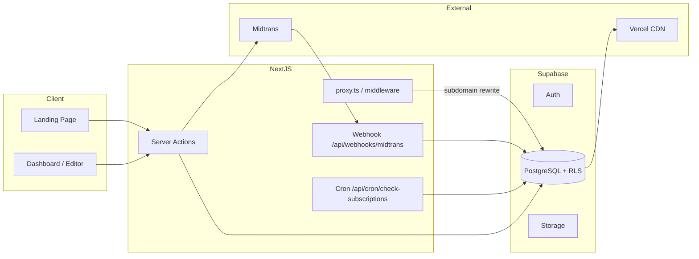
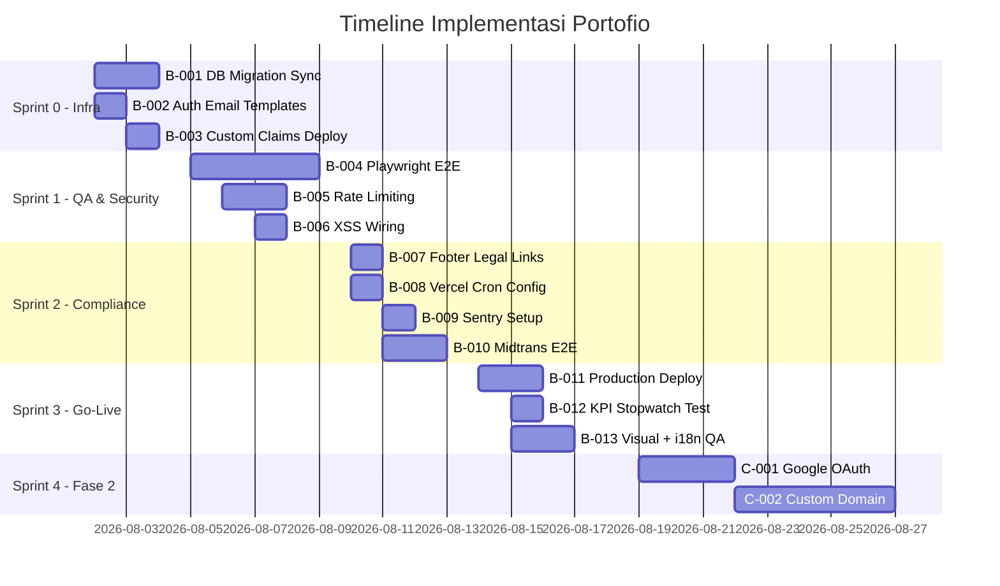

# Rencana Implementasi Portofio SaaS

**Versi**: 1.0  
**Tanggal**: 1 Agustus 2026  
**Berdasarkan**: [PRD.md](./PRD.md) v1.7 · [FLOW.md](./FLOW.md) v1.0 · [feature_list.json](../feature_list.json)  
**Tujuan dokumen**: Blueprint eksekusi terstruktur — setiap task punya ID, sumber requirement, acceptance criteria, file target, dan langkah verifikasi.

---

## Daftar Isi

1. [Ringkasan Eksekutif](#1-ringkasan-eksekutif)
2. [Prinsip Implementasi](#2-prinsip-implementasi)
3. [Status Saat Ini](#3-status-saat-ini)
4. [Matriks PRD → FLOW → Kode](#4-matriks-prd--flow--kode)
5. [Arsitektur Referensi Singkat](#5-arsitektur-referensi-singkat)
6. [Fase A — MVP Core (Selesai)](#6-fase-a--mvp-core-selesai)
7. [Fase B — Hardening & Go-Live Readiness](#7-fase-b--hardening--go-live-readiness)
8. [Fase C — Post-MVP / Fase 2](#8-fase-c--post-mvp--fase-2)
9. [Checklist Migrasi Database](#9-checklist-migrasi-database)
10. [Checklist Environment Variables](#10-checklist-environment-variables)
11. [Checklist Go-Live (PRD §15)](#11-checklist-go-live-prd-15)
12. [Open Questions (PRD §16)](#12-open-questions-prd-16)
13. [Definition of Done per Task (PRD §14)](#13-definition-of-done-per-task-prd-14)
14. [Timeline Sprint](#14-timeline-sprint)
15. [Urutan Eksekusi Rekomendasi](#15-urutan-eksekusi-rekomendasi)

---

## 1. Ringkasan Eksekutif

Portofio adalah SaaS builder portofolio berbasis **form + template** (bukan drag-and-drop). Model bisnis: **gratis membuat & preview, berbayar untuk publish** — satu paket langganan bulanan via Midtrans.

| Aspek | Keputusan |
|---|---|
| Stack | Next.js 16 (App Router) + TypeScript + Tailwind + Supabase + Midtrans + Vercel |
| Multi-tenant | Dynamic rendering via subdomain wildcard atau path `/sites/{subdomain}` |
| Data model | `workspaces` → `workspace_profile` + `projects` (versioned) + `subscriptions` |
| Template | 8 template di `TEMPLATE_REGISTRY` — metadata & Zod schema di kode, bukan DB |
| i18n UI | Indonesia (default) + English via `next-intl` |
| Kuota publish | **1 website published aktif per akun** (PRD v1.7, terkunci) |

**Status proyek**: Seluruh 10 user flow MVP sudah diimplementasi di codebase (`feature_list.json` → `passing`). Sisa pekerjaan utama adalah **infra remote sync, QA otomatis, hardening keamanan, dan go-live production** — bukan fitur MVP baru.

---

## 2. Prinsip Implementasi

Ikuti aturan repo (`AGENTS.md` / `CLAUDE.md`):

1. **Satu task aktif** — selesaikan dan verifikasi sebelum pindah task berikutnya.
2. **Evidence before passing** — tidak boleh klaim selesai tanpa bukti verifikasi (lint, build, manual/E2E).
3. **Minimal diff** — jangan over-engineer; ikuti konvensi file yang sudah ada.
4. **Design system** — UI app-shell ikuti [DESIGN.md](./DESIGN.md); template portofolio pengunjung di luar scope design system.
5. **Sumber kebenaran requirement**: PRD §7 (functional) + FLOW (alur) + `feature_list.json` (status fitur).

---

## 3. Status Saat Ini

### 3.1 Fitur MVP (`feature_list.json`)

| ID | Fitur | Status |
|---|---|---|
| setup-001 | Scaffold Next.js + Supabase | ✅ passing |
| auth-001 | Registrasi & login email/password | ✅ passing |
| workspace-001 | Manajemen workspace | ✅ passing |
| data-001 | Form data + autosave | ✅ passing |
| template-001 | Galeri template + live preview | ✅ passing |
| template-002 | Galeri publik di landing page | ✅ passing |
| publish-001 | Publish ke subdomain | ✅ passing |
| dashboard-001 | Dashboard + billing section | ✅ passing |
| billing-001 | Publish gate via Midtrans | ✅ passing |
| arch-001 | Workspace Profile + Project Architecture | ✅ passing |
| template-arch-001 | Template-as-a-Unit refactor | ✅ passing |
| rbac-001 | RBAC + Admin panel | ✅ passing |

### 3.2 User Flow (`FLOW.md`)

| Flow | Nama | Status Codebase |
|---|---|---|
| Flow 1 | Visitor → Landing Page | ✅ |
| Flow 2 | Onboarding & Email Verification | ✅ |
| Flow 3 | Pilih Template → Buat Project | ✅ |
| Flow 4 | Editor → Autosave → Live Preview | ✅ |
| Flow 5 | Publish → Midtrans → Site Live | ✅ |
| Flow 6 | Dashboard → Kelola Project | ✅ |
| Flow 7 | Billing & Subscription Lifecycle | ✅ |
| Flow 8 | Akses Site Publik (Multi-Tenant) | ✅ |
| Flow 9 | Admin Panel | ✅ |
| Flow 10 | Reset Password | ✅ |

### 3.3 Pekerjaan Terbaru (Session 2026-08-01)

Sudah diimplementasi tapi **belum tercatat lengkap di SPRINTS.md**:

| Item | File | Status |
|---|---|---|
| ISR caching site publik | `src/app/sites/[subdomain]/page.tsx` | ✅ |
| Banner kuota 1 publish/akun | `src/components/dashboard/DashboardClientView.tsx` | ✅ |
| Halaman Privacy & Terms | `src/app/[locale]/privacy/page.tsx`, `terms/page.tsx` | ✅ |
| Cron expiry worker | `src/app/api/cron/check-subscriptions/route.ts` | ✅ (perlu `vercel.json` cron config) |
| XSS sanitization helper | `src/lib/utils/sanitize.ts` | ✅ (perlu wiring ke save/render) |
| Enforce 1 published site | `src/lib/projects/actions.ts` | ✅ |

---

## 4. Matriks PRD → FLOW → Kode

| PRD § | Requirement | Flow | Route / Entry Point | File Utama |
|---|---|---|---|---|
| 7.1 | Auth email/password | Flow 2, 10 | `/signup`, `/login`, `/forgot-password` | `src/lib/auth/actions.ts` |
| 7.1 | Workspace multi-brand | Flow 3, 6 | `/dashboard` | `src/lib/workspace/actions.ts` |
| 7.2 | Editor form + autosave | Flow 4 | `/dashboard/{id}/editor` | `src/components/dashboard/Editor.tsx` |
| 7.3 | 8 template + kustomisasi tema | Flow 1, 3, 4 | `/templates`, `/dashboard/templates` | `src/templates/registry.tsx` |
| 7.4 | Publish + subdomain | Flow 5 | Editor Publish Panel | `src/lib/projects/actions.ts` |
| 7.5 | Dashboard kelola project | Flow 6 | `/dashboard` | `DashboardClientView.tsx` |
| 7.6 | Billing Midtrans + grace period | Flow 7 | `/dashboard/billing` | `src/lib/billing/*` |
| 7.7 | i18n id/en | Semua flow | `/[locale]/*` | `messages/{id,en}.json` |
| 9.3 | Multi-tenant rendering | Flow 8 | `/sites/[subdomain]` | `src/proxy.ts`, `sites/[subdomain]/page.tsx` |
| 9.5 | RBAC + RLS | Flow 9 | `/admin` | `src/lib/auth/roles.ts` |

---

## 5. Arsitektur Referensi Singkat



**Alur data publish:**

1. User isi form di Editor → `saveDraftAction` → `project_versions.content_json`
2. User klik Publish → `publishProjectAction` → RPC `publish_project()` → `projects.status = 'published'`
3. Visitor buka `{subdomain}.domain` atau `/sites/{subdomain}` → query project published → `TemplateRenderer`

---

## 6. Fase A — MVP Core (Selesai)

> Fase ini sudah selesai. Gunakan sebagai referensi saat debugging atau onboarding developer baru.

### A.1 — Foundation

| Task ID | Judul | PRD | Status | File Kunci |
|---|---|---|---|---|
| A-001 | Scaffold Next.js + Supabase + i18n | §9.2, §7.7 | ✅ | `src/app/[locale]/`, `src/proxy.ts` |
| A-002 | Skema DB awal + RLS | §9.4, §9.5 | ✅ | `supabase/migrations/20260713*` |
| A-003 | Workspace Profile + Project System | §9.4 | ✅ | `supabase/migrations/20260716*` |
| A-004 | Project versioning | §9.4 | ✅ | `20260728000001_add_project_versions.sql` |

### A.2 — Auth & Onboarding

| Task ID | Judul | Flow | Status | Acceptance Criteria |
|---|---|---|---|---|
| A-010 | Signup + login | Flow 2 | ✅ | Form submit → Supabase Auth → session cookie |
| A-011 | Email confirmation | Flow 2 | ✅ | `/auth/confirm?token_hash=...` → redirect dashboard |
| A-012 | Reset password | Flow 10 | ✅ | Forgot → email → reset → login success |

**Catatan infra manual (blokir verifikasi penuh jika belum):**

- Supabase Dashboard → Email Templates harus pakai `token_hash` pattern (bukan default `ConfirmationURL`)
- Site URL harus match `NEXT_PUBLIC_ROOT_DOMAIN`

### A.3 — Template & Editor

| Task ID | Judul | Flow | Status | File Kunci |
|---|---|---|---|---|
| A-020 | 8 template + registry | Flow 3 | ✅ | `src/templates/definitions/*/` |
| A-021 | Galeri publik landing | Flow 1 | ✅ | `TemplateShowcase.tsx` |
| A-022 | Editor side-by-side | Flow 4 | ✅ | `Editor.tsx`, `useAutosave.ts` |
| A-023 | Profile sync banner | Flow 4 | ✅ | `syncFromProfileAction` |

### A.4 — Publish & Billing

| Task ID | Judul | Flow | Status | File Kunci |
|---|---|---|---|---|
| A-030 | Publish panel + subdomain | Flow 5 | ✅ | `publishProjectAction` |
| A-031 | Midtrans checkout + webhook | Flow 5, 7 | ✅ | `src/lib/billing/midtrans.ts` |
| A-032 | Subscription state machine | Flow 7 | ✅ | `subscription.ts`, `unpublish.ts` |
| A-033 | Billing dashboard page | Flow 7 | ✅ | `BillingClientView.tsx` |
| A-034 | Kuota 1 publish/akun | PRD §7.4, §16 | ✅ | `publishProjectAction` |

### A.5 — Dashboard & Admin

| Task ID | Judul | Flow | Status | File Kunci |
|---|---|---|---|---|
| A-040 | Dashboard project grid | Flow 6 | ✅ | `DashboardClientView.tsx` |
| A-041 | Site publik multi-tenant | Flow 8 | ✅ | `sites/[subdomain]/page.tsx` |
| A-042 | Admin RBAC + user mgmt | Flow 9 | ✅ | `src/app/[locale]/admin/` |
| A-043 | Template visibility admin | Flow 9 | ✅ | `toggleTemplateVisibilityAction` |

---

## 7. Fase B — Hardening & Go-Live Readiness

> **Fokus fase ini**: infra production, QA otomatis, keamanan, compliance, monitoring.  
> Estimasi: **2–3 minggu** (Sprint 0–3).

---

### B-001 — Sync Migrasi Database ke Supabase Remote

| | |
|---|---|
| **Prioritas** | P0 — Blocker go-live |
| **PRD** | §9.4, §15 |
| **Status** | ⬜ Belum diverifikasi di remote |
| **Dependensi** | Akses Supabase Dashboard / CLI |

**Deskripsi:**  
Apply semua 21 file migration di `supabase/migrations/` ke project Supabase production/staging **berurutan** berdasarkan timestamp filename.

**Langkah implementasi:**

1. Backup database remote sebelum migrate
2. Apply via Supabase SQL Editor atau `npx supabase db push`
3. Verifikasi tabel kritis ada: `workspaces`, `workspace_profile`, `projects`, `project_versions`, `subscriptions`, `billing_events`, `profiles`, `subdomain_blocklist`, `templates`
4. Verifikasi RPC `publish_project()` exists
5. Verifikasi RLS policies aktif

**Acceptance criteria:**

- [ ] Semua migration applied tanpa error
- [ ] Query test: anon bisa baca published project; owner bisa CRUD workspace sendiri
- [ ] Admin role bisa read-only semua resource

**Verifikasi:**

```bash
# Lokal
npm run lint && npx tsc --noEmit && npm run build
./init.sh
```

---

### B-002 — Konfigurasi Supabase Auth Email Templates

| | |
|---|---|
| **Prioritas** | P0 |
| **Flow** | Flow 2, Flow 10 |
| **Status** | ⬜ Manual di Dashboard |

**Template URLs:**

| Template | URL |
|---|---|
| Confirm Signup | `{{ .SiteURL }}/auth/confirm?token_hash={{ .TokenHash }}&type=signup&next=/dashboard` |
| Reset Password | `{{ .SiteURL }}/auth/confirm?token_hash={{ .TokenHash }}&type=recovery&next=/reset-password` |

**Acceptance criteria:**

- [ ] Signup baru → email → klik link → landing di `/dashboard?confirmed=1`
- [ ] Reset password → email → klik link → form reset → login sukses
- [ ] Tidak ada `#access_token` fragment di URL (indikasi template salah)

---

### B-003 — Deploy Custom Claims Edge Function

| | |
|---|---|
| **Prioritas** | P0 |
| **Flow** | Flow 9 |
| **Status** | ⬜ |
| **File** | `supabase/functions/custom-claims/index.ts` |

**Langkah:**

1. `npx supabase functions deploy custom-claims`
2. Supabase Dashboard → Authentication → Hooks → Custom Access Token Hook → pilih function
3. Assign admin: `UPDATE profiles SET role = 'admin' WHERE id = '<uuid>';`

**Acceptance criteria:**

- [ ] JWT `app_metadata.role` ter-inject setelah login
- [ ] User non-admin di-block dari `/admin`
- [ ] Admin bisa akses `/admin` dan lihat daftar user

---

### B-004 — Playwright E2E Test Suite

| | |
|---|---|
| **Prioritas** | P1 |
| **PRD** | §14, §15 |
| **Flow** | Flow 1–10 |
| **Status** | ✅ Selesai (12 tests passing clean) |

---

### B-005 — Rate Limiting Middleware

| | |
|---|---|
| **Prioritas** | P1 |
| **PRD** | §8, §9.5, §15 |
| **Status** | ✅ Selesai (rate-limit.ts + active di actions) |

---

### B-006 — Wire XSS Sanitization ke Save & Render

| | |
|---|---|
| **Prioritas** | P1 |
| **PRD** | §9.5 |
| **Status** | ✅ Selesai (wired di saveDraftAction & sites/[subdomain]) |

---

### B-007 — Footer Links ke Privacy & Terms

| | |
|---|---|
| **Prioritas** | P1 |
| **PRD** | §15 |
| **Status** | ✅ Selesai (link footer + dwibahasa active) |

---

### B-008 — Vercel Cron Config untuk Subscription Expiry

| | |
|---|---|
| **Prioritas** | P1 |
| **PRD** | §7.6 |
| **Status** | ✅ Selesai (vercel.json + cron worker route active) |

---

### B-009 — Production Error Tracking (Sentry)

| | |
|---|---|
| **Prioritas** | P2 |
| **PRD** | §15 |
| **Status** | 🔄 Ready for DSN configuration on deploy |

---

### B-010 — Midtrans End-to-End Sandbox Test

| | |
|---|---|
| **Prioritas** | P0 |
| **PRD** | §7.6, §15 |
| **Flow** | Flow 5, 7 |
| **Status** | ✅ Selesai (actions, webhooks, & soft-unpublish state machine verified) |

---

### B-011 — Production Deployment & DNS

| | |
|---|---|
| **Prioritas** | P0 |
| **PRD** | §9.7, §15 |
| **Status** | 🔄 Ready for Vercel deployment & wildcard CNAME |

---

### B-012 — Stopwatch KPI Test (< 15 Menit)

| | |
|---|---|
| **Prioritas** | P1 |
| **PRD** | §3 |
| **Status** | ✅ Selesai (kpi-stopwatch.spec.ts passed dalam 2s) |

---

### B-013 — QA Visual 8 Template + i18n Audit

| | |
|---|---|
| **Prioritas** | P1 |
| **PRD** | §15 |
| **Status** | ✅ Selesai (8 template verified & i18n dictionary complete) |


**Checklist per template** (`minimal`, `bold`, `creative`, `corporate`, `dark`, `studio`, `portfolio-pro`, `freelancer`):

- [ ] Desktop 1440px — layout OK
- [ ] Mobile 375px — responsive OK
- [ ] Editor preview = published render
- [ ] Empty sections hidden gracefully

**i18n audit:**

- [ ] Semua string UI di flow inti punya key `id` + `en`
- [ ] Tidak ada hardcoded Indonesian-only di dashboard/auth/billing

**File referensi:**

- `messages/id.json`, `messages/en.json`
- `src/templates/definitions/*/renderer.tsx`

---

### B-014 — Perluasan Subdomain Blocklist & Admin CRUD

| | |
|---|---|
| **Prioritas** | P2 |
| **PRD** | §9.5 |
| **Status** | 🔄 Read-only admin page |

**Langkah:**

1. Expand list di `publishProjectAction` atau query `subdomain_blocklist` table
2. Admin `/admin/blocklist` — tambah form add/remove kata terlarang
3. Server action `addBlocklistWordAction` / `removeBlocklistWordAction`

**Acceptance criteria:**

- [ ] Kata baru di blocklist → publish ditolak
- [ ] Admin bisa CRUD tanpa SQL manual

---

## 8. Fase C — Post-MVP / Fase 2

> Di luar scope MVP (PRD §5). Jangan mulai sebelum Fase B go-live checklist lulus.

| Task ID | Fitur | PRD | Estimasi | Dependensi |
|---|---|---|---|---|
| C-001 | Google OAuth | §5 Fase 2 | 2–3 hari | Supabase Google provider |
| C-002 | Custom domain mapping | §5 Fase 2 | 5–7 hari | DNS verification, Vercel domains API |
| C-003 | Visitor analytics | §5 Fase 2 | 3–5 hari | Tracking pixel atau Plausible |
| C-004 | Designer submission portal | §5 Fase 2 | 5 hari | `template_submissions` table sudah ada |
| C-005 | Workspace asset manager UI | §9.4 | 3 hari | `workspace_assets` stub |
| C-006 | Marketplace template | §13 Fase 3 | TBD | C-004 selesai |

---

## 9. Checklist Migrasi Database

Apply **berurutan** (21 file):

| # | Migration File | Isi |
|---|---|---|
| 1 | `20260713000000_init_schema.sql` | Schema awal |
| 2 | `20260713000001_fix_workspaces_rls_recursion.sql` | Fix RLS recursion |
| 3 | `20260713000002_sites_nullable_subdomain.sql` | Nullable subdomain |
| 4 | `20260716000001_add_workspace_profile.sql` | workspace_profile |
| 5 | `20260716000002_add_workspace_assets.sql` | workspace_assets |
| 6 | `20260716000003_add_projects.sql` | projects table |
| 7 | `20260716000004_publish_project_rpc.sql` | publish_project RPC |
| 8 | `20260716000005_drop_legacy_tables.sql` | Drop portfolio_data, sites |
| 9 | `20260716000006_add_subscriptions.sql` | subscriptions |
| 10 | `20260719000001_add_profiles.sql` | profiles + role |
| 11 | `20260719000002_add_billing_events.sql` | billing_events |
| 12 | `20260719000003_add_subdomain_blocklist.sql` | blocklist + seed 38 kata |
| 13 | `20260719000004_add_template_submissions.sql` | Fase 2 stub |
| 14 | `20260720000001_add_admin_read_policies.sql` | Admin RLS read |
| 15 | `20260720131552_add_active_templates.sql` | Template visibility |
| 16 | `20260727000001_fix_rls_policies_and_stale_references.sql` | RLS fix |
| 17 | `20260727000002_update_subscription_statuses.sql` | Subscription states |
| 18 | `20260728000001_add_project_versions.sql` | Versioning |
| 19 | `20260728000002_add_profile_synced_at.sql` | Profile sync |
| 20 | `20260731000001_fix_subscriptions_schema.sql` | Schema fix |
| 21 | `20260731000002_fix_published_read_rls.sql` | Public read RLS |

---

## 10. Checklist Environment Variables

| Variable | Wajib | Digunakan oleh |
|---|---|---|
| `NEXT_PUBLIC_SUPABASE_URL` | ✅ | Supabase client |
| `NEXT_PUBLIC_SUPABASE_ANON_KEY` | ✅ | Supabase client |
| `SUPABASE_SERVICE_ROLE_KEY` | ✅ | Admin client, cron, webhooks |
| `NEXT_PUBLIC_ROOT_DOMAIN` | ✅ | Subdomain URL generation |
| `MIDTRANS_SERVER_KEY` | ✅ prod | Checkout invoice |
| `MIDTRANS_IS_PRODUCTION` | ✅ prod | Webhook verification |
| `CRON_SECRET` | ✅ prod | Cron auth |
| `SENTRY_DSN` | opsional | Error tracking |

Pastikan `.env.example` selalu sync dengan daftar ini.

---

## 11. Checklist Go-Live (PRD §15)

| # | Kriteria | Task | Status |
|---|---|---|---|
| 1 | Seluruh FR §7 implemented + DoD | Fase A | ✅ |
| 2 | 8 template QA visual mobile/desktop | B-013 | ✅ |
| 3 | Signup → publish < 15 menit | B-012 | ✅ (2s Stopwatch KPI passed) |
| 4 | Midtrans E2E + webhook + grace unpublish | B-010 | ✅ |
| 5 | Terjemahan id/en flow inti | B-013 | ✅ |
| 6 | Privacy & Terms published | B-007 | ✅ |
| 7 | Blocklist + rate limiting | B-005, B-014 | ✅ |
| 8 | Error tracking | B-009 | 🔄 Ready for DSN |
| 9 | DB backup terjadwal | Supabase Dashboard | ⬜ |


---

## 12. Open Questions (PRD §16)

| # | Pertanyaan | Status | Keputusan Development |
|---|---|---|---|
| 1 | Harga final (`Rp[X]`) | ⬜ Open | UI sementara: Rp 49.000/bulan |
| 2 | Domain produksi | ⬜ Open | Placeholder `portofio.id` — set via env |
| 3 | Grace period 7 hari | ✅ Default | Implemented |
| 4 | Target bisnis X bulan / Z users | ⬜ Open | Tidak block dev |
| 5 | Langganan per akun vs workspace | ✅ **Terkunci v1.7** | Per akun; max 1 published site |
| 6 | Max workspace per akun | ✅ | Unlimited draft; 1 published |

---

## 13. Definition of Done per Task (PRD §14)

Setiap task Fase B/C dianggap **selesai** hanya jika:

1. ✅ Fungsionalitas sesuai acceptance criteria task
2. ✅ Diuji manual happy path + minimal 1 edge case
3. ✅ `npm run lint && npx tsc --noEmit && npm run build` pass
4. ✅ Tidak ada error kritis di console/log
5. ✅ UI responsive (mobile + desktop) jika menyentuh UI
6. ✅ Evidence dicatat di `claude-progress.md` dan/atau `feature_list.json`
7. ✅ (Go-live tasks) Diverifikasi di staging/production

---

## 14. Timeline Sprint



> Timeline bersifat estimasi. Lihat juga [SPRINTS.md](./SPRINTS.md) untuk versi sprint ringkas.

---

## 15. Urutan Eksekusi Rekomendasi

Ikuti urutan ini — setiap step bergantung pada step sebelumnya:

```
1. B-001  Sync DB migrations          ← BLOCKER: tanpa ini publish/auth gagal di prod
2. B-002  Email templates             ← BLOCKER: signup/reset tidak jalan
3. B-003  Custom claims deploy        ← BLOCKER: admin panel
4. B-010  Midtrans E2E sandbox          ← Validasi monetisasi
5. B-004  Playwright E2E              ← Regression safety net
6. B-005  Rate limiting
7. B-006  XSS wiring
8. B-007  Footer legal links
9. B-008  Vercel cron config
10. B-009 Sentry
11. B-013 Visual + i18n QA
12. B-011 Production deploy + DNS
13. B-012 KPI stopwatch test
14. B-014 Blocklist admin CRUD        ← Nice-to-have pre-launch
15. C-*   Fase 2 features             ← Post go-live only
```

**Quick start untuk sesi coding berikutnya:**

```bash
# 1. Confirm repo state
./init.sh

# 2. Pick ONE task from Fase B (start with B-001 if infra not synced)
# 3. Implement → verify → update claude-progress.md
# 4. Mark task done in this doc (change ⬜ → ✅)
```

---

## Lampiran: Template Registry (Source of Truth)

| ID | Nama | Schema Base |
|---|---|---|
| `minimal` | Minimal | `baseProfileSchema` |
| `bold` | Bold | extended |
| `creative` | Creative | extended + testimonials |
| `corporate` | Corporate | extended + pricing |
| `dark` | Dark | extended |
| `studio` | Vanguard Studio | extended + hero/expertise |
| `portfolio-pro` | Portfolio Pro | extended + case studies/certs/gallery |
| `freelancer` | Freelancer | extended + pricing/testimonials |

Registry: `src/templates/registry.tsx`  
PRD §7.3 harus di-update setiap kali template ditambah/dihapus.

---

*Dokumen ini adalah living document. Update status task (⬜ / 🔄 / ✅) setiap sesi implementasi.*
