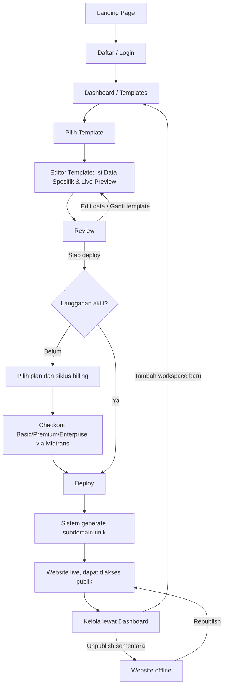
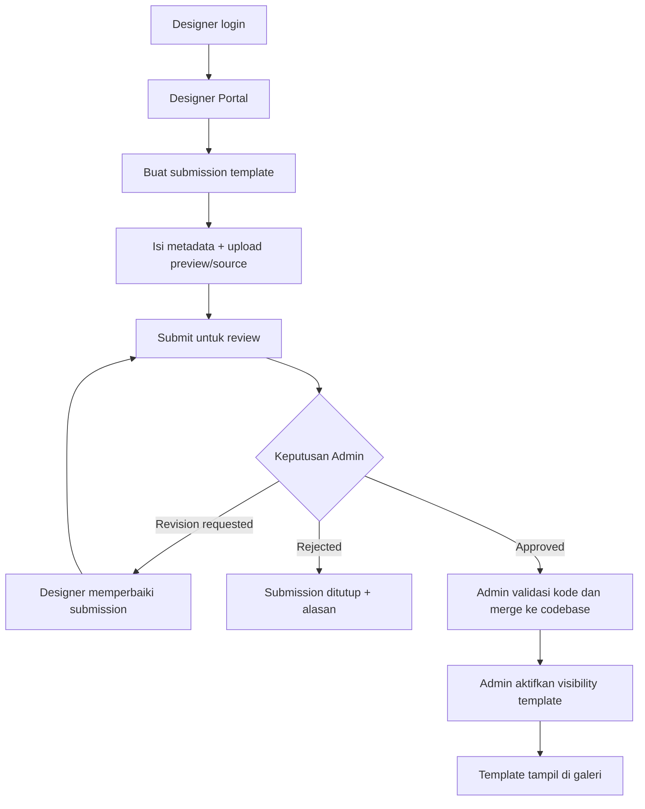
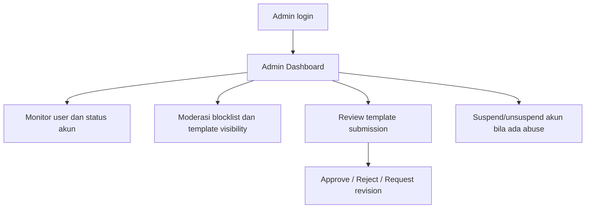

# Product Requirements Document (PRD)
## Portofio - SaaS Portfolio Website Builder

**Versi**: 1.9
**Tanggal**: 11 Agustus 2026
**Disusun oleh**: Maulana Chandra Irawan
**Status**: Baseline produk; MVP role model sudah ditetapkan

> Perubahan v1.1: model monetisasi diubah dari freemium menjadi **gratis membuat & preview, berbayar untuk publish** (satu paket langganan); auth MVP dipersempit ke email/password; UI aplikasi dua bahasa (id/en); skema data portofolio dikonkretkan; spesifikasi 5 template ditambahkan.
>
> Perubahan v1.2: alur utama diubah mengikuti pola Framer/Canva — galeri 5 template kini juga tampil **publik di landing page** (sebelum daftar), diisi data contoh/demo per template supaya calon pengguna bisa lihat hasil jadi sebelum commit. Memilih template di galeri publik lalu mendaftar akan membawa pilihan itu otomatis ke akun baru; template tetap bisa diganti kapan saja dari dashboard seperti sebelumnya. Lihat section 6 dan 7.3.
>
> Perubahan v1.3: ditambahkan konsep **Workspace** — satu akun dapat memiliki lebih dari satu workspace (brand profile), masing-masing dengan data portofolio, pilihan template, dan subdomain publish sendiri-sendiri (sebelumnya diasumsikan 1 akun = 1 portofolio). Alur pengguna dirinci: setelah daftar, pengguna membuat workspace pertama lalu mengisi Data General; di dalam workspace, memilih template menampilkan preview dengan **data dummy** dulu, baru setelah "Gunakan template" pengguna masuk ke form khusus yang auto-fill dari Data General dan hanya minta field yang belum terisi (bukan field unik per template — kontrak data tetap satu untuk semua template, lihat 7.3/9.4). Ditambahkan langkah Review eksplisit sebelum Deploy (=Publish). Skema data (9.4) dan model billing (7.6) disesuaikan; harga per-workspace vs per-akun dicatat sebagai open question (16) karena belum diputuskan.
>
> Perubahan v1.4: Menyederhanakan alur pengguna (Ponytail mode). Menghapus langkah isi "Data General" di awal. Pengguna langsung masuk ke Dashboard setelah login untuk memilih template, lalu mengisi data spesifik di dalam Editor (mirip Framer).
>
> Perubahan v1.5 (2026-07-16, doc-sync pass): §9.3/9.4 ditulis ulang untuk mencocokkan arsitektur yang sudah dibangun ("Workspace Profile + Project Architecture", `arch-001` di `feature_list.json`) dan menggantikan `portfolio_data`+`sites` yang sudah di-drop dari database. Skema baru: `workspace_profile` (data umum 1:1 per workspace) + `projects` (banyak per workspace, `draft_json`/`published_json`, publish via RPC `publish_project()`) + template didefinisikan lewat Zod `TemplateDefinition` di kode (`src/lib/templates/schemas/`), bukan satu interface `PortfolioData` tunggal. Tidak ada perubahan pada alur pengguna (section 6) atau scope (section 5) — murni penyelarasan skema data dengan kode yang sudah berjalan.
>
> Perubahan v1.6 (2026-07-17, maintenance pass): v1.5's changelog note klaim §9.3/9.4 sudah ditulis ulang, tapi isinya ternyata masih versi lama (tabel `portfolio_data`/`sites`, interface `PortfolioData` tunggal, `src/templates/`) — janji changelog yang tidak benar-benar dieksekusi. Kali ini benar-benar diperbaiki: §9.3 (tidak ada tabel `templates` di DB, semua lewat `TEMPLATE_REGISTRY` di kode, path folder per-template yang benar) dan §9.4 (skema real: `workspace_profile`/`workspace_assets`/`projects`/`subscriptions`, `WebsiteDocument`+per-template Zod schema, bukan `PortfolioData` global). §7.3 diperbarui dari 5 jadi 7 template terdaftar (`Vanguard Studio`, `Portfolio Pro` ditambahkan tanpa update PRD sebelumnya).
>
> Perubahan v1.7 (2026-08-01, policy enforcement pass): Menetapkan aturan ketat batasan kuota publikasi: **1 user hanya bisa mempublikasikan (deploy) 1 website aktif di 1 akun**. Pengguna bebas membuat draft project lain atau mengganti template pada website tersebut, namun sistem secara tegas memblokir publikasi website kedua kecuali website pertama di-unpublish terlebih dahulu. Lihat section 7.4 & 16.
>
> Perubahan v1.8 (2026-08-11, role model clarification): menetapkan tiga role akun (`user`, `designer`, `admin`), permission matrix, batas isolasi data, serta lifecycle submission template. `user` adalah pemilik portofolio, `designer` adalah kontributor template yang tetap dapat membuat portofolio sendiri, dan `admin` adalah operator platform. Admin operations masuk MVP; portal submission designer masuk Fase 2. Arsitektur template diperjelas menjadi hybrid: schema/renderer/metadata desain di codebase, visibility katalog di database. Jumlah template terdaftar saat ini menjadi 8 termasuk Freelancer.
>
> Perubahan v1.9 (2026-08-11, tiered billing clarification): mengganti model satu paket menjadi tiga tier berbayar: Basic, Premium, dan Enterprise. Semua tier untuk sementara memiliki maksimal satu website live per akun. Basic memakai subdomain Portofio dan watermark kecil; Premium menambahkan custom domain dan menghapus watermark; Enterprise tersedia self-service tetapi fitur team collaboration dan governance menjadi roadmap setelah tiered billing stabil. Billing mendukung monthly dan annual melalui Midtrans. Akses template ditentukan oleh status katalog Admin dan minimum plan template. Designer dapat memperoleh revenue sharing berdasarkan penggunaan template yang disetujui.

---

## 1. Ringkasan Produk

Portofio adalah platform SaaS untuk membuat dan menerbitkan website portofolio profesional tanpa coding maupun desain. Pengguna mengisi data melalui form terstruktur, memilih template, melihat preview real-time, lalu mempublikasikan satu website aktif ke subdomain atau custom domain sesuai plan. Membuat dan mem-preview portofolio gratis; publish adalah fitur berbayar melalui tier Basic, Premium, atau Enterprise.

Produk memiliki tiga role produk: `user` sebagai pemilik portofolio, `designer` sebagai pembuat atau kontributor template, dan `admin` sebagai operator platform. Semua akun memiliki kemampuan dasar User. Status Designer adalah capability tambahan yang dapat diberikan kepada akun User terverifikasi; Admin adalah capability administratif terpisah. Ketiganya menggunakan autentikasi yang sama, tetapi memiliki area aplikasi dan izin yang berbeda.

Model ini terinspirasi dari platform seperti Framer, namun disederhanakan dengan pendekatan form + template (bukan drag-and-drop canvas bebas) agar proses pembuatan lebih cepat dan ramah untuk pengguna non-teknis.

## 2. Latar Belakang dan Problem Statement

Banyak profesional umum (fresh graduate, freelancer, job seeker, content creator) membutuhkan portofolio online yang terlihat profesional, tetapi tidak memiliki waktu maupun keahlian teknis untuk membangunnya dari nol. Alternatif yang ada saat ini punya kelemahan masing-masing:

- Website builder seperti Framer/Webflow terlalu kompleks dan mahal untuk kebutuhan sederhana
- Template desain statis (Canva, dsb) menghasilkan file gambar/PDF, bukan website yang bisa diakses lewat link
- Membangun sendiri dengan coding butuh skill dan waktu yang tidak dimiliki mayoritas target pengguna

Portofio mengisi celah ini dengan alur super sederhana: isi data, pilih template, publish.

## 3. Tujuan Produk dan Success Metrics

**Tujuan Bisnis**
- Meluncurkan MVP dalam [X bulan] dengan minimal 5 template siap pakai (8 sudah terdaftar per 2026-08-11, lihat 7.3)
- Mendapatkan [Z] pengguna terdaftar dalam 3 bulan pertama pasca-launch
- Konversi minimal 5-10% dari pembuat portofolio (akun gratis) menjadi pelanggan berbayar yang publish

**Metrik Keberhasilan (KPI)**
- Jumlah website yang berhasil dipublikasikan
- Time-to-publish rata-rata (target di bawah 15 menit dari signup sampai publish)
- Retention rate bulanan
- Conversion rate free ke paid subscription
- Conversion rate Free ke Basic dan Basic ke Premium
- Revenue mix, ARPU, dan churn per plan
- Churn rate subscription bulanan
- Jumlah template submission designer dan persentase submission yang lolos review
- Waktu rata-rata admin menyelesaikan review submission
- Jumlah insiden abuse yang berhasil ditangani sebelum atau segera setelah publish

## 4. Target Pengguna (Persona)

Persona utama: profesional umum non-teknis (fresh graduate, freelancer, job seeker, konsultan individu, content creator) yang butuh portofolio online cepat tanpa belajar coding atau desain.

Karakteristik:
- Melek digital dasar, bukan developer maupun desainer
- Mengutamakan kecepatan dan hasil yang terlihat profesional
- Sensitif terhadap harga, terutama segmen fresh graduate
- Mengakses baik dari desktop maupun mobile

### 4.1 Role Akun dan Batas Tanggung Jawab

Signup biasa selalu menghasilkan akun `user`. Status `designer` hanya dapat diberikan melalui proses internal yang dikendalikan Admin; pengguna tidak dapat menaikkan statusnya sendiri dari client. Akun Designer mewarisi seluruh kemampuan User. Status `admin` juga hanya diberikan melalui operasi internal terproteksi. Enterprise membership roles seperti owner, editor, billing, dan viewer bukan bagian dari role platform MVP dan menjadi roadmap Enterprise.

| Role | Tujuan utama | Area yang boleh diakses | Batasan utama |
|---|---|---|---|
| **User** | Membuat dan menerbitkan portofolio miliknya | Dashboard, workspace, project/editor, Content Library milik akun, billing, analytics situs sendiri | Tidak dapat mengirim submission template, melihat data akun lain, atau mengakses `/admin` |
| **Designer** | Membuat portofolio sendiri dan mengusulkan template untuk katalog | Seluruh kemampuan User, ditambah Designer Portal dan submission miliknya sendiri | Tidak dapat melihat data customer lain, menyetujui submission sendiri, mengubah registry, atau mengakses `/admin` |
| **Admin** | Mengoperasikan, menjaga keamanan, dan memoderasi platform | Admin Dashboard, manajemen user, blocklist, visibility template, review submission, metadata billing dan moderation | Tidak boleh mengedit isi portofolio user atau mengambil alih akun secara normal; tindakan support sensitif wajib terkontrol dan tercatat |

Prinsip isolasi data:

- User dan Designer hanya dapat membaca atau mengubah workspace, project, Content Library, dan analytics yang menjadi milik akunnya.
- Submission Designer hanya terlihat oleh designer pemilik dan Admin yang melakukan review.
- Admin dapat melihat metadata operasional yang diperlukan untuk support dan moderation. Akses ke konten portofolio customer bukan bagian dari alur normal dan, bila kelak diperlukan untuk support, harus memakai audit log serta alasan akses.
- Perubahan role, suspend akun, keputusan review, perubahan blocklist, dan perubahan visibility template adalah tindakan administratif yang harus dapat diaudit.

### 4.2 Matriks Izin MVP dan Fase 2

| Kemampuan | User | Designer | Admin |
|---|---:|---:|---:|
| Membuat workspace/project dan mengedit portofolio sendiri | Ya | Ya | Tidak sebagai alur utama |
| Preview dan draft tanpa subscription | Ya | Ya | N/A |
| Publish maksimal satu website aktif per akun | Ya, berbayar | Ya, berbayar | N/A |
| Mengelola Content Library sendiri | Ya | Ya | Tidak |
| Mengirim template submission | Tidak | Fase 2 | Ya untuk kebutuhan internal |
| Melihat status dan catatan submission sendiri | Tidak | Fase 2 | Ya, semua submission |
| Approve/reject/request revision submission | Tidak | Tidak | Fase 2, Ya |
| Mengatur visibility template katalog | Tidak | Tidak | Ya |
| Suspend/unsuspend akun | Tidak | Tidak | Ya |
| Mengelola subdomain blocklist | Tidak | Tidak | Ya |

Role `designer` dan alur submission didukung oleh fondasi RBAC pada MVP, tetapi Designer Portal bukan syarat launch MVP. Sampai portal tersedia, submission dilakukan melalui proses internal atau ditunda ke Fase 2.

## 5. Ruang Lingkup (Scope)

### MVP (Fase 1)
- Registrasi dan autentikasi pengguna via email/password.
- RBAC tiga role (`user`, `designer`, `admin`) dengan default signup sebagai `user`.
- Admin operations: daftar user, suspend/unsuspend, moderasi blocklist subdomain, dan mengatur visibility template.
- **Workspace**: satu akun dapat memiliki lebih dari satu workspace/brand profile. Workspace tambahan dapat dibuat dari dashboard.
- Landing page untuk marketing.
- Editor form per workspace (biodata, pengalaman, skill, project/karya, kontak, sosial media) yang diisi langsung di dalam halaman Editor Template.
- 8 template siap pakai (Minimal, Bold, Creative, Corporate, Dark, Vanguard Studio, Portfolio Pro, dan Freelancer), struktur tetap, tanpa kustomisasi bebas. Setiap template memiliki kontrak data sendiri; sebagian meng-*extend* `basePortfolioSchema` (lihat 9.4).
- Kustomisasi dasar melalui predefined theme variants per template; tidak ada color picker atau font picker bebas pada MVP.
- Live preview real-time saat mengisi data — preview galeri (sebelum pilih) memakai data dummy, preview setelah "Gunakan template" memakai Data General workspace yang aktif
- Publish (Deploy) ke subdomain (contoh: nama.appku.com) untuk Basic atau custom domain mulai Premium — khusus pelanggan berbayar; satu akun hanya boleh memiliki 1 website aktif yang published pada satu waktu
- Dashboard pengguna (kelola workspace, kelola data, ganti template, unpublish/republish)
- Visitor analytics dasar untuk website yang sudah published; analytics lanjutan tetap di luar MVP
- Model akses: gratis membuat portofolio dan melihat live preview; publish hanya untuk pelanggan Basic, Premium, atau Enterprise. Semua tier sementara berlaku per akun dan maksimal satu website dapat berstatus `published` pada satu waktu.
- Integrasi payment gateway untuk subscription
- Tier billing monthly dan annual melalui Midtrans
- UI aplikasi dua bahasa: Bahasa Indonesia dan English

### Di Luar Scope MVP (Fase 2+)
- OAuth Google (login sosial)
- Drag-and-drop editor bebas
- Analytics lanjutan, export data analytics, dan integrasi analytics pihak ketiga
- Multi-bahasa untuk website yang dihasilkan
- Marketplace template dari kreator pihak ketiga
- Integrasi CMS/blog
- Onboarding B2B (kampus, organisasi)
- Designer Portal untuk submission template pihak ketiga, termasuk upload source, status review, revision loop, dan revenue sharing (Fase 2)
- Marketplace template berbayar atau revenue sharing untuk designer (setelah lifecycle submission stabil)
- Enterprise team collaboration, organization roles, approval workflow, dan governance (roadmap setelah tiered billing stabil)

## 6. Alur Pengguna Utama

Poin penting dari alur di atas (Ponytail simplified flow):
1. Pengguna daftar/login.
2. Langsung diarahkan ke Dashboard untuk memilih template.
3. Setelah klik template, pengguna masuk ke **Editor**. Di sini mereka mengisi biodata dan data portofolio melalui panel form, sembari melihat live preview. Tidak ada langkah "Isi Biodata" yang terpisah (YAGNI).
4. Gerbang berbayar hanya ada di langkah Deploy (=Publish): tanpa plan aktif, tombol Deploy mengarahkan ke pemilihan plan dan checkout.
5. Sistem menolak Deploy jika akun sudah memiliki website lain dengan status `published`; website pertama harus di-unpublish terlebih dahulu. Batas ini berlaku untuk Basic, Premium, dan Enterprise sampai ada keputusan baru.
6. Basic publish ke subdomain Portofio dan menampilkan watermark kecil. Premium dan Enterprise dapat menggunakan custom domain; Premium menghapus watermark.

### 6.1 Alur Role Designer

Alur ini disiapkan untuk Fase 2 dan tidak mengganggu alur User MVP.

Designer tidak mengunggah atau mengeksekusi kode template langsung dari database. Submission yang approved tetap melewati validasi keamanan, QA responsif, dan integrasi manual ke registry codebase.

### 6.2 Alur Role Admin

Admin tidak masuk ke editor customer untuk mengubah konten. Jika ada laporan abuse, Admin dapat menonaktifkan akun atau website melalui kontrol moderation; isi data tetap dimiliki user dan tidak diubah oleh Admin.

## 7. Functional Requirements

### 7.1 Autentikasi, Akun, dan Workspace
- Registrasi via email/password (OAuth Google = Fase 2)
- Verifikasi email
- Reset password
- Manajemen profil akun
- Role disimpan pada profil akun dengan nilai `user`, `designer`, atau `admin`; default signup adalah `user`.
- User tidak dapat mengubah role sendiri. Assignment atau perubahan role hanya dilakukan melalui operasi internal yang terproteksi.
- Route dan server action wajib memeriksa role di server; menyembunyikan menu di client saja bukan kontrol akses.
- **Workspace**: satu akun bisa memiliki banyak workspace, dibuat kapan saja dari dashboard. Setiap workspace memiliki data, pilihan template, dan status publish sendiri-sendiri.

### 7.2 Editor dan Input Data Portofolio
- Form input terintegrasi langsung di halaman **Editor Template** (seperti Framer). Panel form berdampingan dengan Live Preview.
- Data yang diisi (identitas diri, bio, pengalaman, dll) secara otomatis tersimpan di workspace tersebut.
- Validasi input dan upload gambar dengan kompresi otomatis.
- Auto-save draft.

### 7.3 Template dan Kustomisasi
- **Dashboard Galeri**: setelah login, user disuguhkan pilihan template.
- Setiap template punya `TemplateDefinition` + skema Zod sendiri (lihat 9.4). Minimal, Bold, Creative, Corporate, dan Dark memakai base schema; Vanguard Studio, Portfolio Pro, dan Freelancer dapat memiliki extension section masing-masing.
- Kustomisasi terbatas berupa predefined theme variants yang didefinisikan oleh template; user tidak mengubah CSS atau layout secara bebas.
- Live Preview real-time: perubahan input data dan kustomisasi langsung terlihat.

Delapan template tersedia saat ini (nama kerja, masing-masing satu karakter desain yang jelas — renderer/schema adalah source of truth di `src/templates/registry.tsx`; visibility katalog dikontrol oleh tabel `templates`):

| Template | Karakter |
|---|---|
| Minimal | Putih bersih, tipografi serif, satu kolom, fokus ke teks |
| Bold | Warna aksen kuat, heading besar, cocok untuk creative/marketer |
| Creative | Grid project menonjol di atas, cocok untuk desainer/fotografer |
| Corporate | Rapi dan formal, timeline pengalaman kerja menonjol, cocok job seeker |
| Dark | Tema gelap, aksen neon, cocok untuk developer/tech |
| Vanguard Studio | Agency-tier, bento grid asimetris, glass texture, motion halus, cocok agency/premium |
| Portfolio Pro | Portofolio profesional lengkap (skills, case study, sertifikat, gallery) + color/dark-mode switcher yang bisa diganti pengunjung |
| Freelancer | Warm independent-practice portfolio dengan services, testimonial, pricing, dan CTA hire |

Data contoh/demo untuk galeri publik: satu dokumen demo per template, sesuai skema Zod milik template itu (nama, headline, bio, 1–2 pengalaman, beberapa skill, 1–2 project, ditambah section unik seperti case study/sertifikat untuk Studio/Portfolio Pro — cukup untuk menunjukkan karakter template, tidak perlu realistis sempurna), disimpan sebagai fixture statis di kode, bukan di database (tidak terhubung ke akun manapun).

### 7.4 Preview dan Publish
- Preview mode identik dengan tampilan akhir sebelum publish
- Basic menggunakan subdomain otomatis dengan validasi nama unik dan filter kata terlarang; Premium dan Enterprise dapat mengatur custom domain sesuai entitlement.
- Proses publish idealnya di bawah beberapa detik karena render dinamis, bukan build statis per pengguna
- Opsi unpublish sementara
- Satu akun hanya boleh memiliki satu project dengan status `published` pada satu waktu, lintas semua workspace.
- Project draft lain tetap boleh dibuat dan diedit. Untuk mengganti website aktif, user harus unpublish website lama sebelum publish project baru.
- Unpublish karena user atau subscription berakhir tidak menghapus `draft_json` maupun `published_json`; user dapat republish setelah syarat terpenuhi.

### 7.5 Dashboard Pengguna
- Daftar workspace milik akun, tombol tambah workspace baru (v1.3)
- Per workspace: daftar project, ringkasan status website (published/draft), kelola data dan template
- Content Library bersifat account-global agar konten reusable di semua workspace milik akun.
- Statistik dasar website published (jumlah views dan engagement section)
- Kelola langganan dan billing

### 7.6 Billing dan Subscription
- Akun tanpa subscription tetap bisa mengisi data, memilih template, dan melihat preview, tetapi tidak bisa publish/deploy.
- Tersedia tiga paid plan: Basic, Premium, dan Enterprise.
- Basic: maksimal satu website live, subdomain Portofio, watermark kecil, template yang ditandai Basic oleh Admin, dan basic analytics.
- Premium: maksimal satu website live, custom domain, tanpa watermark, template Premium, advanced analytics, dan priority support.
- Enterprise: maksimal satu website live pada tahap awal, self-service checkout, seluruh entitlement Premium yang tersedia, dan roadmap team collaboration/governance setelah tiered billing stabil.
- Satu subscription aktif berlaku per akun. Policy kuota sementara membatasi satu website aktif yang published pada satu waktu untuk semua tier.
- Billing tersedia dalam siklus monthly dan annual. Setiap kombinasi plan dan siklus billing memiliki product/order identifier tersendiri di Midtrans.
- Payment provider yang digunakan adalah Midtrans. Domain model billing tetap menyimpan provider identifiers dan plan snapshot agar webhook, audit, dan perubahan harga dapat dilacak.
- Notifikasi jatuh tempo dan invoice; pembatalan langganan
- Upgrade dan downgrade harus mengubah entitlement pada periode yang ditentukan, tanpa menghapus data.
- Perilaku saat langganan berakhir/gagal bayar: grace period 7 hari, lalu website auto-unpublish. Data portofolio tetap tersimpan; berlangganan lagi mengaktifkan kembali kemampuan republish.
- Enterprise team collaboration, organization billing, dan governance bukan scope billing tier awal; fitur tersebut berada di roadmap Enterprise.

### 7.7 Internasionalisasi UI
- UI aplikasi (dashboard, form, halaman marketing) tersedia dalam Bahasa Indonesia dan English, mis. via `next-intl`, dengan bahasa default Indonesia
- Website portofolio yang dihasilkan pengguna satu bahasa saja (mengikuti konten yang diisi pengguna) — multi-bahasa untuk website hasil tetap di luar scope MVP

### 7.8 Role-Based Access Control dan Moderasi
- Middleware melindungi `/admin` untuk role `admin` dan Designer Portal untuk role `designer` atau `admin`.
- Server action dan query tetap melakukan authorization check walaupun route sudah dilindungi middleware.
- `user` dan `designer` tidak boleh membaca atau menulis resource milik akun lain; RLS mengikuti `auth.uid()` dan relasi kepemilikan.
- Admin dapat membaca data operasional yang diperlukan untuk support, melihat status subscription, mengelola template visibility, review submission, mengelola blocklist, dan suspend/unsuspend akun.
- Suspend akun harus menghentikan login atau akses aplikasi sesuai kebijakan Auth serta menonaktifkan kemampuan publish. Data draft tidak dihapus.
- Admin tidak dapat mengubah `draft_json`, `published_json`, atau konten Content Library user melalui alur admin standar.
- Setiap keputusan review submission menyimpan reviewer, waktu review, status, dan catatan.
- Template katalog memiliki attribution Designer dan minimum plan yang dapat menggunakannya. Admin mengontrol visibility dan minimum plan; Designer tidak dapat mengaktifkan template sendiri.
- Designer yang submission-nya approved dan template-nya digunakan oleh website live dapat menerima revenue sharing sesuai kebijakan payout platform.
- Revenue sharing dihitung dari net subscription revenue setelah biaya payment, refund, chargeback, dan kewajiban pajak yang berlaku. Detail persentase, threshold, KYC, dan jadwal payout ditetapkan sebelum marketplace submission dibuka.
- Semua input dari Designer diperlakukan sebagai untrusted content. Source code template tidak boleh dieksekusi dari database atau upload user.

## 8. Non-Functional Requirements

- Performa: waktu render halaman publik di bawah 2 detik
- Skalabilitas: arsitektur multi-tenant harus mendukung ribuan subdomain aktif tanpa proses build terpisah per pengguna
- Keamanan: enkripsi data pengguna, proteksi terhadap subdomain hijacking, rate limiting pada form submission
- Ketersediaan: target uptime 99.5% untuk website publik yang sudah live
- Seluruh template harus responsif di perangkat mobile

## 9. Tech Stack dan Arsitektur Teknis

### 9.1 Ringkasan Arsitektur

Sistem ini adalah aplikasi multi-tenant, satu aplikasi melayani banyak pengguna, dan setiap pengguna memiliki representasi website publik sendiri yang diakses lewat subdomain unik. Alih-alih melakukan build/deploy statis per pengguna yang mahal secara komputasi dan lambat, pendekatan yang direkomendasikan adalah dynamic rendering: data pengguna disimpan di database, dan halaman publik dirender secara dinamis berdasarkan subdomain yang diakses.

### 9.2 Rekomendasi Tech Stack

Mengingat sudah familiar dengan ekosistem Next.js/React dan Supabase, berikut rekomendasi yang mempercepat development tanpa mengorbankan skalabilitas:

**Frontend (dashboard editor dan rendering website publik)**
- Next.js (App Router) dengan TypeScript
- Tailwind CSS untuk styling dan sistem template
- React Hook Form + Zod untuk validasi form input data

**Backend**
- Next.js API Routes / Server Actions untuk MVP, fullstack dalam satu codebase agar iterasi lebih cepat
- Backend terpisah (NestJS atau Laravel) baru dipertimbangkan bila kompleksitas bisnis logic seperti billing dan moderasi tumbuh signifikan pasca-MVP

**Database dan Auth**
- Supabase (PostgreSQL) untuk database relasional, autentikasi pengguna, dan storage file (foto profil, gambar project)
- Alasan pemilihan: mengurangi effort setup infrastruktur auth dan storage dari nol, cocok untuk kecepatan MVP

**Payment Gateway**
- Keputusan: Midtrans digunakan untuk checkout monthly dan annual Basic, Premium, dan Enterprise.
- Setiap checkout harus membawa plan dan billing cycle yang divalidasi server-side.
- Modul billing menyimpan provider identifiers, order history, dan plan snapshot agar perubahan harga atau entitlement tidak mengubah histori transaksi.

**Hosting dan Infrastruktur**
- Vercel direkomendasikan untuk MVP karena dukungan native terhadap wildcard subdomain routing, SSL otomatis, dan overhead DevOps minim
- Alternatif jika ingin kontrol penuh dan biaya lebih rendah di skala besar: VPS + Docker + Traefik/Nginx untuk wildcard SSL, dengan kompleksitas operasional yang lebih tinggi

### 9.3 Arsitektur Multi-Tenant dan Penyimpanan Template

Sistem menggunakan pendekatan **Hybrid Template Storage**. Kode tetap menjadi sumber kebenaran untuk perilaku template, sedangkan database menyimpan status operasional katalog dan workflow moderation:

- **Registry Template (di Codebase)**: `TEMPLATE_REGISTRY` di `src/templates/registry.tsx` berisi `TemplateDefinition`, schema Zod, defaults, migrations, metadata desain, dan renderer. Registry menentukan template mana yang dapat dirender oleh aplikasi.
- **Template catalog (Database)**: tabel `templates` menyimpan `id`, nama, `is_active`, `minimum_plan`, dan attribution Designer bila relevan untuk mengontrol visibility template built-in di galeri publik dan dashboard. Database tidak menyimpan renderer atau arbitrary UI code.
- **Template submission (Database + Codebase)**: tabel `template_submissions` menyimpan metadata submission, source/preview URL, status review, catatan admin, dan `registry_id`. Submission approved belum otomatis menjadi executable template; Admin/engineering tetap melakukan security review, QA, dan merge manual ke codebase sebelum template ditambahkan ke registry.
- **Kode UI Template (di Codebase)**: satu folder per template di `src/templates/definitions/<id>/` berisi definition, schema, defaults, mapper, migrations, dan renderer. Pendekatan ini mencegah XSS/eksekusi kode dari DB dan menghindari engine JSON-to-UI yang tidak diperlukan.

Alur rendering teknis:

1. DNS wildcard (*.appku.com) diarahkan ke aplikasi
2. Next.js Middleware (`src/proxy.ts`) membaca header host dari setiap request masuk
3. Middleware mengekstrak subdomain dan melakukan rewrite ke route dinamis `/sites/[subdomain]`
4. Route tersebut query tabel `projects` berdasarkan `subdomain` + `status='published'` untuk mengambil `published_json` dan `template_id`
5. `TemplateRenderer` (`src/templates/registry.tsx`) mengambil `TemplateDefinition` dari `template_id`, memvalidasi `published_json` terhadap skema Zod milik template itu (§9.4), lalu merender komponen template yang sesuai — setiap template punya bentuk data sendiri (base atau extended), bukan satu struktur seragam untuk semua
6. Gunakan ISR (Incremental Static Regeneration) atau caching di edge untuk menjaga performa tanpa perlu build ulang setiap kali data berubah

`templates.is_active = false` menyembunyikan template dari pemilihan template baru, tetapi tidak boleh mematikan website user yang sudah published. Website existing tetap dapat dirender selama renderer dan schema versi yang dibutuhkan masih tersedia; penghapusan renderer memerlukan migration atau deprecation plan.

### 9.4 Skema Data

> Ditulis ulang 2026-07-17 mengikuti migrasi Workspace Profile + Project System (Fase 1-4, lihat `claude-progress.md`). Versi sebelumnya mendeskripsikan tabel `portfolio_data`/`sites` dan interface `PortfolioData` tunggal — keduanya sudah di-drop (`supabase/migrations/20260716000005_drop_legacy_tables.sql`) dan digantikan struktur di bawah. Riwayat lama ada di `docs/progress-archive.md` kalau perlu konteks kenapa berubah.

Entitas utama (lihat `supabase/migrations/2026071600000{1,2,3,6}_*.sql` untuk DDL persis):

- **profiles**: profil akun dan role (`user`/`designer`/`admin`), locale, dan metadata profil. Role tidak boleh diubah oleh user biasa.
- **workspaces**: satu workspace = satu brand/portofolio. `id`, `user_id` (satu user → banyak workspace), `name`, `created_at`.
- **workspace_profile** (1:1 dengan workspace): data induk brand yang dipakai untuk auto-fill project baru — `workspace_id` (PK), `name`, `logo_url`, `email`, `phone`, `address`, `website_url`, `extended_data` (jsonb: tagline, description, socials).
- **workspace_assets**: pustaka aset per workspace (belum ada UI upload khusus, stub) — `id`, `workspace_id`, `name`, `url`, `mime_type`, `size_bytes`.
- **content_library**: Content Library reusable milik akun, bukan workspace tertentu. Menyimpan item seperti project, testimonial, certificate, experience, education, publication, dan media yang dapat dipakai oleh beberapa workspace.
- **projects**: satu workspace bisa punya beberapa project/situs, relasi one-to-many — `id`, `workspace_id`, `name`, `template_id`, `template_version`, `draft_json`, `published_json`, `subdomain` (unique, nullable sampai publish), `status` (`draft`/`published`), `published_at`. `publish_project()` RPC (SECURITY DEFINER) menyalin `draft_json` → `published_json` secara atomik.
- **templates**: katalog operasional untuk built-in template (`id`, `name`, `is_active`). Schema, renderer, defaults, dan metadata desain tetap berada di codebase registry. Delapan template terdaftar saat ini (lihat 7.3).
- **template_submissions**: submission template milik Designer dengan `designer_id`, metadata, desktop/mobile preview URL, `license_name`, private `source_path`, source filename/size, `status` (`draft`/`pending`/`revision_requested`/`approved`/`rejected`), reviewer, catatan review, `registry_id`, `submitted_at`, dan integration lifecycle (`integration_status`, `integration_notes`, `integrated_at`). Source ZIP disimpan di private Storage bucket dan tidak dieksekusi langsung dari row ini. Submission approved tetap menunggu security review dan merge manual ke registry codebase.
- **plans**: katalog plan billing dengan key Basic/Premium/Enterprise, billing cycle, price snapshot, dan product identifier Midtrans.
- **subscriptions**: `user_id` (unique, satu subscription aktif per akun), `plan_id`, provider identifiers, `status`, `current_period_start`, `current_period_end`, `cancel_at_period_end`, dan price snapshot. Tetap per-`user_id` bukan per-`workspace_id`.
- **entitlements**: resolver berbasis plan untuk publish quota, custom domain, watermark, analytics, dan template access. Entitlement tidak boleh ditentukan dari harga di client.

Kontrak data portofolio — setiap template punya `TemplateDefinition<TSchema>` sendiri (`src/templates/definition.ts`), bukan satu interface global lagi:

- **`WebsiteDocument`** — bentuk yang disimpan di `projects.draft_json`/`published_json`: `{ meta: { templateId, templateVersion, createdAt, updatedAt, locale }, data: Record<string, unknown> }`. `data` divalidasi terhadap skema Zod milik template itu sendiri (`parseDocumentData`), dengan migrasi versi-ke-versi kalau skema berubah (`runMigrations`).
- **`basePortfolioSchema`** (`src/templates/shared/_base.ts`) — skema dasar (profile, experiences, educations, skills, projects, contact, socials, theme) yang dipakai oleh template yang kompatibel. Template lain dapat meng-*extend* skema ini dengan section tambahan sendiri (mis. `caseStudies`, `certificates`, `gallery`) — lihat file `schema.ts` masing-masing template di `src/templates/definitions/<id>/`.
- **`WorkspaceProfile`** — dibaca dari tabel `workspace_profile`, dipakai untuk auto-fill project baru (`buildInitialDocument`) dan diteruskan ke setiap renderer template sebagai prop kedua.

Semua teks adalah plain text (tanpa HTML) dan wajib di-escape saat render untuk mencegah XSS (lihat 9.5).

### 9.5 Pertimbangan Keamanan

- Validasi dan sanitasi ketat pada seluruh input form untuk mencegah XSS di halaman publik yang menampilkan data pengguna
- Rate limiting pada proses signup, publish, dan pemilihan nama subdomain
- Daftar kata terlarang untuk validasi nama subdomain
- Row Level Security (RLS) di Supabase agar pengguna hanya bisa mengakses workspace miliknya sendiri (dan data/site di bawahnya) — bukan hanya per-user seperti sebelum v1.3, karena kepemilikan data kini lewat `workspace_id`
- RBAC berbasis server dan JWT claim untuk membedakan `user`, `designer`, dan `admin`; client-side route hiding bukan security boundary
- Admin service-role key hanya boleh dipakai di server action/route yang sudah melakukan `requireRole('admin')`; tidak pernah dikirim ke browser
- Source template dari Designer diperlakukan sebagai artefak tidak tepercaya, melalui review dan build pipeline sebelum masuk registry
- Suspend, perubahan role, keputusan moderation, dan akses support sensitif harus memiliki audit trail

### 9.6 Pertimbangan Skalabilitas

- Dengan pendekatan dynamic rendering (bukan static build per pengguna), penambahan jumlah pengguna tidak menambah beban build/deploy
- Caching di edge (Vercel Edge Cache atau CDN) untuk halaman publik yang jarang berubah
- Pisahkan proses upload dan optimasi gambar, misalnya lewat image CDN seperti Cloudflare Images atau Supabase Storage transformation, agar tidak membebani server aplikasi utama

### 9.7 Lingkungan Development

- **Subdomain lokal**: gunakan `http://nama.localhost:3000` (browser modern me-resolve `*.localhost` ke loopback tanpa konfigurasi) atau `nama.lvh.me:3000` sebagai fallback. Middleware harus memperlakukan host lokal ini sama dengan wildcard produksi.
- **Domain produksi**: belum ditentukan — `appku.com` di dokumen ini adalah placeholder. Simpan sebagai env var (`NEXT_PUBLIC_ROOT_DOMAIN`) sejak awal agar penggantian domain hanya soal konfigurasi.
- **Env vars minimum**: `NEXT_PUBLIC_SUPABASE_URL`, `NEXT_PUBLIC_SUPABASE_ANON_KEY`, `SUPABASE_SERVICE_ROLE_KEY`, `MIDTRANS_SERVER_KEY` (sandbox), `MIDTRANS_IS_PRODUCTION`, `NEXT_PUBLIC_ROOT_DOMAIN`. Sediakan `.env.example` saat scaffold.
- **Billing di lokal**: gunakan Midtrans sandbox; webhook diuji via tunnel (mis. `ngrok`) atau simulasi request manual.

### 9.8 Estimasi Kompleksitas Development

| Modul | Kompleksitas | Catatan |
|---|---|---|
| Auth dan onboarding | Rendah | Supabase Auth mempercepat signifikan |
| Form input data + wizard | Sedang | Perlu UX matang untuk multi-step form |
| Template system (8 template) | Sedang-Tinggi | Setiap template adalah desain + kode terpisah, beberapa template memiliki skema data extension |
| Subdomain routing dan rendering | Sedang | Middleware Next.js sudah menyediakan primitif yang dibutuhkan |
| Billing dan subscription | Sedang | Bergantung kompleksitas integrasi payment gateway |
| Dashboard pengguna | Rendah-Sedang | CRUD standar |
| RBAC dan admin operations | Sedang | Memerlukan server authorization, RLS, custom claims, dan moderation workflow |
| Designer submission workflow | Sedang-Tinggi | Fase 2; mencakup upload artefak, review, QA, dan code integration |

## 10. Monetisasi dan Pricing

Model: **gratis membuat, berbayar untuk publish** melalui tiga tier. Harga final masih perlu validasi willingness-to-pay pasar Indonesia.

| Akses | Harga | Yang didapat |
|---|---|---|
| Tanpa langganan | Rp0 | Buat akun, isi data portofolio, pilih template yang tersedia untuk preview, dan live preview. Tidak bisa publish |
| Basic | Rp[X_B]/bulan atau Rp[Y_B]/tahun | Publish 1 website ke subdomain Portofio, watermark kecil, Basic templates, basic analytics |
| Premium | Rp[X_P]/bulan atau Rp[Y_P]/tahun | Publish 1 website ke subdomain atau custom domain, tanpa watermark, Premium templates, advanced analytics |
| Enterprise | Rp[X_E]/bulan atau Rp[Y_E]/tahun | Publish 1 website, self-service checkout, entitlement Premium yang tersedia, fitur organisasi berada di roadmap |

Saat langganan berakhir: grace period 7 hari, lalu website auto-unpublish; data tetap tersimpan (lihat 7.6).

Catatan: harga final, diskon annual, dan persentase revenue sharing perlu riset kompetitor serta validasi willingness-to-pay. Semua tier sementara hanya mengizinkan satu website live per akun.

## 11. Asumsi dan Batasan

- Basic menggunakan subdomain di root domain platform; custom domain tersedia mulai Premium.
- Template bersifat struktur tetap (bukan drag-and-drop bebas) untuk mempercepat development
- Fokus pasar awal adalah Indonesia, mencakup payment gateway lokal
- UI aplikasi dua bahasa (Indonesia default + English); website hasil pengguna satu bahasa mengikuti konten yang diisi
- Auth MVP hanya email/password; OAuth Google menyusul di Fase 2
- Hanya pelanggan Basic, Premium, atau Enterprise yang bisa mem-publish; tidak ada website live dari akun gratis
- Signup biasa menghasilkan User. Status Designer dan Admin diberikan melalui proses internal terproteksi.
- Designer Portal dan revenue sharing bukan syarat launch billing tier awal; role foundation dan permission boundary tetap harus aman.
- Enterprise self-service tersedia sebagai tier, tetapi team collaboration dan governance berada di roadmap setelah tiered billing stabil.

## 12. Risiko dan Mitigasi

| Risiko | Mitigasi |
|---|---|
| Kompetitor besar (Framer, Wix, Canva) sudah mapan | Diferensiasi lewat kesederhanaan alur dan harga lebih terjangkau untuk pasar lokal |
| Subdomain rentan disalahgunakan (spam, konten tidak pantas) | Hanya pelanggan berbayar yang bisa publish (menaikkan biaya penyalahgunaan), filter kata terlarang, rate limiting, terms of service yang jelas |
| Biaya infrastruktur membengkak seiring pertumbuhan akun gratis | Akun gratis tidak menghasilkan website live (hanya data + preview), monitoring biaya hosting berkala |
| Gerbang bayar di publish menekan konversi | Pastikan preview meyakinkan (identik dengan hasil akhir), pertimbangkan trial/diskon peluncuran bila konversi rendah |
| Designer mengirim source berbahaya atau template berkualitas rendah | Submission tidak dieksekusi langsung; admin review, automated checks, visual QA, dan merge manual ke codebase |
| Admin privilege disalahgunakan atau data customer terbaca tanpa alasan | Least privilege, service-role hanya di server, audit log, dan pembatasan data yang terlihat di admin panel |
| Tier terlalu mirip sehingga user tidak punya alasan upgrade | Bedakan Premium melalui custom domain, watermark removal, template access, analytics, dan support; validasi melalui conversion dan upgrade rate |
| Enterprise terlihat tidak memiliki nilai karena masih satu website live | Posisikan Enterprise sebagai tier self-service organisasi; team collaboration dan governance ditulis sebagai roadmap berikutnya, bukan janji MVP |

## 13. Roadmap Tingkat Tinggi

- **Fase 1 (MVP)**: User portfolio flow, Basic/Premium/Enterprise billing tier awal, publish gate, 8 built-in templates, account-global Content Library, visitor analytics dasar, serta RBAC dan Admin operations inti.
- **Fase 2**: Designer Portal, submission/revision workflow, template attribution, revenue sharing, OAuth Google, analytics lanjutan, dan penambahan template.
- **Fase 3**: Enterprise team collaboration, organization roles, approval workflow, governance, drag-and-drop editor terbatas, marketplace template penuh, dan dukungan multi-bahasa untuk website hasil.

## 14. Definition of Done (DoD)

Checklist yang berlaku untuk setiap fitur/task sebelum dianggap selesai dikerjakan:

- Fungsionalitas sesuai acceptance criteria pada user story/backlog terkait
- Sudah diuji manual pada happy path dan minimal satu edge case
- Tidak ada error atau warning kritis di console/log
- Tampilan responsif di mobile dan desktop (untuk fitur yang menyentuh UI)
- Sudah di-deploy ke environment staging dan diverifikasi berjalan normal sebelum masuk ke branch utama
- Untuk fitur role-sensitive, sudah diuji dengan minimal satu akun per role dan dibuktikan tidak ada cross-role atau cross-tenant access

## 15. Kriteria Go-Live MVP

Checklist tingkat produk yang harus terpenuhi sebelum MVP diluncurkan ke publik:

- Seluruh functional requirement di section 7 sudah diimplementasi dan lulus DoD
- Kedelapan template sudah siap dan lulus QA visual di berbagai ukuran layar
- Alur signup sampai publish (termasuk checkout langganan) bisa diselesaikan di bawah 15 menit, sesuai target KPI di section 3
- Integrasi Midtrans sudah diuji end-to-end, termasuk penanganan webhook untuk status pembayaran dan alur langganan berakhir (grace period → auto-unpublish)
- Checkout monthly dan annual untuk Basic, Premium, dan Enterprise sudah diuji end-to-end; webhook menyimpan plan, billing cycle, dan subscription status secara idempotent.
- Entitlement diuji untuk publish quota, watermark, custom domain, analytics, dan template access.
- Terjemahan UI lengkap untuk kedua bahasa (id/en) di seluruh alur inti
- Kebijakan privasi dan syarat & ketentuan sudah dipublikasikan di aplikasi
- Moderasi dasar aktif: filter kata terlarang untuk nama subdomain dan rate limiting pada signup/publish
- Monitoring dan error tracking dasar sudah terpasang
- Backup database terjadwal sudah aktif
- RBAC diuji untuk tiga role; `/admin` dan Designer Portal tidak dapat diakses role yang salah
- Admin moderation dan suspend flow memiliki audit trail minimum serta tidak mengubah atau menghapus draft user
- Security review memastikan source template Designer tidak dapat mengeksekusi kode langsung dari database

## 16. Keputusan Produk dan Open Questions

### 16.1 Keputusan yang Sudah Terkunci

- Role akun ada tiga: `user`, `designer`, dan `admin`.
- Signup biasa selalu membuat akun `user`; role `designer`/`admin` diberikan melalui proses internal yang terproteksi.
- Designer mewarisi kemampuan membuat portofolio sendiri, tetapi hanya dapat mengakses submission template miliknya.
- Admin adalah operator platform, bukan editor portofolio customer. Admin dapat melakukan moderation dan support sesuai permission, bukan mengubah konten customer secara normal.
- Tersedia tiga tier subscription: Basic, Premium, dan Enterprise.
- Satu subscription berlaku per akun dan maksimal satu website aktif dapat berstatus `published` pada satu waktu untuk semua tier sampai ada keputusan baru.
- Basic menggunakan subdomain Portofio dan watermark kecil; Premium dapat memakai custom domain dan tidak menampilkan watermark.
- Enterprise tersedia self-service; team collaboration dan governance berada di roadmap setelah tiered billing stabil.
- Draft project dan workspace boleh lebih dari satu; hanya satu website aktif yang boleh live.
- Template renderer, schema, defaults, migration, dan source code berada di codebase. Database hanya menyimpan katalog visibility dan workflow submission.
- Designer Portal dan marketplace submission adalah Fase 2; fondasi RBAC dan admin moderation adalah bagian dari kesiapan MVP.

### 16.2 Open Questions Sebelum Go-Live

- Harga final monthly dan annual untuk Basic, Premium, dan Enterprise?
- Berapa diskon annual yang akan digunakan?
- Nama domain produksi (pengganti placeholder `appku.com`)?
- Durasi grace period saat langganan berakhir — default usulan 7 hari, dikonfirmasi?
- Target bisnis: `[X bulan]` waktu peluncuran MVP dan `[Z]` jumlah pengguna 3 bulan pertama (section 3)?
- Berapa persentase revenue sharing, payout threshold, masa hold, dan metode payout Designer?
- Apakah recurring Midtrans memakai recurring native atau monthly transaction renewal dengan reminder? Ini harus dikonfirmasi sebelum production billing.
- Siapa yang menjadi reviewer template secara operasional dan berapa SLA review submission pada Fase 2?
- Apakah admin support boleh melakukan impersonation terbatas untuk troubleshooting? Default: tidak; gunakan audit log dan akses read-only bila kebutuhan ini muncul.
