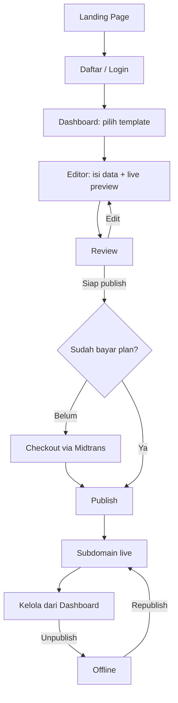

# Product Requirements Document (PRD)
## Portofio — SaaS Portfolio Website Builder

**Versi:** 2.0 (MVP Rewrite)
**Tanggal:** 21 Agustus 2026
**Disusun oleh:** Maulana Chandra Irawan (pemilik produk) — rewrite dibantu Claude atas permintaan pemilik produk
**Status:** Draft untuk keputusan pemilik produk sebelum jadi baseline resmi
**Menggantikan:** `docs/PRD.md` v1.9 (11 Agustus 2026) sebagai acuan **launch pertama**. v1.9 tidak dibuang — visinya dipindahkan ke Section 14 (Roadmap) sebagai arah jangka panjang yang tetap valid.

### Kenapa dokumen ini ada

v1.9 adalah PRD yang matang dan sangat detail, tapi scope di section 5-nya (RBAC 3 role, 3 tier billing × 2 siklus, revenue sharing designer, 8 template, workspace multi-tenant per akun, admin ops penuh) sudah lebih besar dari definisi wajar sebuah MVP. Dua audit teknik internal memverifikasi ini lewat inspeksi kode langsung, bukan opini:

- `docs/archive/DEEP_PRODUCT_ENGINEERING_AUDIT.md` (15 Agustus 2026) — skor kesiapan rata-rata **~6/10**, verdict: jangan tambah fitur, tutup dulu blocker keamanan/data-consistency.
- `docs/archive/READINESS_AUDIT_2026-08-17.md` (17 Agustus 2026) — verdict eksplisit: **belum siap production/public launch**.

Dokumen ini melakukan tiga hal: (1) mempersempit scope launch pertama menjadi benar-benar minimal dengan cara **gating**, bukan membongkar apa yang sudah dibangun — 38 dari 41 fitur di `feature_list.json` sudah berstatus *passing*, jadi memotong scope di sini artinya menyembunyikan/menunda expose ke publik, bukan menghapus kerja; (2) menyilangkan satu keputusan produk yang belum tervalidasi (multi-portfolio per akun) dengan riset kompetitor singkat; (3) mengubah kriteria go-live dari kalimat aspirasional ("sudah terpasang") menjadi checklist yang butuh bukti konkret.

---

## 1. Ringkasan Produk

Portofio adalah platform SaaS untuk membuat dan menerbitkan website portofolio profesional tanpa coding maupun desain: isi data lewat form terstruktur, pilih template, lihat live preview, publish ke subdomain. Membuat dan preview gratis; publish berbayar.

**Perubahan paling penting dari v1.9:** launch pertama hanya menjual **satu plan** dan hanya mengizinkan **satu portofolio per akun**. Model tiga-role (user/designer/admin), tiga-tier billing, dan multi-workspace tetap ada sebagai fondasi kode dan sebagai arah roadmap — tapi tidak diekspos ke publik sampai ada bukti demand dan sampai lapisan keamanan/entitlement-nya benar-benar tuntas diuji.

## 2. Problem Statement & Persona

Tidak berubah signifikan dari v1.9 section 2/4: fresh graduate, freelancer, job seeker, content creator butuh portofolio online yang terlihat profesional tanpa keahlian teknis. Framer/Webflow terlalu kompleks dan mahal; Canva menghasilkan gambar/PDF bukan website; coding sendiri butuh skill yang tidak dimiliki mayoritas.

**Satu penambahan wajib:** seluruh UI aplikasi (bukan hanya landing page) harus memakai istilah yang dipahami persona ini — *Portofolio*, *Publish*, *Isi Data* — bukan istilah developer-centric seperti *Workspace*, *Project*, *Version*, *Content Library*. Ini bukan saran kosmetik; audit teknik (temuan M1) sudah menandai istilah-istilah ini sebagai beban kognitif nyata untuk persona non-teknis. Nama tabel/kolom di database boleh tetap `workspace`/`project` (biaya migrasi nama kolom tidak sepadan), tapi **tidak ada satupun istilah itu yang boleh muncul di copy yang dilihat user**.

## 3. Riset Kompetitor & Insight Kunci

Riset singkat (21 Agustus 2026) untuk menjawab satu pertanyaan spesifik: apakah "user butuh lebih dari satu portofolio per akun" adalah kebutuhan yang tervalidasi atau asumsi?

| Kompetitor | Kategori | Multi-situs per akun? | Model monetisasi multi-situs |
|---|---|---|---|
| Framer | Website builder umum | Ya, proyek tidak dibatasi | Per-situs — tiap situs yang publish ke custom domain butuh paket sendiri |
| Adobe Portfolio | Portfolio builder (langsung sebanding) | Ya, sampai 5 situs, semua boleh live bersamaan | Gratis dalam satu subscription Creative Cloud — dipasarkan khusus untuk kreator multidisiplin |
| Journo Portfolio | Portfolio builder (langsung sebanding) | Ya | Diskon 50% per langganan tambahan — tetap dijual per situs, bukan gratis tak terbatas |
| Pixpa | Portfolio + client gallery + store | Fokus satu situs per subscription, upsell ke paket lebih tinggi untuk kapasitas | Per-tier |

**Insight kunci:**

1. Kebutuhan multi-portofolio itu **nyata**, bukan fitur yang "kelihatan berguna" tanpa dasar — Adobe secara eksplisit membangun ini untuk kreator yang mengerjakan lebih dari satu bidang, dan testimoni pengguna Journo mengonfirmasi pola yang sama.
2. Tapi **tidak ada satupun kompetitor yang menggratiskan banyak situs live tanpa batas**. Semua memonetisasi situs tambahan — baik lewat harga per-situs, atau lewat batas jumlah situs yang dibundel ke satu subscription.
3. Desain v1.9 (banyak workspace gratis per akun, tapi dibatasi hanya 1 yang boleh `published`) tidak mencerminkan pola manapun di atas. Ia memberi ongkos rekayasa (skema multi-tenant, switcher UI, isolasi kepemilikan) tanpa upside monetisasi yang jelas, dan justru **mengecilkan nilai** untuk persona yang paling butuh fitur ini (kreator multidisiplin) karena tetap dibatasi satu output live.

**Keputusan yang diambil:** launch v1 = satu portofolio per akun (skema `workspace_id` di database tidak diubah, hanya tidak diekspos sebagai fitur tambah-workspace di UI). Multi-portofolio dipindah ke roadmap sebagai **paid add-on** (lihat Section 14), mengikuti pola Adobe/Journo — bukan dihapus dari visi produk, hanya ditunda sampai ada bukti permintaan dari kohort pertama.

## 4. Tujuan Produk & Success Metrics (v1)

**Tujuan bisnis launch pertama:**
- Validasi dengan kohort kecil (10–20 pengguna) sebelum buka publik luas — mengikuti rekomendasi eksplisit audit teknik, bukan target pengguna massal di awal.
- Time-to-publish di bawah 15 menit dari signup sampai publish (dipertahankan dari v1.9, target ini realistis dan terukur).
- Validasi willingness-to-pay untuk satu plan sebelum mendesain tier kedua/ketiga.

**KPI v1 (dipersempit dari v1.9, item yang butuh 3 tier/designer/revenue-sharing dihapus dulu):**
- Jumlah website berhasil dipublikasikan.
- Time-to-publish rata-rata.
- Conversion rate akun gratis → publish berbayar.
- Retention rate bulanan.
- Churn rate bulanan.
- Jumlah insiden abuse yang tertangani sebelum/segera setelah publish.

**Target angka** (jumlah bulan ke launch, jumlah pengguna, harga) sengaja tidak diisi di sini — lihat Section 17, ini keputusan bisnis pemilik produk, bukan sesuatu yang pantas ditebak dalam dokumen teknis.

## 5. Target Pengguna

Sama dengan v1.9 Section 4: profesional non-teknis, sensitif harga, akses desktop & mobile.

**Role v1**: hanya `user` yang aktif secara publik. Kolom role dan RBAC middleware untuk `designer`/`admin` **tetap ada di kode** (biaya sudah dikeluarkan, tidak perlu dibongkar) — tapi Designer Portal dan admin UI publik-facing tidak di-launch. Admin operations dasar (suspend akun, blocklist subdomain) tetap dipakai secara internal oleh tim, bukan sebagai fitur yang dipromosikan.

## 6. Scope

### 6.1 Launch v1 (yang benar-benar dibangun & diuji untuk go-live)

- Registrasi & autentikasi email/password, verifikasi email, reset password.
- Satu portofolio per akun (workspace dibuat otomatis saat signup, tanpa switcher/tambah-workspace di UI).
- Editor form terintegrasi dengan live preview (form + preview berdampingan, auto-save draft).
- **Minimum 5 dari 8 template** lulus QA visual responsif sebelum launch, sisanya menyusul lewat rolling activation (`templates.is_active` dinyalakan begitu satu template lulus checklist, tidak menunggu kedelapannya selesai bersamaan).
- Publish ke subdomain Portofio (satu plan, satu website live per akun — quota ini **wajib atomic**, lihat Section 8).
- Unpublish/republish.
- Dashboard: kelola data, ganti template, status publish, statistik dasar (views).
- Analytics dasar untuk website published, dengan rate-limit dan retention (lihat Section 8 — ini P1 audit yang belum ada sama sekali di kode saat ini).
- Satu plan berbayar (lihat Section 11).
- UI dua bahasa (id/en), default Indonesia.

### 6.2 Di luar Section v1, masuk Fase 1.5 (dibuka begitu v1 tervalidasi + blocker keamanan tuntas)

- Portofolio kedua per akun sebagai **paid add-on** (bukan gratis tak terbatas — lihat Section 3 & 14).
- Tier Premium (custom domain, watermark removal) dan Enterprise.
- Sisa template dari 8 yang belum lulus QA di v1.
- Template switching pada project existing (dijanjikan di v1.9 tapi belum ada implementasinya — sekarang eksplisit jadi janji Fase 1.5, bukan janji v1).

### 6.3 Roadmap jangka panjang (Fase 2/3, tidak berubah dari visi v1.9)

- Designer Portal, submission/revision workflow, revenue sharing.
- OAuth Google.
- Analytics lanjutan.
- Enterprise team collaboration, organization roles, governance.
- Marketplace template pihak ketiga, multi-bahasa untuk website hasil.

## 7. Alur Pengguna Utama (v1)

Tidak ada lagi percabangan pilih-plan (cuma satu plan) atau pilih-workspace (cuma satu portofolio) — alur ini sengaja jadi jauh lebih pendek dari diagram v1.9.

## 8. Non-Functional Requirements (v1 — ditulis supaya bisa diverifikasi, bukan aspirasional)

Setiap baris di bawah ini punya bentuk "syarat" + "bukti yang harus ada sebelum dicentang", diambil langsung dari temuan P0/P1 di `docs/archive/DEEP_PRODUCT_ENGINEERING_AUDIT.md` dan `docs/archive/READINESS_AUDIT_2026-08-17.md`.

| # | Syarat | Bukti minimum sebelum go-live |
|---|---|---|
| N1 | Cron subscription tidak boleh fail-open | `CRON_SECRET` wajib di-set di production; endpoint return 503 kalau kosong, 401 kalau salah — bukan jalan tanpa auth |
| N2 | Quota "1 website published per akun" atomic | Enforcement dipindah ke dalam satu transaksi/RPC dengan lock, bukan check-lalu-insert dua langkah terpisah |
| N3 | Rate limiting durable | Bukan `Map` in-memory (hilang tiap cold start Vercel) — pindah ke counter atomic di Postgres atau limiter terkelola; berlaku juga untuk `/api/track` |
| N4 | Public path tidak pakai service-role | `sites/[subdomain]`, `/api/track`, dan jalur publik lain pakai client anon/server dengan RLS, bukan `createAdminClient()` |
| N5 | Validasi skema URL & gambar | Scheme allowlist (`http`/`https`/`mailto`/`tel`) di semua field URL; upload gambar divalidasi magic-byte + dimensi, bukan cuma MIME string |
| N6 | Redirect parameter di-allowlist | Hanya terima path relatif, tolak `//` dan scheme asing (cegah open redirect) |
| N7 | Dependency bersih | `npm audit --audit-level=high` nol temuan high sebelum go-live |
| N8 | Email transaksional terbukti jalan di production | SMTP + template Supabase Confirm/Reset diverifikasi end-to-end dengan akun nyata, bukan cuma lolos build |
| N9 | Monitoring & error tracking aktif | Nama tool eksplisit (mis. Sentry) + alert untuk kegagalan webhook/cron terpasang dan teruji |
| N10 | Backup & restore terbukti | Bukan sekadar "terjadwal" — ada log restore drill yang berhasil, dengan RPO/RTO yang dinyatakan angkanya |
| N11 | Advisor keamanan Supabase bersih | Mutable search_path, publicly executable SECURITY DEFINER, leaked-password protection — semua ditinjau dan grants dibatasi |
| N12 | Performa | Render halaman publik < 2 detik (dipertahankan dari v1.9) |
| N13 | Responsif | Template yang aktif (minimum 5) lulus QA visual di ukuran layar mobile & desktop |

## 9. Arsitektur Teknis

Tidak berubah dari v1.9 Section 9 — arsitekturnya sudah tepat dan audit teknik secara eksplisit bilang **jangan ganti stack**:

- Next.js (App Router) + TypeScript, Tailwind, Supabase (Postgres/Auth/Storage/RLS), Midtrans, Vercel wildcard subdomain.
- **Hybrid Template Storage**: renderer/schema/defaults di codebase (`TEMPLATE_REGISTRY`), database hanya simpan visibility katalog. Ini keputusan arsitektur paling penting yang benar — mencegah eksekusi kode tak tepercaya dari database.
- Dynamic rendering per subdomain (bukan static build per user) — skalabel tanpa proses build terpisah per akun.
- Publish via RPC `publish_project()` (SECURITY DEFINER) — snapshot atomic draft→published. Pola ini benar; yang perlu diperbaiki adalah enforcement quota-nya (N2), bukan mekanisme publish-nya.

**Satu catatan untuk v1**: skema `workspaces`/`workspace_profile` tidak perlu dibongkar untuk mendukung "1 portofolio per akun". Cukup: (a) signup otomatis membuat tepat satu workspace, (b) UI tidak menyediakan tombol tambah workspace, (c) server action menolak permintaan buat workspace kedua kecuali akun punya entitlement add-on yang relevan (disiapkan sebagai gate kosong dulu, diisi logikanya saat Fase 1.5 dibuka). Ini pendekatan gating yang sama seperti billing dan template — murah dibalik kalau riset lanjutan menunjukkan demand lebih cepat dari perkiraan.

## 10. Skema Data (ringkas — DDL persis tetap di `supabase/migrations/`)

Entitas utama dipertahankan dari v1.9 Section 9.4: `profiles`, `workspaces`, `workspace_profile`, `projects` (`draft_json`/`published_json`, `status`, `subdomain`), `templates` (katalog + `is_active`), `plans`, `subscriptions`, `entitlements`.

**Perubahan status untuk v1**: `plans` hanya berisi satu baris aktif (Basic) yang terlihat di checkout publik; baris Premium/Enterprise boleh tetap ada di tabel (tidak perlu dihapus) tapi tidak ditampilkan di UI sampai Fase 1.5.

**Isu yang perlu diputuskan, bukan dihindari**: v1.9 mencatat ada dua sumber data profil yang tumpang tindih (`profiles` akun + `workspace_profile`), yang membuat user berpotensi mengisi data yang sama dua kali — bertentangan dengan janji "isi data sekali" di Section 1. Karena v1 hanya punya satu workspace per akun, ini saat yang tepat untuk menyatukan alur input (auto-fill penuh dari satu sumber, bukan tambal lewat `syncFromProfileAction`) sebelum kompleksitasnya bertambah lagi di Fase 1.5.

## 11. Keamanan

Daftar di bawah adalah subset actionable dari Section 8 (N1–N11), dikelompokkan sesuai prioritas audit asli untuk memudahkan tracking:

**P0 — wajib sebelum akun nyata pertama publish:** N1, N2, N3, N4, N5, N6.
**P1 — wajib sebelum buka ke publik luas (boleh setelah kohort tertutup 10–20 user):** N7, N8, N9, N10, N11.

Prinsip yang dipertahankan dari v1.9 (masih benar, tidak berubah): RLS berbasis kepemilikan (`auth.uid()`), RBAC server-side (client-side hiding bukan security boundary), service-role key hanya di server action yang sudah `requireRole()`, source template Designer diperlakukan sebagai untrusted content.

## 12. Monetisasi & Pricing v1

Satu plan: **Basic** — publish 1 website ke subdomain Portofio, watermark kecil, akses ke template yang sudah `is_active`, basic analytics. Billing monthly & annual via Midtrans (skema `plans`/`entitlements` yang sudah ada dipakai apa adanya, cukup satu baris aktif).

Harga final belum diisi di sini secara sengaja — lihat Section 17. Rekomendasi proses: uji willingness-to-pay pada kohort 10–20 user pertama sebelum mengunci angka, bukan menebak dari awal seperti placeholder `Rp[X_B]` di v1.9 yang sampai versi 1.9 pun belum terisi.

Saat langganan berakhir/gagal bayar: grace period 7 hari lalu auto-unpublish (dipertahankan dari v1.9 — ini keputusan yang sudah masuk akal, tinggal dikonfirmasi angkanya, lihat Section 17).

## 13. Risiko & Mitigasi (v1)

| Risiko | Mitigasi |
|---|---|
| Scope masih terlalu besar walau sudah dipangkas | Rolling activation template + gating billing/workspace membuat semuanya reversibel — tidak ada keputusan di sini yang permanen kalau ternyata salah |
| Kohort kecil tidak cukup representatif untuk validasi harga | Pilih 10–20 user dari persona beragam (fresh graduate, freelancer, job seeker) bukan dari satu sumber saja |
| Subdomain disalahgunakan | Hanya pelanggan berbayar bisa publish, filter kata terlarang, rate limiting durable (N3) |
| Kompetitor besar (Framer, Wix, Canva, Adobe Portfolio) sudah mapan | Diferensiasi: form+template lebih cepat dari drag-and-drop, harga lokal, variasi karakter template — dikonfirmasi relevan lewat riset Section 3 |
| Menunda multi-portofolio mengecewakan user yang butuh lebih dari satu | Section 3 menunjukkan pola industri memang menjual ini sebagai add-on, bukan gratis — jadi menunda bukan penyimpangan dari pasar, justru mengikuti pola yang terbukti jalan |

## 14. Roadmap

- **Fase 1 (v1, dokumen ini)**: satu plan, satu portofolio per akun, 5+ template, security P0 tuntas, kohort 10–20 user.
- **Fase 1.5**: buka Premium/Enterprise, portofolio kedua sebagai paid add-on (mengikuti pola Adobe Portfolio/Journo Portfolio di Section 3), sisa template, template switching pada project existing.
- **Fase 2**: Designer Portal, submission/revision workflow, revenue sharing, OAuth Google, analytics lanjutan.
- **Fase 3**: Enterprise team collaboration, governance, marketplace template, multi-bahasa output.

## 15. Definition of Done

Dipertahankan dari v1.9 Section 14 tanpa perubahan — checklist ini sudah baik: acceptance criteria terpenuhi, teruji manual (happy path + edge case), tanpa error/warning kritis, responsif mobile/desktop, sudah di-deploy staging dan diverifikasi, untuk fitur role-sensitive sudah diuji cross-tenant.

## 16. Kriteria Go-Live v1 (evidence-based)

| Kriteria | Bukti yang dibutuhkan |
|---|---|
| Security P0 tuntas | N1–N6 di Section 11 masing-masing punya bukti verifikasi (bukan cuma "sudah dikerjakan") |
| Minimum 5 template lulus QA | Screenshot/hasil test responsif per template, per breakpoint |
| Alur signup→publish < 15 menit | Hasil pengukuran manual/E2E timing, bukan estimasi |
| Midtrans teruji end-to-end | Checkout sandbox berhasil, webhook idempotent teruji dengan request duplikat sengaja dikirim |
| Email production proven | Minimal satu signup + satu reset password nyata berhasil di production, bukan di local dev |
| Monitoring aktif | Dashboard Sentry (atau setara) menunjukkan data masuk, alert Slack/email teruji trigger |
| Backup/restore | Log restore drill sukses dengan timestamp, RPO/RTO dinyatakan |
| RBAC diuji | Minimal satu akun `user` mencoba akses resource akun lain dan ditolak (bukti cross-tenant isolation) |
| Kebijakan privasi & ToS | Dipublikasikan di aplikasi, sudah direview |
| npm audit bersih | N7 terpenuhi, output audit dilampirkan |

Tidak ada item di sini yang boleh dicentang tanpa artefak (screenshot, log, hasil test) yang bisa ditunjukkan — ini beda paling penting dari checklist v1.9 yang sudah "terpenuhi" di atas kertas tapi terbukti belum di audit nyata.

## 17. Keputusan Terkunci & Open Decisions

### 17.1 Terkunci lewat dokumen ini

- Launch v1 = satu plan (Basic), satu portofolio per akun, role `user` saja yang publik.
- Template rolling activation, minimum 5 dari 8 sebelum launch.
- Multi-portofolio dan tier Premium/Enterprise dipindah ke Fase 1.5 sebagai paid add-on (bukan dihapus dari visi).
- Terminologi user-facing wajib non-teknis (Portofolio/Publish/Isi Data).
- Kriteria go-live wajib berbukti, bukan checkbox aspirasional.

### 17.2 Masih perlu keputusan pemilik produk

- Harga plan Basic (monthly & annual) — direkomendasikan divalidasi lewat kohort 10–20 user, bukan ditebak dulu.
- Target waktu launch dan target jumlah user 3 bulan pertama.
- Nama domain produksi (pengganti placeholder `appku.com`).
- Konfirmasi grace period 7 hari saat langganan berakhir.
- Siapa yang mengerjakan closure N1–N11 di Section 8 dan target tanggalnya.
- Kriteria eksplisit untuk "kapan Fase 1.5 dibuka" (mis. jumlah publish, feedback demand multi-portofolio dari kohort).

## 18. Lampiran — Sumber Riset Kompetitor (21 Agustus 2026)

- Framer — Site Plans Explained, framer.com/help/articles/site-plans-explained
- Framer Pricing, framer.com/pricing
- Adobe Portfolio — Create and manage multiple sites, help.myportfolio.com/hc/en-us/articles/360036117214
- Adobe Portfolio Pricing, josephnilo.com/blog/adobe-portfolio-pricing
- Journo Portfolio — Pricing, journoportfolio.com/pricing
- Journo Portfolio — Create a Stunning Online Writing Portfolio (testimonial multi-skill), journoportfolio.com/writing-portfolio
- Pixpa — Pricing, pixpa.com/pricing
