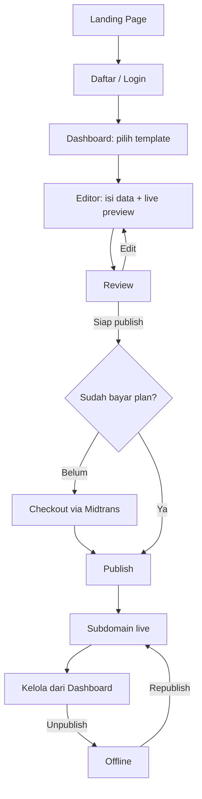

# Product Requirements Document (PRD)
## Portofio — SaaS Portfolio Website Builder

**Versi:** 2.1 (MVP Rewrite + Template Architecture Pivot)
**Tanggal:** 22 Agustus 2026
**Disusun oleh:** Maulana Chandra Irawan (pemilik produk) — rewrite dibantu Claude atas permintaan pemilik produk
**Status:** Draft untuk keputusan pemilik produk sebelum jadi baseline resmi
**Menggantikan:** `docs/PRD.md` v1.9 (11 Agustus 2026) sebagai acuan **launch pertama**. v1.9 tidak dibuang — visinya dipindahkan ke Section 14 (Roadmap) sebagai arah jangka panjang yang tetap valid.
**Merge 22 Agustus 2026:** dokumen terpisah `docs/PRD-v2.md` (audit arsitektur template/designer/admin) dilebur ke sini sebagai **Section 9A**, atas permintaan pemilik produk agar hanya ada satu spec produk (lihat `CLAUDE.md`). File `PRD-v2.md` sudah dihapus — isinya sekarang di sini. Section 9, 10, 11, 13, 14, dan 17 dikoreksi menyesuaikan; lihat Section 9A untuk detail penuh dan Section 17.1 untuk konflik yang belum diputuskan.

### Kenapa dokumen ini ada

v1.9 adalah PRD yang matang dan sangat detail, tapi scope di section 5-nya (RBAC 3 role, 3 tier billing × 2 siklus, revenue sharing designer, 8 template, workspace multi-tenant per akun, admin ops penuh) sudah lebih besar dari definisi wajar sebuah MVP. Dua audit teknik internal memverifikasi ini lewat inspeksi kode langsung, bukan opini:

- `docs/archive/DEEP_PRODUCT_ENGINEERING_AUDIT.md` (15 Agustus 2026) — skor kesiapan rata-rata **~6/10**, verdict: jangan tambah fitur, tutup dulu blocker keamanan/data-consistency.
- `docs/archive/READINESS_AUDIT_2026-08-17.md` (17 Agustus 2026) — verdict eksplisit: **belum siap production/public launch**.

Dokumen ini melakukan tiga hal: (1) mempersempit scope launch pertama menjadi benar-benar minimal dengan cara **gating**, bukan membongkar apa yang sudah dibangun — 38 dari 41 fitur di `feature_list.json` sudah berstatus *passing*, jadi memotong scope di sini artinya menyembunyikan/menunda expose ke publik, bukan menghapus kerja; (2) menyilangkan satu keputusan produk yang belum tervalidasi (multi-portfolio per akun) dengan riset kompetitor singkat; (3) mengubah kriteria go-live dari kalimat aspirasional ("sudah terpasang") menjadi checklist yang butuh bukti konkret.

---

## 1. Ringkasan Produk

Portofio adalah platform SaaS untuk membuat dan menerbitkan website portofolio profesional tanpa coding maupun desain: isi data lewat form terstruktur, pilih template, lihat live preview, publish ke subdomain. Membuat dan preview gratis; publish berbayar.

**Koreksi 22 Agustus 2026 (lihat Section 9A):** janji "isi data sekali, pilih template" hari ini punya celah — skema data berbeda per template, jadi berpindah template bisa menghilangkan sebagian data yang sudah diisi. Section 9A mengoreksi ini dengan satu skema konten kanonik untuk semua template, dan sekaligus mengubah cara template baru dibuat (dari kode di-review manual ke data yang bisa diterbitkan tanpa deploy) supaya Designer Portal punya jalan realistis untuk tumbuh jadi marketplace.

**Perubahan paling penting dari v1.9:** launch pertama hanya menjual **satu plan** dan hanya mengizinkan **satu portofolio per akun**. Model tiga-role (user/designer/admin), tiga-tier billing, dan multi-workspace tetap ada sebagai fondasi kode dan sebagai arah roadmap — tapi tidak diekspos ke publik sampai ada bukti demand dan sampai lapisan keamanan/entitlement-nya benar-benar tuntas diuji.

## 2. Problem Statement & Persona

Tidak berubah signifikan dari v1.9 section 2/4: fresh graduate, freelancer, job seeker, content creator butuh portofolio online yang terlihat profesional tanpa keahlian teknis. Framer/Webflow terlalu kompleks dan mahal; Canva menghasilkan gambar/PDF bukan website; coding sendiri butuh skill yang tidak dimiliki mayoritas.

**Satu penambahan wajib:** seluruh UI aplikasi (bukan hanya landing page) harus memakai istilah yang dipahami persona ini — *Portofolio*, *Publish*, *Isi Data* — bukan istilah developer-centric seperti *Workspace*, *Project*, *Version*, *Content Library*. Ini bukan saran kosmetik; audit teknik (temuan M1) sudah menandai istilah-istilah ini sebagai beban kognitif nyata untuk persona non-teknis. Nama tabel/kolom di database boleh tetap `workspace`/`project` (biaya migrasi nama kolom tidak sepadan), tapi **tidak ada satupun istilah itu yang boleh muncul di copy yang dilihat user**.

## 3. Riset Kompetitor & Insight Kunci

Riset singkat (21 Agustus 2026) untuk menjawab satu pertanyaan spesifik: apakah "user butuh lebih dari satu portofolio per akun" adalah kebutuhan yang tervalidasi atau asumsi?

| Kompetitor | Kategori | Multi-situs per akun? | Model monetisasi multi-situs |
|---|---|---|---|
| Framer | Website builder umum | Ya, proyek tidak dibatasi | Per-situs — tiap situs yang publish ke custom domain butuh paket sendiri |
| Adobe Portfolio | Portfolio builder (langsung sebanding) | Ya, sampai 5 situs, semua boleh live bersamaan | Gratis dalam satu subscription Creative Cloud — dipasarkan khusus untuk kreator multidisiplin |
| Journo Portfolio | Portfolio builder (langsung sebanding) | Ya | Diskon 50% per langganan tambahan — tetap dijual per situs, bukan gratis tak terbatas |
| Pixpa | Portfolio + client gallery + store | Fokus satu situs per subscription, upsell ke paket lebih tinggi untuk kapasitas | Per-tier |

**Insight kunci:**

1. Kebutuhan multi-portofolio itu **nyata**, bukan fitur yang "kelihatan berguna" tanpa dasar — Adobe secara eksplisit membangun ini untuk kreator yang mengerjakan lebih dari satu bidang, dan testimoni pengguna Journo mengonfirmasi pola yang sama.
2. Tapi **tidak ada satupun kompetitor yang menggratiskan banyak situs live tanpa batas**. Semua memonetisasi situs tambahan — baik lewat harga per-situs, atau lewat batas jumlah situs yang dibundel ke satu subscription.
3. Desain v1.9 (banyak workspace gratis per akun, tapi dibatasi hanya 1 yang boleh `published`) tidak mencerminkan pola manapun di atas. Ia memberi ongkos rekayasa (skema multi-tenant, switcher UI, isolasi kepemilikan) tanpa upside monetisasi yang jelas, dan justru **mengecilkan nilai** untuk persona yang paling butuh fitur ini (kreator multidisiplin) karena tetap dibatasi satu output live.

**Keputusan yang diambil:** launch v1 = satu portofolio per akun (skema `workspace_id` di database tidak diubah, hanya tidak diekspos sebagai fitur tambah-workspace di UI). Multi-portofolio dipindah ke roadmap sebagai **paid add-on** (lihat Section 14), mengikuti pola Adobe/Journo — bukan dihapus dari visi produk, hanya ditunda sampai ada bukti permintaan dari kohort pertama.

## 4. Tujuan Produk & Success Metrics (v1)

**Tujuan bisnis launch pertama:**
- Validasi dengan kohort kecil (10–20 pengguna) sebelum buka publik luas — mengikuti rekomendasi eksplisit audit teknik, bukan target pengguna massal di awal.
- Time-to-publish di bawah 15 menit dari signup sampai publish (dipertahankan dari v1.9, target ini realistis dan terukur).
- Validasi willingness-to-pay untuk satu plan sebelum mendesain tier kedua/ketiga.

**KPI v1 (dipersempit dari v1.9, item yang butuh 3 tier/designer/revenue-sharing dihapus dulu):**
- Jumlah website berhasil dipublikasikan.
- Time-to-publish rata-rata.
- Conversion rate akun gratis → publish berbayar.
- Retention rate bulanan.
- Churn rate bulanan.
- Jumlah insiden abuse yang tertangani sebelum/segera setelah publish.

**Target angka** (jumlah bulan ke launch, jumlah pengguna, harga) sengaja tidak diisi di sini — lihat Section 17, ini keputusan bisnis pemilik produk, bukan sesuatu yang pantas ditebak dalam dokumen teknis.

## 5. Target Pengguna

Sama dengan v1.9 Section 4: profesional non-teknis, sensitif harga, akses desktop & mobile.

**Role v1**: hanya `user` yang aktif secara publik. Kolom role dan RBAC middleware untuk `designer`/`admin` **tetap ada di kode** (biaya sudah dikeluarkan, tidak perlu dibongkar) — tapi Designer Portal dan admin UI publik-facing tidak di-launch. Admin operations dasar (suspend akun, blocklist subdomain) tetap dipakai secara internal oleh tim, bukan sebagai fitur yang dipromosikan.

## 6. Scope

### 6.1 Launch v1 (yang benar-benar dibangun & diuji untuk go-live)

- Registrasi & autentikasi email/password, verifikasi email, reset password.
- Satu portofolio per akun (workspace dibuat otomatis saat signup, tanpa switcher/tambah-workspace di UI).
- Editor form terintegrasi dengan live preview (form + preview berdampingan, auto-save draft).
- **Minimum 5 dari 8 template** lulus QA visual responsif sebelum launch, sisanya menyusul lewat rolling activation (`templates.is_active` dinyalakan begitu satu template lulus checklist, tidak menunggu kedelapannya selesai bersamaan).
- Publish ke subdomain Portofio (satu plan, satu website live per akun — quota ini **wajib atomic**, lihat Section 8).
- Unpublish/republish.
- Dashboard: kelola data, ganti template, status publish, statistik dasar (views).
- Analytics dasar untuk website published, dengan rate-limit dan retention (lihat Section 8 — ini P1 audit yang belum ada sama sekali di kode saat ini).
- Satu plan berbayar (lihat Section 11).
- UI dua bahasa (id/en), default Indonesia.

### 6.2 Di luar Section v1, masuk Fase 1.5 (dibuka begitu v1 tervalidasi + blocker keamanan tuntas)

- Portofolio kedua per akun sebagai **paid add-on** (bukan gratis tak terbatas — lihat Section 3 & 14).
- Tier Premium (custom domain, watermark removal) dan Enterprise.
- Sisa template dari 8 yang belum lulus QA di v1.
- Template switching pada project existing (dijanjikan di v1.9 tapi belum ada implementasinya — sekarang eksplisit jadi janji Fase 1.5, bukan janji v1).

### 6.3 Roadmap jangka panjang (Fase 2/3/4, visi v1.9 dipertahankan — mekanisme Designer Portal dikoreksi 22 Agustus 2026, lihat Section 9A)

- Designer Portal — **dibangun ulang di atas arsitektur data-driven** (Section 9A: skema konten kanonik, section kit, Designer Studio kanvas, gate otomatis), bukan lagi alur ZIP-upload-review-merge-deploy. Revenue sharing menyusul setelahnya, bukan bersamaan (lihat Section 9A.7 dan Section 14 Fase 2/3).
- OAuth Google.
- Analytics lanjutan.
- Enterprise team collaboration, organization roles, governance.
- Marketplace template pihak ketiga, multi-bahasa untuk website hasil.

## 7. Alur Pengguna Utama (v1)



Tidak ada lagi percabangan pilih-plan (cuma satu plan) atau pilih-workspace (cuma satu portofolio) — alur ini sengaja jadi jauh lebih pendek dari diagram v1.9.

## 8. Non-Functional Requirements (v1 — ditulis supaya bisa diverifikasi, bukan aspirasional)

Setiap baris di bawah ini punya bentuk "syarat" + "bukti yang harus ada sebelum dicentang", diambil langsung dari temuan P0/P1 di `docs/archive/DEEP_PRODUCT_ENGINEERING_AUDIT.md` dan `docs/archive/READINESS_AUDIT_2026-08-17.md`.

| # | Syarat | Bukti minimum sebelum go-live |
|---|---|---|
| N1 | Cron subscription tidak boleh fail-open | `CRON_SECRET` wajib di-set di production; endpoint return 503 kalau kosong, 401 kalau salah — bukan jalan tanpa auth |
| N2 | Quota "1 website published per akun" atomic | Enforcement dipindah ke dalam satu transaksi/RPC dengan lock, bukan check-lalu-insert dua langkah terpisah |
| N3 | Rate limiting durable | Bukan `Map` in-memory (hilang tiap cold start Vercel) — pindah ke counter atomic di Postgres atau limiter terkelola; berlaku juga untuk `/api/track` |
| N4 | Public path tidak pakai service-role | `sites/[subdomain]`, `/api/track`, dan jalur publik lain pakai client anon/server dengan RLS, bukan `createAdminClient()` |
| N5 | Validasi skema URL & gambar | Scheme allowlist (`http`/`https`/`mailto`/`tel`) di semua field URL; upload gambar divalidasi magic-byte + dimensi, bukan cuma MIME string |
| N6 | Redirect parameter di-allowlist | Hanya terima path relatif, tolak `//` dan scheme asing (cegah open redirect) |
| N7 | Dependency bersih | `npm audit --audit-level=high` nol temuan high sebelum go-live |
| N8 | Email transaksional terbukti jalan di production | SMTP + template Supabase Confirm/Reset diverifikasi end-to-end dengan akun nyata, bukan cuma lolos build |
| N9 | Monitoring & error tracking aktif | Nama tool eksplisit (mis. Sentry) + alert untuk kegagalan webhook/cron terpasang dan teruji |
| N10 | Backup & restore terbukti | Bukan sekadar "terjadwal" — ada log restore drill yang berhasil, dengan RPO/RTO yang dinyatakan angkanya |
| N11 | Advisor keamanan Supabase bersih | Mutable search_path, publicly executable SECURITY DEFINER, leaked-password protection — semua ditinjau dan grants dibatasi |
| N12 | Performa | Render halaman publik < 2 detik (dipertahankan dari v1.9) |
| N13 | Responsif | Template yang aktif (minimum 5) lulus QA visual di ukuran layar mobile & desktop |

## 9. Arsitektur Teknis

Sebagian besar tidak berubah dari v1.9 Section 9 — stack-nya tetap tepat dan audit teknik secara eksplisit bilang **jangan ganti stack**:

- Next.js (App Router) + TypeScript, Tailwind, Supabase (Postgres/Auth/Storage/RLS), Midtrans, Vercel wildcard subdomain.
- Dynamic rendering per subdomain (bukan static build per user) — skalabel tanpa proses build terpisah per akun.
- Publish via RPC `publish_project()` (SECURITY DEFINER) — snapshot atomic draft→published. Pola ini benar; yang perlu diperbaiki adalah enforcement quota-nya (N2), bukan mekanisme publish-nya.

**Koreksi 22 Agustus 2026 — Template Storage (lihat Section 9A untuk detail penuh):** v1.9/v2.0 menyebut *Hybrid Template Storage* (renderer/schema/defaults di codebase lewat `TEMPLATE_REGISTRY`, database hanya simpan visibility) sebagai "keputusan arsitektur paling penting yang benar". Prinsip keamanannya — jangan eksekusi kode tak tepercaya dari database — tetap benar dan sebetulnya **diperkuat** oleh koreksi ini, bukan dibuang. Yang salah adalah mekanismenya: taruh template di kode berarti setiap template baru (termasuk dari designer eksternal) butuh review kode + merge + deploy, yang secara struktural tidak bisa jadi marketplace. Section 9A mengubah template dari kode menjadi **baris database berisi layout JSON yang dideklarasikan, bukan dieksekusi** — permukaan "kode tak tepercaya" yang tadinya dicegah dengan menaruh template di repo, sekarang dicegah lebih kuat lagi karena layout JSON tidak pernah punya jalur eksekusi sama sekali.

**Satu catatan untuk v1**: skema `workspaces`/`workspace_profile` tidak perlu dibongkar untuk mendukung "1 portofolio per akun". Cukup: (a) signup otomatis membuat tepat satu workspace, (b) UI tidak menyediakan tombol tambah workspace, (c) server action menolak permintaan buat workspace kedua kecuali akun punya entitlement add-on yang relevan (disiapkan sebagai gate kosong dulu, diisi logikanya saat Fase 1.5 dibuka). Ini pendekatan gating yang sama seperti billing dan template — murah dibalik kalau riset lanjutan menunjukkan demand lebih cepat dari perkiraan.

## 9A. Template & Designer Platform — Koreksi Arsitektur (dilebur dari `docs/PRD-v2.md`, 22 Agustus 2026)

Status: **usulan, belum disetujui untuk implementasi**. Tidak mengubah scope launch v1 di Section 6 — ini koreksi jalur Fase 2/3 (Designer Portal/marketplace, Section 6.3/14), plus satu perbaikan (skema konten kanonik) yang bernilai bahkan sebelum Fase 2 dibuka karena langsung menjawab isu "profil ganda" di Section 10.

### 9A.1 Kenapa koreksi ini ada

Audit langsung atas kode `src/templates/*` dan `supabase/migrations/*designer*` (bukan asumsi) menemukan empat batasan struktural pada jalur template/designer/admin yang ada sekarang:

1. **Template adalah kode, bukan data.** `TEMPLATE_IDS` di-hardcode di `src/templates/types.ts`, registry mengambil folder lewat `import.meta.glob`. Alur designer yang tertulis di migration `20260719000004_add_template_submissions.sql`: designer upload ZIP → admin review kode → admin merge ke repo → deploy. Setiap template baru butuh satu deploy — marketplace mentok di sekitar 20 template, jauh dari skala yang dibutuhkan model marketplace.
2. **Data user terikat ke template.** Tiap template punya `schema.ts` sendiri; dokumen tersimpan sebagai `data: Record<string, unknown>`. User yang pindah dari `corporate` (punya `education`, `pricing`) ke `minimal` (tidak punya keduanya) kehilangan data. Ini bertentangan langsung dengan janji "isi sekali, coba semua template" di Section 1.
3. **Tidak ada ekonomi designer.** `TemplateMeta.price` hanya field dengan komentar `// >0 reserved for marketplace` — tidak ada order, lisensi, atau earnings.
4. **Admin berperan sebagai integrator kode**, bukan operator katalog.

Bukti pendukung arahnya benar: 8 template yang sudah ada hanya memakai 13 jenis section yang sama berulang (`profile`, `skills`, `projects`, `contact`, `experience`, `education`, `pricing`, `testimonials`, `gallery`, `certificates`, `hero`, `about`, `socials`). Perbedaan antar template adalah presentasi, bukan struktur.

### 9A.2 Prinsip

- **P1 — Satu schema konten kanonik untuk semua template.** Template tidak mendefinisikan schema data; template hanya memilih section mana yang dipakai dan tampilannya. Ini yang menyelesaikan celah di Section 9A.1 poin 2, dan juga menyelesaikan isu profil ganda di Section 10 kalau digabung dengan penyatuan sumber data yang sudah direncanakan di sana.
- **P2 — Template adalah baris database, bukan folder repo.** Terbit = insert row, bukan deploy.
- **P3 — Satu `SectionRenderer` untuk tiga permukaan**: kanvas designer, preview user, situs live. Jalur render yang berbeda antar permukaan membuat WYSIWYG bohong dan bug muncul di tempat termahal — situs live pelanggan.
- **P4 — Situs terbit dikunci ke versi template** (`sites.template_version_id`). Designer memperbarui template tidak pernah mengubah situs yang sudah live tanpa persetujuan pemiliknya.

### 9A.3 Model konten kanonik

Diturunkan langsung dari `src/templates/shared/_base.ts` yang sudah ada — bukan rancangan baru dari nol:

```text
content: {
  profile, contact, socials, skills, experience, education,
  projects, testimonials, pricing, gallery, certificates
}
```

Field boleh ditambah, tidak pernah dihapus/diganti nama tanpa migration. Section yang slot datanya kosong tidak dirender (bukan kotak kosong). Form user adalah proyeksi dari schema ini, bukan turunan dari template yang sedang dipilih. Migrasi dari `portfolio_data.data` per-template ke bentuk kanonik dapat dilakukan deterministik karena semua template v1 sudah meng-extend `baseProfileSchema` yang sama.

### 9A.4 Section Kit

Unit terkecil yang bisa disusun designer: `hero`, `about`, `skills`, `experience`, `education`, `projects`, `gallery`, `testimonials`, `pricing`, `certificates`, `contact` — masing-masing punya slot data kanonik tetap dan beberapa varian presentasi (mis. `projects`: grid-2, grid-3, masonry, list, featured-first). Menambah varian tidak butuh migration. Menambah `kind` baru boleh dilakukan berdasarkan permintaan designer — katup pelepas tekanan kalau kit terasa sempit. Wajib minimal satu `hero`-family dan satu `contact` per template, ditegakkan di validasi.

Bentuk penyimpanan: `layout_json` berisi `tokens` (font, warna, radius, density, maxWidth) dan `sections[]` (kind, variant, props, style). Tidak ada kode, tidak ada CSS bebas, tidak ada eksekusi.

### 9A.5 Designer Studio (kanvas, bukan ZIP)

Rasa Figma (layers kiri, kanvas tengah dengan pan/zoom, inspector kanan, token global di atas, undo/redo), tapi unit terkecilnya **section**, bukan rectangle bebas — desain bebas tidak punya slot untuk "project user yang jumlahnya 3 atau 17". Fitur yang menggantikan kebebasan piksel: **toggle preview data ekstrem** (kosong / minimum / khas / ekstrem — 17 project, bio 8 paragraf) supaya designer melihat templatenya gagal sebelum user yang mengalaminya.

Alur: Studio → simpan draft → submit versi → gate otomatis → antrean admin → terbit atau revisi.

### 9A.6 Admin

Gate otomatis lebih dulu (kontras WCAG AA, overflow di 360px pada 4 set data preview, section wajib ada, layout JSON valid, bukan duplikat mendekati template lain) — admin hanya melihat kandidat yang sudah lolos mesin. Review manusia menilai yang tidak bisa dinilai mesin: bagus atau tidak, nama jujur atau tidak, kategori benar atau tidak. Operasi katalog: feature/unfeature, unlist (situs live tetap jalan karena terkunci versi — P4), takedown dengan jalur migrasi untuk pemilik situs terdampak. **Dihapus dari peran admin**: review kode, merge, edit `types.ts`, deploy.

### 9A.7 Monetisasi designer

**Ditunda.** Semua template gratis dulu; designer dapat profil publik, atribusi, badge, statistik. Kompensasi uang dirancang setelah supply dan demand terbukti. Yang **harus** disiapkan sekarang meski uang ditunda: `designer_id` di setiap template, `install_count`/situs aktif per versi, dan persetujuan lisensi saat submit — tanpa tiga ini, monetisasi nanti butuh migrasi data yang menyakitkan.

### 9A.8 Skema tambahan

```sql
create table templates (
  id uuid primary key, slug text unique, designer_id uuid references auth.users(id),
  name text, description text, category text, tags text[],
  status text default 'draft', -- draft|in_review|published|rejected|unlisted|takedown
  current_version_id uuid, install_count int default 0, view_count int default 0,
  featured_at timestamptz, published_at timestamptz
);

create table template_versions (
  id uuid primary key, template_id uuid references templates(id) on delete cascade,
  version int, layout_json jsonb not null, kit_version int,
  status text default 'draft', -- draft|gate_failed|in_review|approved|rejected
  gate_report jsonb, reviewed_by uuid, reviewed_at timestamptz, review_notes text,
  unique (template_id, version)
);

alter table sites
  add column template_ref_id uuid references templates(id),
  add column template_version_id uuid references template_versions(id);
```

**Koreksi 22 Agustus 2026:** `template_submissions`, bucket `template-submissions`, seluruh jalur upload ZIP, dan RLS/trigger-nya sudah **dihapus** (bukan lagi "akan pensiun") lewat `20260822000001_drop_designer_submissions.sql` — lihat Section 17.1 untuk keputusan dan bukti verifikasinya. Tabel `templates`/`template_versions` di atas jadi rancangan bersih untuk Fase 2, tidak mewarisi apa pun dari skema lama.

### 9A.9 Fase (setelah v1 launch, di dalam Fase 2/3 Section 14)

F1 model konten kanonik (migrasi `portfolio_data`) → F2 section kit + `SectionRenderer` + port 8 template existing (hapus `src/templates/definitions/`) → F3 galeri template merender data user sendiri + onboarding 5-field progresif → F4 Designer Studio kanvas → F5 gate otomatis + konsol admin → F6 profil publik designer. Setiap fase punya gate verifikasi konkret (contoh F1: user pindah `corporate` ↔ `minimal` tanpa field hilang, dibuktikan tes).

**Di luar cakupan**: payout/revenue share, kode/CSS kustom dari designer, penempatan bebas ala kanvas vektor, kolaborasi realtime, blog/CMS multi-halaman.

### 9A.10 Risiko tambahan

| Risiko | Mitigasi |
|---|---|
| Port 8 template kehilangan nuansa visual | Perbandingan visual per template sebagai gate F2; kalau satu varian tak tereproduksi, tambah varian ke kit — bukan pertahankan jalur kode kedua |
| Kit terasa sempit, designer bosan | Varian/token dibuat luas sejak awal; jalur permintaan `kind` baru dibuka |
| Template gratis, supply designer lemah | Diterima untuk fase ini; rekrut 5–10 designer awal manual dengan atribusi; monetisasi menyusul setelah demand terbukti |
| Studio kanvas menyita waktu, user berbayar tidak dapat apa-apa dulu | F1–F3 rilis lebih dulu dan berdiri sendiri, langsung menaikkan konversi user berbayar; Studio (F4) boleh telat tanpa memblokir siapa pun |
| Situs live rusak saat designer update template | P4: `sites` terkunci ke `template_version_id`, upgrade selalu tindakan sadar pemilik situs |

## 10. Skema Data (ringkas — DDL persis tetap di `supabase/migrations/`)

Entitas utama dipertahankan dari v1.9 Section 9.4: `profiles`, `workspaces`, `workspace_profile`, `projects` (`draft_json`/`published_json`, `status`, `subdomain`), `templates` (katalog + `is_active`), `plans`, `subscriptions`, `entitlements`. Section 9A.8 menambah `templates`/`template_versions` sebagai koreksi Fase 2/3 — catatan: nama `templates` di 9A.8 bentrok dengan tabel katalog `is_active` yang sudah ada di sini; rekonsiliasi nama tabel adalah bagian dari kerja F1/F2, bukan sesuatu yang diputuskan lewat dokumen ini.

**Perubahan status untuk v1**: `plans` hanya berisi satu baris aktif (Basic) yang terlihat di checkout publik; baris Premium/Enterprise boleh tetap ada di tabel (tidak perlu dihapus) tapi tidak ditampilkan di UI sampai Fase 1.5.

**Isu yang tadinya "perlu diputuskan", sekarang punya jawaban lewat 9A**: v1.9 mencatat ada dua sumber data profil yang tumpang tindih (`profiles` akun + `workspace_profile`), yang membuat user berpotensi mengisi data yang sama dua kali — bertentangan dengan janji "isi data sekali" di Section 1. Karena v1 hanya punya satu workspace per akun, ini saat yang tepat untuk menyatukan alur input (auto-fill penuh dari satu sumber, bukan tambal lewat `syncFromProfileAction`) sebelum kompleksitasnya bertambah lagi di Fase 1.5 — dan model konten kanonik di Section 9A.3 (F1) adalah kendaraan yang tepat untuk menyatukannya sekaligus, bukan dua pekerjaan terpisah.

## 11. Keamanan

Daftar di bawah adalah subset actionable dari Section 8 (N1–N11), dikelompokkan sesuai prioritas audit asli untuk memudahkan tracking:

**P0 — wajib sebelum akun nyata pertama publish:** N1, N2, N3, N4, N5, N6.
**P1 — wajib sebelum buka ke publik luas (boleh setelah kohort tertutup 10–20 user):** N7, N8, N9, N10, N11.

Prinsip yang dipertahankan dari v1.9 (masih benar, tidak berubah): RLS berbasis kepemilikan (`auth.uid()`), RBAC server-side (client-side hiding bukan security boundary), service-role key hanya di server action yang sudah `requireRole()`.

**Koreksi 22 Agustus 2026:** prinsip lama "source template Designer diperlakukan sebagai untrusted content" mengasumsikan designer upload ZIP/kode yang dieksekusi. Section 9A mengganti mekanismenya jadi `layout_json` yang dideklarasikan, tidak pernah dieksekusi — permukaan serangan itu **hilang seluruhnya**, bukan sekadar dimitigasi lebih baik. Konsekuensinya, bucket privat `template-submissions` dan `src/lib/designer/actions.ts` sudah **dihapus** (bukan menunggu Fase 2/3) — lihat keputusan dan bukti verifikasi di Section 17.1.

## 12. Monetisasi & Pricing v1

Satu plan: **Basic** — publish 1 website ke subdomain Portofio, watermark kecil, akses ke template yang sudah `is_active`, basic analytics. Billing monthly & annual via Midtrans (skema `plans`/`entitlements` yang sudah ada dipakai apa adanya, cukup satu baris aktif).

**Harga (dikunci 2026-08-21, atas keputusan pemilik produk)**: **Rp49.000/bulan**, **Rp490.000/tahun** (setara 2 bulan gratis, diskon ~17%). Ini hipotesis harga awal untuk kohort 10–20 user pertama, bukan angka final permanen — tetap divalidasi lewat willingness-to-pay kohort tersebut dan boleh disesuaikan sebelum dibuka ke publik luas. Rasional pemilihan: (a) di bawah ambang psikologis Rp50rb tapi cukup tinggi untuk tidak terbaca sebagai produk asal-asalan, (b) sepadan dengan anchor SaaS lokal lain (mis. Canva Pro), jauh di bawah website builder umum (Wix/Squarespace) — cocok untuk scope produk yang sempit (portofolio, bukan website builder umum), (c) menyisakan headroom harga untuk tier Premium/Enterprise saat Fase 1.5 dibuka (Premium biasanya 2–3x Basic).

Saat langganan berakhir/gagal bayar: grace period 7 hari lalu auto-unpublish (dipertahankan dari v1.9 — ini keputusan yang sudah masuk akal, tinggal dikonfirmasi angkanya, lihat Section 17).

## 13. Risiko & Mitigasi (v1)

| Risiko | Mitigasi |
|---|---|
| Scope masih terlalu besar walau sudah dipangkas | Rolling activation template + gating billing/workspace membuat semuanya reversibel — tidak ada keputusan di sini yang permanen kalau ternyata salah |
| Kohort kecil tidak cukup representatif untuk validasi harga | Pilih 10–20 user dari persona beragam (fresh graduate, freelancer, job seeker) bukan dari satu sumber saja |
| Subdomain disalahgunakan | Hanya pelanggan berbayar bisa publish, filter kata terlarang, rate limiting durable (N3) |
| Kompetitor besar (Framer, Wix, Canva, Adobe Portfolio) sudah mapan | Diferensiasi: form+template lebih cepat dari drag-and-drop, harga lokal, variasi karakter template — dikonfirmasi relevan lewat riset Section 3 |
| Menunda multi-portofolio mengecewakan user yang butuh lebih dari satu | Section 3 menunjukkan pola industri memang menjual ini sebagai add-on, bukan gratis — jadi menunda bukan penyimpangan dari pasar, justru mengikuti pola yang terbukti jalan |

**Risiko tambahan dari koreksi Section 9A** (Designer Portal/marketplace, Fase 2/3 — tidak memengaruhi go-live v1): lihat Section 9A.10 untuk tabel lengkap. Ringkas: port 8 template ke section kit berisiko kehilangan nuansa visual (mitigasi: perbandingan visual per template sebagai gate), dan `designer-001` yang sudah dibangun di atas arsitektur ZIP-upload akan butuh dikerjakan ulang bukan dilanjutkan (lihat Section 17.1/17.2 — ini keputusan yang butuh persetujuan eksplisit pemilik produk, bukan otomatis).

## 14. Roadmap

- **Fase 1 (v1, dokumen ini)**: satu plan, satu portofolio per akun, 5+ template, security P0 tuntas, kohort 10–20 user.
- **Fase 1.5**: buka Premium/Enterprise, portofolio kedua sebagai paid add-on (mengikuti pola Adobe Portfolio/Journo Portfolio di Section 3), sisa template, template switching pada project existing.
- **Fase 2**: Designer Portal dibangun ulang di atas arsitektur data-driven Section 9A (F1–F6: skema konten kanonik, section kit, Designer Studio kanvas, gate otomatis + konsol admin, profil designer), bukan lagi alur ZIP-upload-review-merge-deploy. OAuth Google, analytics lanjutan.
- **Fase 3**: monetisasi designer (revenue share/payout) dibuka setelah Fase 2 (Section 9A.9) terbukti punya demand — lihat Section 9A.7.
- **Fase 4**: Enterprise team collaboration, governance, marketplace template pihak ketiga (di atas fondasi Fase 2), multi-bahasa output.

## 15. Definition of Done

Dipertahankan dari v1.9 Section 14 tanpa perubahan — checklist ini sudah baik: acceptance criteria terpenuhi, teruji manual (happy path + edge case), tanpa error/warning kritis, responsif mobile/desktop, sudah di-deploy staging dan diverifikasi, untuk fitur role-sensitive sudah diuji cross-tenant.

## 16. Kriteria Go-Live v1 (evidence-based)

| Kriteria | Bukti yang dibutuhkan |
|---|---|
| Security P0 tuntas | N1–N6 di Section 11 masing-masing punya bukti verifikasi (bukan cuma "sudah dikerjakan") |
| Minimum 5 template lulus QA | Screenshot/hasil test responsif per template, per breakpoint |
| Alur signup→publish < 15 menit | Hasil pengukuran manual/E2E timing, bukan estimasi |
| Midtrans teruji end-to-end | Checkout sandbox berhasil, webhook idempotent teruji dengan request duplikat sengaja dikirim |
| Email production proven | Minimal satu signup + satu reset password nyata berhasil di production, bukan di local dev |
| Monitoring aktif | Dashboard Sentry (atau setara) menunjukkan data masuk, alert Slack/email teruji trigger |
| Backup/restore | Log restore drill sukses dengan timestamp, RPO/RTO dinyatakan |
| RBAC diuji | Minimal satu akun `user` mencoba akses resource akun lain dan ditolak (bukti cross-tenant isolation) |
| Kebijakan privasi & ToS | Dipublikasikan di aplikasi, sudah direview |
| npm audit bersih | N7 terpenuhi, output audit dilampirkan |

Tidak ada item di sini yang boleh dicentang tanpa artefak (screenshot, log, hasil test) yang bisa ditunjukkan — ini beda paling penting dari checklist v1.9 yang sudah "terpenuhi" di atas kertas tapi terbukti belum di audit nyata.

## 17. Keputusan Terkunci & Open Decisions

### 17.1 Terkunci lewat dokumen ini

- Launch v1 = satu plan (Basic), satu portofolio per akun, role `user` saja yang publik.
- Template rolling activation, minimum 5 dari 8 sebelum launch.
- Multi-portofolio dan tier Premium/Enterprise dipindah ke Fase 1.5 sebagai paid add-on (bukan dihapus dari visi).
- Terminologi user-facing wajib non-teknis (Portofolio/Publish/Isi Data).
- Kriteria go-live wajib berbukti, bukan checkbox aspirasional.
- Harga plan Basic: Rp49.000/bulan, Rp490.000/tahun (dikunci 2026-08-21 — detail & rasional di Section 12). Tanggal launch tetap belum ditentukan (lihat 17.2) — angka harga ini dikunci duluan supaya tidak memblokir kerja lain, bukan berarti launch sudah dijadwalkan.
- **2026-08-21**: atas instruksi eksplisit pemilik produk, kerja **designer-001 (Designer Portal / template submission workflow)** dibuka dan dikerjakan sekarang, **mendahului** penyelesaian P1 hardening (N7–N11, Section 11) yang sebelumnya jadi prioritas berikutnya. Ini pivot urutan prioritas dari yang dikunci sesi 101 — dicatat di sini supaya sesi berikutnya tidak menganggap ini kesalahan urutan. N7–N11 tetap wajib tuntas sebelum go-live publik luas (lihat Section 16), hanya urutan pengerjaannya yang berubah.
- **2026-08-22**: audit arsitektur (Section 9A, dilebur dari `docs/PRD-v2.md`) mengoreksi mekanisme Designer Portal dari kode+ZIP+review-manual+deploy menjadi data (`layout_json` di database, section kit, `SectionRenderer` tunggal). Ini mengunci arah arsitektur untuk Fase 2/3.
- **2026-08-22 (lanjutan, sama hari)**: pemilik produk memilih opsi (a) dari tiga opsi di 17.2 — **`designer-001` (alur ZIP-upload) dipensiunkan**, bukan dipertahankan sebagai jalur advanced atau dimigrasi parsial. Kode dihapus penuh: routes `/designer`, komponen designer, `src/lib/designer/*`, 3 komponen review admin, 4 server action review/integrasi di `src/lib/admin/actions.ts` (`toggleTemplateVisibilityAction` untuk katalog v1 **tidak** ikut terhapus — beda fitur), proxy guard `/designer`, link navbar, e2e `13-designer-portal.spec.ts`, dan namespace i18n `Designer`. Migration baru `20260822000001_drop_designer_submissions.sql` drop tabel `template_submissions`, trigger, bucket storage privat, dan policy-nya (migration lama yang sudah pernah diterapkan tidak diedit/dihapus). `feature_list.json` designer-001 diubah statusnya jadi `retired` (status baru, ditambahkan ke `status_legend`) dengan bukti verifikasi (`tsc`/`lint`/`build` bersih setelah penghapusan) — baris tidak dihapus, dipertahankan sebagai riwayat. Rebuild Designer Portal di Fase 2 (Section 9A) memakai feature id baru, bukan membuka kembali `designer-001`.

### 17.2 Masih perlu keputusan pemilik produk

- Target waktu launch dan target jumlah user 3 bulan pertama.
- Nama domain produksi (pengganti placeholder `appku.com`).
- Konfirmasi grace period 7 hari saat langganan berakhir.
- Siapa yang mengerjakan closure N1–N11 di Section 8 dan target tanggalnya.
- Kriteria eksplisit untuk "kapan Fase 1.5 dibuka" (mis. jumlah publish, feedback demand multi-portofolio dari kohort) — catatan: designer-001 kini sudah mulai dikerjakan lebih awal (lihat 17.1), jadi kriteria ini mungkin perlu direvisi supaya konsisten dengan status riil.
- ~~Nasib `designer-001`~~ — **terjawab 2026-08-22, lihat Section 17.1**: dipensiunkan (opsi a), kode dihapus penuh, baris `feature_list.json` diberi status `retired` dan dipertahankan sebagai riwayat.
- Kapan Fase 1 Section 9A (model konten kanonik) mulai dikerjakan relatif terhadap P1 hardening (N7–N11) yang masih tertunda — pola yang sama seperti pivot designer-001 2026-08-21, butuh instruksi eksplisit kalau mau didahulukan.

## 18. Lampiran — Sumber Riset Kompetitor (21 Agustus 2026)

- Framer — Site Plans Explained, framer.com/help/articles/site-plans-explained
- Framer Pricing, framer.com/pricing
- Adobe Portfolio — Create and manage multiple sites, help.myportfolio.com/hc/en-us/articles/360036117214
- Adobe Portfolio Pricing, josephnilo.com/blog/adobe-portfolio-pricing
- Journo Portfolio — Pricing, journoportfolio.com/pricing
- Journo Portfolio — Create a Stunning Online Writing Portfolio (testimonial multi-skill), journoportfolio.com/writing-portfolio
- Pixpa — Pricing, pixpa.com/pricing
