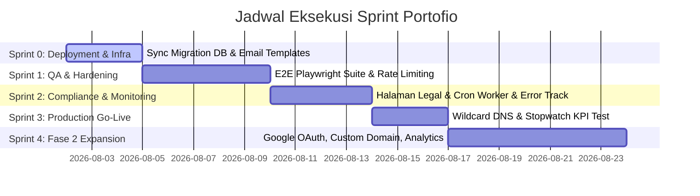

# Master Sprint Plan: Portofio SaaS

Dokumen ini mendefinisikan rencana eksekusi sprint untuk menyelesaikan dan meluncurkan platform **Portofio SaaS** berdasarkan acuan [PRD.md](file:///Users/maaullntech/Dev/portofio-saas/docs/PRD.md) (v1.6) dan [FLOW.md](file:///Users/maaullntech/Dev/portofio-saas/docs/FLOW.md) (v1.0).

---

## 📊 Status Audit Alur (Flow 1 – Flow 10)

Seluruh 10 alur pengguna utama dalam [FLOW.md](file:///Users/maaullntech/Dev/portofio-saas/docs/FLOW.md) telah selesai dikembangkan pada level MVP codebase (`passing` pada `feature_list.json`):

| Flow ID | Flow Name | Status | Main Files |
|---|---|---|---|
| **Flow 1** | Visitor → Landing Page | ✅ Passing | `src/components/landing/LandingPage.tsx` |
| **Flow 2** | Onboarding & Email Verification | ✅ Passing | `src/lib/auth/actions.ts`, `src/app/auth/confirm/route.ts` |
| **Flow 3** | Template Pick → First Project | ✅ Passing | `src/components/dashboard/TemplateGallery.tsx` |
| **Flow 4** | Editor → Data Form → Autosave | ✅ Passing | `src/components/dashboard/Editor.tsx`, `src/templates/registry.tsx` |
| **Flow 5** | Publish → Midtrans Checkout → Site Live | ✅ Passing | `src/app/api/webhooks/midtrans/route.ts`, `src/lib/projects/actions.ts` |
| **Flow 6** | Dashboard → Project Management | ✅ Passing | `src/components/dashboard/DashboardClientView.tsx` |
| **Flow 7** | Billing & Subscription Lifecycle | ✅ Passing | `src/components/dashboard/BillingClientView.tsx`, `src/lib/billing/unpublish.ts` |
| **Flow 8** | Public Multi-Tenant Site | ✅ Passing | `src/middleware.ts`, `src/app/sites/[subdomain]/page.tsx` |
| **Flow 9** | Admin Panel & RBAC | ✅ Passing | `src/app/[locale]/admin/page.tsx`, `src/lib/auth/roles.ts` |
| **Flow 10** | Reset Password Flow | ✅ Passing | `src/app/[locale]/reset-password/page.tsx` |

---

## 🚀 Rencana Sprint Peluncuran & Pengembangan (Sprint 0 - 4)

---

### 🔹 Sprint 0: Production Infrastructure & DB Migration Sync (3 Hari)
**Fokus**: Sinkronisasi basis data Supabase Remote, konfigurasi Auth Email, dan Edge Function deployment.

#### Task List:
- [ ] **0.1 Apply Pending Migrations di Supabase Remote**
  - Eksekusi 12 SQL migration yang ada di `supabase/migrations/` pada Supabase SQL Editor remote.
- [ ] **0.2 Setup Supabase Auth Email Templates**
  - Set template URL "Confirm Signup": `{{ .SiteURL }}/auth/confirm?token_hash={{ .TokenHash }}&type=signup&next=/dashboard`
  - Set template URL "Reset Password": `{{ .SiteURL }}/auth/confirm?token_hash={{ .TokenHash }}&type=recovery&next=/reset-password`
  - Ubah Site URL di Supabase Authentication → URL Configuration ke domain produksi.
- [ ] **0.3 Deploy Custom Claims Edge Function**
  - Deploy `supabase/functions/custom-claims/index.ts` via Supabase CLI.
  - Aktifkan Custom Access Token Hook di Dashboard Supabase.

---

### 🔹 Sprint 1: E2E Regression Testing & Moderation Hardening (5 Hari)
**Fokus**: Pembuatan automated end-to-end testing suite (Playwright) dan proteksi penyalahgunaan subdomain.

#### Task List:
- [ ] **1.1 Playwright E2E Test Suite (`e2e/flows.spec.ts`)**
  - Uji otomatis Flow 1 hingga Flow 10 secara menyeluruh (signup, isi editor, checkout stub, publish, billing state, unpublish, reset password).
- [ ] **1.2 Subdomain Blocklist, Moderation & Single Published Site Check**
  - Validasi regex `^[a-z0-9-]{3,63}$`, kata terlarang (`subdomain_blocklist`), dan kuota **maksimal 1 website publish aktif per akun** pada server action `publishProjectAction`. Pengguna dapat berganti template pada website tersebut, namun tidak bisa mempublikasikan 2 website sekaligus.
- [ ] **1.3 Rate Limiter Middleware**
  - Pasang sliding window rate limiter di `/signup`, `/forgot-password`, dan `/publish`.

---

### 🔹 Sprint 2: Legal Pages, Background Cron & Error Tracking (4 Hari)
**Fokus**: Pemenuhan standar legal, worker otomatisasi pembatalan langganan, dan pemantauan error.

#### Task List:
- [ ] **2.1 Halaman Legal (Privacy Policy & Terms of Service)**
  - Buat `src/app/[locale]/privacy/page.tsx` (`/privacy`) dan `src/app/[locale]/terms/page.tsx` (`/terms`).
  - Tambahkan link footer di Landing Page dan Auth pages.
- [ ] **2.2 Scheduled Cron Job Expiry Worker**
  - Buat route `src/app/api/cron/check-subscriptions/route.ts` (Vercel Cron) yang mengeksekusi `softUnpublishUserProjects()` harian jika grace period 7 hari habis.
- [ ] **2.3 Production Error Tracking**
  - Setup `@sentry/nextjs` atau Vercel Analytics untuk monitoring runtime exception.

---

### 🔹 Sprint 3: Production Go-Live & Launch Readiness (3 Hari)
**Fokus**: Deploy domain produksi, pengujian KPI waktu publish, dan audit go-live.

#### Task List:
- [ ] **3.1 Production Deployment & Wildcard DNS**
  - Hubungkan domain produksi (misal `portofio.id`) ke Vercel dengan CNAME wildcard `*.portofio.id`.
  - Pasang seluruh env secrets produksi.
- [ ] **3.2 Stopwatch Target KPI Test (< 15 Menit)**
  - Lakukan smoke test manual dari Visitor → Signup → Editor → Midtrans Checkout → Publish di bawah 15 menit (PRD §3 KPI).
- [ ] **3.3 Go-Live Audit Checklist (PRD §15)**
  - Verifikasi responsivitas 8 template di Mobile/Desktop & coverage terjemahan i18n (`id`/`en`).

---

### 🔹 Sprint 4: Fase 2 Feature Expansion (7 Hari)
**Fokus**: Fitur lanjutan di luar MVP sesuai PRD §5 & §13.

#### Task List:
- [ ] **4.1 Google OAuth Integration**
  - Login & Registrasi 1-klik via Supabase Auth Google Provider.
- [ ] **4.2 Custom Domain Mapping UI**
  - Fitur pengaitan domain kustom (misal `john.com`) ke workspace dengan verifikasi CNAME DNS.
- [ ] **4.3 Visitor Analytics Dashboard**
  - Widget statistik jumlah pengunjung website di dashboard workspace.
- [ ] **4.4 Designer Template Submission Portal**
  - Halaman `/designer` untuk submisi template pihak ketiga & panel `/admin/templates` untuk approval admin.
